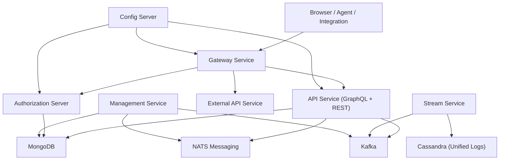

# Introduction to OpenFrame OSS Tenant

[](https://www.youtube.com/watch?v=-_56_qYvMWk)

## What is OpenFrame?

**OpenFrame** ([openframe.ai](https://openframe.ai) / [flamingo.run/openframe](https://www.flamingo.run/openframe)) is the unified platform that integrates multiple MSP (Managed Service Provider) tools into a single AI-driven interface, automating IT support operations across the stack.

The **`openframe-oss-tenant`** repository contains the full **multi-tenant runtime backend stack** of the OpenFrame platform. It assembles identity, API, routing, persistence, messaging, stream processing, and management services into a cohesive tenant-aware system — ready for production deployment as a cloud-native MSP backend.

> **Part of Flamingo**: OpenFrame is the open-source backbone of [Flamingo](https://flamingo.run), an AI-powered MSP platform that replaces expensive proprietary software with open-source alternatives enhanced by intelligent automation (Mingo AI for technicians, Fae for clients).

---

## Elevator Pitch

OpenFrame OSS Tenant gives MSPs and IT teams a **complete, self-hostable, multi-tenant backend** that:

- Unifies multiple RMM/MDM tools behind a single API and UI
- Provides AI-powered automation via Mingo AI
- Replaces costly proprietary MSP platforms with open-source alternatives
- Scales from a single technician to a large MSP team
- Ships as modular Spring Boot microservices with event-driven communication

---

## Key Features

| Feature | Description |
|---|---|
| **Multi-tenant Architecture** | Every layer is tenant-scoped by design — data, auth, messaging, and more |
| **OAuth2 / OIDC Authorization** | Full-featured auth server with SSO (Google, Microsoft), per-tenant JWT keys |
| **GraphQL + REST API** | Netflix DGS-powered GraphQL with Relay pagination, plus REST endpoints |
| **Reactive Gateway** | Spring Cloud Gateway with JWT + API key authentication, rate limiting |
| **Event-Driven Messaging** | Apache Kafka (durable) + NATS (real-time) for agent and tool communication |
| **Stream Processing** | Debezium CDC ingestion, event normalization, Cassandra unified logs |
| **Tool Integrations** | MeshCentral, Tactical RMM, Fleet MDM support out of the box |
| **Mingo AI** | AI-powered ticket automation and IT support intelligence |
| **Next.js Frontend** | Modern React/Next.js UI in the `openframe-frontend` service |
| **Self-Hosted** | Deploy on your own infrastructure with Kubernetes manifests provided |

---

## Target Audience

OpenFrame OSS Tenant is designed for:

- **MSP Developers** building or extending a managed services platform
- **IT Teams** seeking an open-source alternative to proprietary RMM/PSA tools
- **Platform Engineers** deploying a multi-tenant SaaS backend
- **Contributors** to the OpenFrame open-source ecosystem

---

## Platform Overview


```mermaid
flowchart TD
    Client["Browser / Agent / Integration"] --> Gateway["Gateway Service"]

    Gateway --> Auth["Authorization Server"]
    Gateway --> API["API Service (GraphQL + REST)"]
    Gateway --> ExternalAPI["External API Service"]

    API --> Mongo["MongoDB"]
    API --> NATS["NATS Messaging"]
    API --> Kafka["Kafka"]

    Auth --> Mongo

    Stream["Stream Service"] --> Kafka
    Stream --> Cassandra["Cassandra (Unified Logs)"]

    Management["Management Service"] --> Mongo
    Management --> NATS
    Management --> Kafka

    Config["Config Server"] --> Gateway
    Config --> API
    Config --> Auth
```

### Architecture Layers

| Layer | Responsibility |
|-------|----------------|
| **Gateway** | Routing, JWT validation, API key auth, rate limiting |
| **Authorization Server** | OAuth2, OIDC, SSO, per-tenant identity |
| **API Service** | GraphQL + REST orchestration |
| **Data Layer** | MongoDB domain & repositories |
| **Stream Layer** | CDC ingestion, event enrichment, unified logs |
| **Messaging** | Kafka (durable) + NATS (real-time) |
| **Management** | Initialization, migrations, schedulers |
| **Runtime Apps** | Executable Spring Boot services |

---

## Technology Stack

### Backend Services (Java 21 + Spring Boot 3.3)

- **Runtime**: Java 21, Spring Boot 3.3, Spring Cloud 2023.0
- **API**: Netflix DGS (GraphQL), Spring WebFlux
- **Security**: Spring Authorization Server, Spring Security (OAuth2/JWT)
- **Gateway**: Spring Cloud Gateway (Reactive)
- **Messaging**: Apache Kafka 3.6, NATS JetStream
- **Database**: MongoDB 4.2+, Redis, Apache Cassandra
- **Observability**: Micrometer + Prometheus
- **Build**: Maven (multi-module `openframe-parent`)

### Frontend (Next.js)

The `openframe-frontend` service uses **Next.js** with a React component library (`@flamingo-stack/openframe-frontend-core`) providing UI components for device management, tickets, monitoring, and AI chat (Mingo).

### AI Layer (VoltAgent / Anthropic)

The documentation and automation tooling integrates with **VoltAgent** (`@voltagent/core`) and the **Anthropic SDK** (`@anthropic-ai/sdk`) for AI-assisted workflows.

---

## Repository Structure

```text
openframe-oss-tenant/
├── openframe/
│   └── services/
│       ├── openframe-api/               # API Application entry point
│       ├── openframe-authorization-server/  # Auth Server entry point
│       ├── openframe-gateway/           # Gateway Application entry point
│       ├── openframe-external-api/      # External API entry point
│       ├── openframe-management/        # Management Application entry point
│       ├── openframe-stream/            # Stream Application entry point
│       ├── openframe-client/            # Client Application entry point
│       ├── openframe-config/            # Config Server entry point
│       └── openframe-frontend/          # Next.js frontend
├── clients/
│   ├── openframe-client/               # Rust agent client
│   └── openframe-chat/                 # Tauri desktop chat app
├── manifests/                          # Kubernetes deployment manifests
└── pom.xml                             # Maven parent POM
```

---

## Community & Support

OpenFrame is an open-source project developed by the Flamingo team and the OpenMSP community.

- **Community**: [OpenMSP Slack](https://join.slack.com/t/openmsp/shared_invite/zt-36bl7mx0h-3~U2nFH6nqHqoTPXMaHEHA)
- **Website**: [openframe.ai](https://openframe.ai)
- **Flamingo Platform**: [flamingo.run](https://flamingo.run)
- **OpenMSP Community**: [openmsp.ai](https://www.openmsp.ai/)

---

## Getting Started

| Document | Description |
|---|---|
| [Prerequisites](prerequisites.md) | Required software and system requirements |
| [Quick Start](quick-start.md) | Get the platform running in minutes |
| [First Steps](first-steps.md) | Explore key features after setup |
