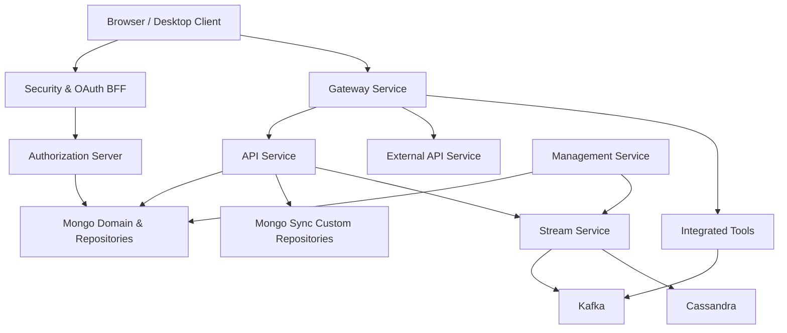

# Introduction to OpenFrame OSS Tenant

## What is OpenFrame OSS Tenant?

**OpenFrame OSS Tenant** is the open-source, multi-service tenant runtime of the [OpenFrame platform](https://openframe.ai) — a unified, AI-driven platform that integrates multiple MSP (Managed Service Provider) tools into a single intelligent interface.

The `openframe-oss-tenant` repository packages all core services, shared libraries, and client modules required to run a **full OpenFrame tenant stack**, enabling MSPs to automate IT support operations across the entire stack while replacing expensive proprietary software with open-source alternatives enhanced by intelligent automation.

> **Flamingo** (https://flamingo.run) powers this platform with AI agents — Mingo AI for technicians and Fae for clients — sitting on top of OpenFrame to deliver autonomous IT operations.

---

## Key Features & Benefits

| Feature | Description |
|---------|-------------|
| **Multi-tenant SaaS-ready backend** | Fully isolated tenant environments with per-tenant RSA key signing |
| **OAuth2 / OIDC Identity Provider** | Authorization Code + PKCE, Google & Microsoft SSO |
| **GraphQL + REST API Runtime** | Netflix DGS, Relay-compatible pagination, DataLoader batching |
| **Reactive Gateway** | JWT & API key enforcement, WebSocket proxying, rate limiting |
| **Kafka Stream Processing** | CDC ingestion from Tactical RMM, MeshCentral, Fleet MDM |
| **MongoDB Domain Layer** | Canonical document models for all platform entities |
| **Management Control Plane** | Schedulers, Mongock migrations, tool lifecycle orchestration |
| **Security OAuth BFF** | Browser-safe PKCE login flows with HTTPOnly cookie storage |
| **Desktop Chat Client** | Tauri-based GraphQL runtime for the OpenFrame Chat app |

---

## Target Audience

OpenFrame OSS Tenant is designed for:

- **MSP Operators** looking to self-host the OpenFrame platform on their own infrastructure
- **Backend Engineers** building MSP automation integrations and extending the OpenFrame services
- **DevOps / Platform Engineers** deploying and maintaining a multi-tenant microservices stack
- **Open-Source Contributors** contributing to the MSP tooling ecosystem via the [OpenMSP community](https://www.openmsp.ai/)

---

## Platform Architecture Overview

The `openframe-oss-tenant` stack is a **complete microservice-based architecture** composed of the following primary layers:

```mermaid
flowchart TD
    Browser["Browser / Desktop Client"] --> BFF["Security & OAuth BFF"]
    BFF --> Authz["Authorization Server"]
    Browser --> Gateway["Gateway Service"]

    Gateway --> Api["API Service"]
    Gateway --> External["External API Service"]
    Gateway --> Tools["Integrated Tools"]

    Api --> Mongo["Mongo Domain & Repositories"]
    Api --> Sync["Mongo Sync Custom Repositories"]
    Api --> Stream["Stream Service"]

    Authz --> Mongo
    Management["Management Service"] --> Mongo
    Management --> Stream

    Stream --> Kafka["Kafka"]
    Stream --> Cassandra["Cassandra"]

    Tools --> Kafka
```

### Core Services

| Service | Role |
|---------|------|
| `openframe-gateway` | Edge routing, JWT validation, WebSocket proxy |
| `openframe-authorization-server` | OAuth2/OIDC multi-tenant identity provider |
| `openframe-api` | Business logic (GraphQL + REST) |
| `openframe-client` | Agent client for device registration |
| `openframe-stream` | Kafka CDC event ingestion & enrichment |
| `openframe-management` | Schedulers, migrations, tool orchestration |
| `openframe-external-api` | External REST API for third-party integrations |
| `openframe-config` | Spring Cloud Config Server |

---

## Technology Stack

The platform is built on proven enterprise-grade technologies:

- **Backend**: Java 21 + Spring Boot 3.3 + Spring Cloud
- **API**: Netflix DGS (GraphQL) + Spring MVC (REST) + Spring WebFlux
- **Messaging**: Apache Kafka 3.6 + NATS
- **Persistence**: MongoDB 4.2 + Redis + Apache Cassandra + Apache Pinot
- **Security**: OAuth2 / OIDC + JWT (JJWT 0.11) + Spring Security
- **Tooling (doc/AI)**: Node.js + `@voltagent/core` + Anthropic SDK
- **Deployment**: Kubernetes manifests (see `manifests/`)

---

## The OpenMSP Community

OpenFrame is community-driven. Questions, support, and discussions happen on the **OpenMSP Slack community**:

- 🌐 Community: [https://www.openmsp.ai/](https://www.openmsp.ai/)
- 💬 Slack: [Join OpenMSP Slack](https://join.slack.com/t/openmsp/shared_invite/zt-36bl7mx0h-3~U2nFH6nqHqoTPXMaHEHA)

---

## What's Next?

To start working with OpenFrame OSS Tenant:

- Review the **Prerequisites** to ensure your environment is ready
- Follow the **Quick Start** guide for a 5-minute setup overview
- Read the **First Steps** guide to configure your first tenant
- Explore the **Development** section for architecture deep-dives and contribution guides
