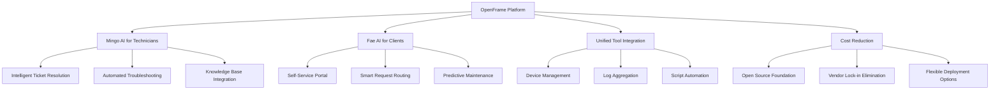
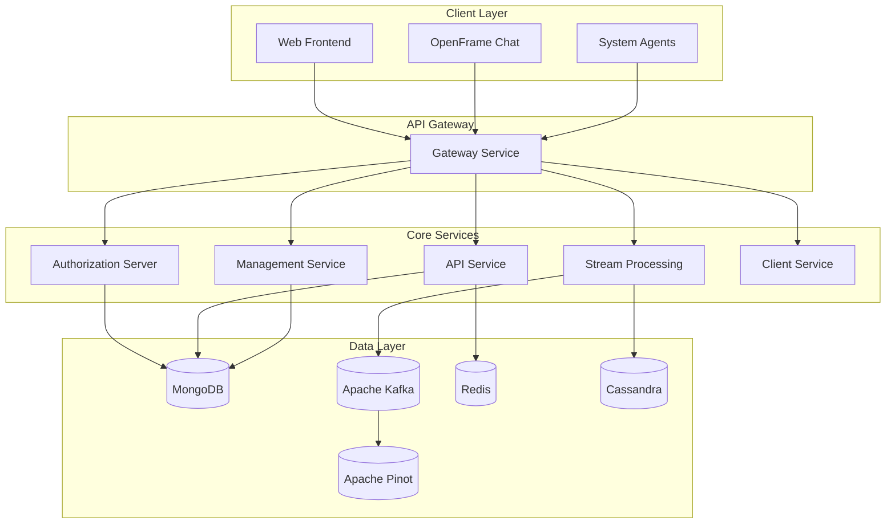

# OpenFrame Introduction

Welcome to **OpenFrame** - the unified, AI-powered MSP platform that replaces expensive proprietary software with open-source alternatives enhanced by intelligent automation.

## What is OpenFrame?

OpenFrame is Flamingo's comprehensive MSP (Managed Service Provider) platform that integrates multiple IT management tools into a single, AI-driven interface. Built on modern open-source technologies, OpenFrame automates IT support operations across your entire technology stack.

### Key Value Propositions

```mermaid
graph TD
    A[OpenFrame Platform] --> B[Mingo AI for Technicians]
    A --> C[Fae AI for Clients]
    A --> D[Unified Tool Integration]
    A --> E[Cost Reduction]
    
    B --> B1[Intelligent Ticket Resolution]
    B --> B2[Automated Troubleshooting]
    B --> B3[Knowledge Base Integration]
    
    C --> C1[Self-Service Portal]
    C --> C2[Smart Request Routing]
    C --> C3[Predictive Maintenance]
    
    D --> D1[Device Management]
    D --> D2[Log Aggregation]
    D --> D3[Script Automation]
    
    E --> E1[Open Source Foundation]
    E --> E2[Vendor Lock-in Elimination]
    E --> E3[Flexible Deployment Options]
```

## Core Features

| Feature | Description | Benefits |
|---------|-------------|----------|
| **Mingo AI Assistant** | Intelligent technician support with enterprise guardrails | Faster ticket resolution, reduced training time |
| **Unified Device Management** | Cross-platform agent deployment and monitoring | Single pane of glass for all endpoints |
| **Real-time Log Aggregation** | Centralized logging with AI-powered analysis | Proactive issue detection, simplified troubleshooting |
| **Automation Engine** | Script deployment and policy management | Reduced manual work, consistent configurations |
| **Multi-tenant Architecture** | Secure tenant isolation with SSO integration | Enterprise-ready scalability |
| **Open Source Foundation** | Built on proven technologies like Spring Boot, Vue.js | No vendor lock-in, community-driven innovation |

## Target Audience

### MSP Providers
- **Small to Enterprise MSPs** looking to modernize their tech stack
- Teams wanting to **reduce operational costs** by 30-50%
- Organizations seeking **AI-enhanced workflows** without compromising security

### IT Teams
- **Internal IT departments** managing distributed environments  
- DevOps teams requiring **unified monitoring and automation**
- Security teams needing **centralized visibility and control**

### System Integrators
- Partners building **custom MSP solutions**
- Developers creating **specialized automation workflows**
- Organizations requiring **deep customization** and white-labeling

## Architecture Overview

OpenFrame follows a modern microservices architecture designed for scalability and flexibility:

```mermaid
flowchart TD
    subgraph "Client Layer"
        Web[Web Frontend]
        Chat[OpenFrame Chat]
        Agent[System Agents]
    end
    
    subgraph "API Gateway"
        Gateway[Gateway Service]
    end
    
    subgraph "Core Services"
        Auth[Authorization Server]
        API[API Service]
        Stream[Stream Processing]
        Management[Management Service]
        Client[Client Service]
    end
    
    subgraph "Data Layer"
        Mongo[(MongoDB)]
        Kafka[(Apache Kafka)]
        Redis[(Redis)]
        Cassandra[(Cassandra)]
        Pinot[(Apache Pinot)]
    end
    
    Web --> Gateway
    Chat --> Gateway
    Agent --> Gateway
    
    Gateway --> Auth
    Gateway --> API
    Gateway --> Stream
    Gateway --> Management
    Gateway --> Client
    
    Auth --> Mongo
    API --> Mongo
    API --> Redis
    Stream --> Kafka
    Stream --> Cassandra
    Management --> Mongo
    
    Kafka --> Pinot
```

## Technology Stack

### Backend Technologies
- **Java 21** with Spring Boot 3.3.0
- **GraphQL** for flexible API queries
- **Apache Kafka** for real-time event streaming
- **MongoDB** for transactional data
- **Apache Pinot** for analytics
- **Redis** for caching and sessions

### Frontend Technologies  
- **Vue 3** with Composition API
- **TypeScript** for type safety
- **PrimeVue** component library
- **Vite** for fast development builds
- **Pinia** for state management

### Infrastructure
- **Docker** and **Kubernetes** support
- **Helm charts** for deployment
- **Prometheus/Grafana** for monitoring
- **Istio** service mesh capabilities

## Deployment Options

OpenFrame supports multiple deployment scenarios:

| Deployment Type | Description | Best For |
|----------------|-------------|----------|
| **Cloud SaaS** | Fully managed by Flamingo | Quick start, minimal maintenance |
| **Self-Hosted** | Deploy on your infrastructure | Data sovereignty, custom compliance |
| **Hybrid** | Mix of cloud and on-premises | Gradual migration, specific workload requirements |
| **Edge** | Distributed edge deployments | Remote locations, low-latency requirements |

## What's Next?

Ready to get started with OpenFrame? Here's your learning path:

### Step 1: Prerequisites
Review the [Prerequisites Guide](prerequisites.md) to ensure your environment is ready for OpenFrame installation.

### Step 2: Quick Start
Follow our [Quick Start Guide](quick-start.md) to get OpenFrame running in under 10 minutes.

### Step 3: First Steps
Complete the [First Steps Guide](first-steps.md) to configure your organization and start managing devices.

### Step 4: Deep Dive
Explore our development documentation for customization and integration options.

## Community and Support

- **OpenMSP Community**: Join our [Slack workspace](https://join.slack.com/t/openmsp/shared_invite/zt-36bl7mx0h-3~U2nFH6nqHqoTPXMaHEHA)
- **Documentation**: Comprehensive guides and API references
- **GitHub Discussions**: Community-driven Q&A and feature requests
- **Professional Support**: Enterprise support available through Flamingo

---

OpenFrame transforms how MSPs operate by combining the best of open-source flexibility with enterprise-grade AI capabilities. Start your journey today and join the future of IT service management.