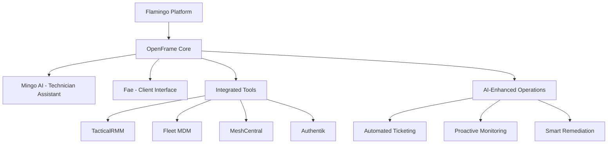
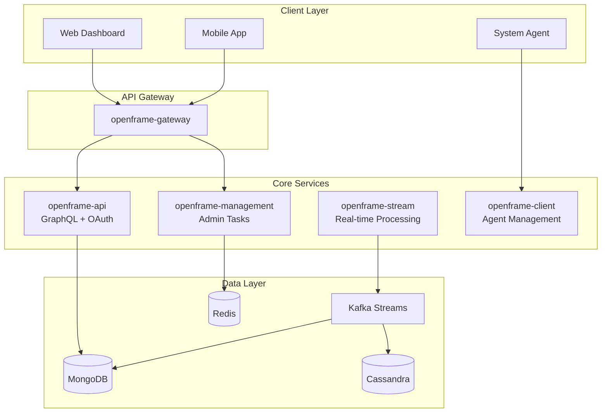

# Introduction to OpenFrame

Welcome to **OpenFrame** - the unified AI-powered MSP platform that replaces expensive proprietary software with open-source alternatives enhanced by intelligent automation.

## What is OpenFrame?

OpenFrame is the core platform that integrates multiple MSP tools into a single AI-driven interface, automating IT support operations across the entire technology stack. As part of the Flamingo ecosystem (https://flamingo.run), OpenFrame helps MSPs:

- **Replace expensive proprietary tools** with open-source alternatives
- **Unify fragmented toolsets** into a single interface
- **Automate routine tasks** with intelligent AI assistance
- **Scale operations** without proportional cost increases

## Platform Overview

```mermaid
graph TD
    A[Flamingo Platform] --> B[OpenFrame Core]
    B --> C[Mingo AI - Technician Assistant]
    B --> D[Fae - Client Interface]
    B --> E[Integrated Tools]
    E --> F[TacticalRMM]
    E --> G[Fleet MDM]
    E --> H[MeshCentral]
    E --> I[Authentik]
    B --> J[AI-Enhanced Operations]
    J --> K[Automated Ticketing]
    J --> L[Proactive Monitoring]
    J --> M[Smart Remediation]
```

## Key Features

### 🔧 Tool Integration
- **Native RMM**: TacticalRMM for endpoint management
- **Device Management**: Fleet MDM for mobile device oversight
- **Remote Access**: MeshCentral for secure remote control
- **Identity Management**: Authentik for single sign-on
- **Custom Integrations**: API-driven connections to existing tools

### 🤖 AI-Powered Automation
- **Mingo AI**: Intelligent technician assistant for troubleshooting
- **Fae**: Client-facing AI for user support
- **Smart Routing**: Automatic ticket classification and assignment
- **Predictive Analytics**: Proactive issue identification

### 📊 Unified Dashboard
- **Single Pane of Glass**: Consolidated view of all connected tools
- **Real-time Monitoring**: Live status across infrastructure
- **Custom Widgets**: Tailored insights for your MSP
- **Cross-tool Workflows**: Seamless automation between platforms

### 🔒 Enterprise Security
- **OAuth2/OpenID Connect**: Secure authentication
- **Role-based Access**: Granular permissions
- **JWT with HTTP-only Cookies**: Enhanced security model
- **Multi-tenant Architecture**: Isolated customer environments

## Architecture Highlights

OpenFrame follows a modern microservices architecture:

```mermaid
graph TB
    subgraph "Client Layer"
        Web[Web Dashboard]
        Mobile[Mobile App]
        Agent[System Agent]
    end
    
    subgraph "API Gateway"
        Gateway[openframe-gateway]
    end
    
    subgraph "Core Services"
        API[openframe-api<br/>GraphQL + OAuth]
        Management[openframe-management<br/>Admin Tasks]
        Stream[openframe-stream<br/>Real-time Processing]
        Client[openframe-client<br/>Agent Management]
    end
    
    subgraph "Data Layer"
        MongoDB[(MongoDB)]
        Cassandra[(Cassandra)]
        Redis[(Redis)]
        Kafka[Kafka Streams]
    end
    
    Web --> Gateway
    Mobile --> Gateway
    Agent --> Client
    Gateway --> API
    Gateway --> Management
    Stream --> Kafka
    Kafka --> MongoDB
    Kafka --> Cassandra
    API --> MongoDB
    Management --> Redis
```

## Target Audience

OpenFrame is designed for:

- **MSP Owners** seeking cost reduction and operational efficiency
- **IT Directors** needing unified tool management
- **Technicians** wanting AI-assisted troubleshooting
- **System Administrators** requiring automated workflows
- **Developers** building custom integrations

## Technology Stack

### Backend
- **Runtime**: Java 21 with Spring Boot 3.3.0
- **API**: GraphQL (Netflix DGS) + RESTful services
- **Security**: JWT with OAuth2/OpenID Connect
- **Data**: MongoDB, Cassandra, Apache Pinot, Redis
- **Messaging**: Apache Kafka for event streaming

### Frontend
- **Framework**: Vue 3 with TypeScript
- **UI Components**: PrimeVue design system
- **State Management**: Pinia stores
- **GraphQL Client**: Apollo Client
- **Build System**: Vite with hot reload

### Infrastructure
- **Containerization**: Docker & Docker Compose
- **Orchestration**: Kubernetes with Helm charts
- **Service Mesh**: Istio for traffic management
- **Monitoring**: Prometheus + Grafana stack

## Getting Started Video

Watch our comprehensive platform walkthrough to see OpenFrame in action:

This video covers installation, configuration, tool integrations, and basic usage patterns.

## Benefits for MSPs

### 💰 Cost Reduction
- Replace expensive per-seat licensing with open-source tools
- Eliminate vendor lock-in and reduce dependency on proprietary solutions
- Lower total cost of ownership through automation

### ⚡ Operational Efficiency
- Unified interface reduces context switching
- Automated workflows minimize manual tasks
- AI assistance accelerates problem resolution

### 🚀 Scalability
- Multi-tenant architecture supports growth
- API-driven integrations adapt to changing needs
- Cloud-native design ensures reliable scaling

### 🔍 Enhanced Visibility
- Comprehensive monitoring across all tools
- Centralized logging and analytics
- Predictive insights for proactive management

## Community and Support

OpenFrame is part of the broader OpenMSP community:

- **Slack Community**: https://join.slack.com/t/openmsp/shared_invite/zt-36bl7mx0h-3~U2nFH6nqHqoTPXMaHEHA
- **Platform Website**: https://www.flamingo.run/openframe
- **OpenMSP Hub**: https://www.openmsp.ai/

> 🔗 **Note**: We don't use GitHub Issues or GitHub Discussions. All support, feature requests, and community discussions happen in our OpenMSP Slack workspace.

## Next Steps

Ready to get started with OpenFrame? Continue to the next guides:

1. **[Prerequisites](./prerequisites.md)** - System requirements and setup preparation
2. **[Quick Start](./quick-start.md)** - 5-minute installation guide
3. **[First Steps](./first-steps.md)** - Initial configuration and exploration

For developers interested in contributing or customizing OpenFrame:

- **[Development Setup](../development/setup/environment.md)** - Local development environment
- **[Architecture Overview](../development/architecture/overview.md)** - Detailed system design
- **[Contributing Guidelines](../development/contributing/guidelines.md)** - How to contribute code

---

OpenFrame represents the future of MSP tooling - where open-source flexibility meets enterprise reliability, all enhanced by the power of AI automation.