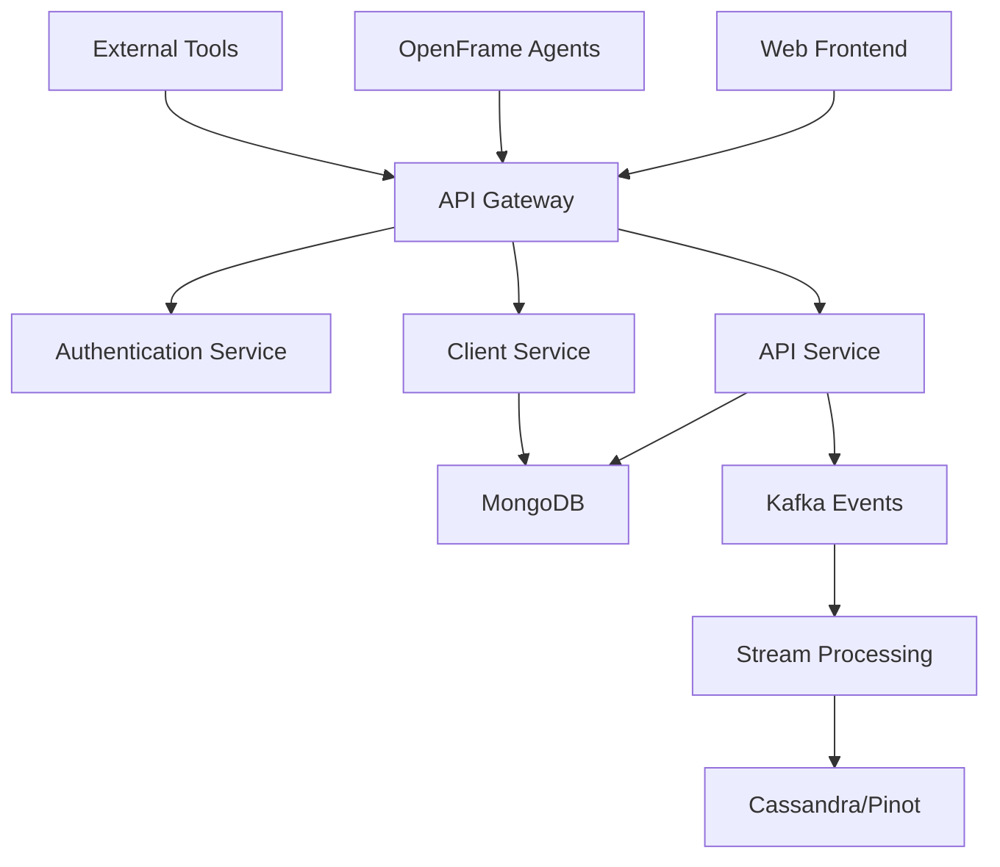

# Introduction to OpenFrame

Welcome to OpenFrame, the open-source unified MSP (Managed Service Provider) platform that replaces expensive proprietary software with intelligent automation.

## What is OpenFrame?

OpenFrame is an AI-powered MSP platform developed by Flamingo that integrates multiple IT management tools into a single, unified interface. It provides:

- **Unified Dashboard**: Single pane of glass for all MSP operations
- **AI Automation**: Mingo AI for technicians and Fae for clients
- **Open Source Alternative**: Replace costly proprietary MSP tools
- **Multi-Tenant Architecture**: Secure, scalable SaaS platform
- **Tool Integration**: Connect FleetMDM, TacticalRMM, MeshCentral, and more

## Key Features

### 🤖 AI-Powered Operations
- **Mingo AI**: Intelligent assistant for technicians
- **Autonomous Agent Architecture**: Handles incident triage and alert management
- **Natural Language Processing**: Chat-based interface for complex operations

### 🔗 Tool Integration
OpenFrame connects and unifies these essential MSP tools:
- **FleetMDM**: Device management and compliance
- **TacticalRMM**: Remote monitoring and management
- **MeshCentral**: Remote access and control
- **Authentik**: Identity and access management

### 🏢 Multi-Tenant Platform
- Secure tenant isolation
- OAuth2/OIDC authentication
- SSO integration (Google, Microsoft)
- Role-based access control

### 📊 Real-Time Data Processing
- Event streaming with Apache Kafka
- Real-time device monitoring
- Automated alert processing
- Historical data analysis

## Architecture Overview

```mermaid
graph TD
    A[Web Frontend] --> B[API Gateway]
    B --> C[Authentication Service]
    B --> D[API Service]
    B --> E[Client Service]
    
    D --> F[MongoDB]
    E --> F
    
    D --> G[Kafka Events]
    G --> H[Stream Processing]
    H --> I[Cassandra/Pinot]
    
    J[OpenFrame Agents] --> B
    K[External Tools] --> B
```

## Target Audience

OpenFrame is designed for:

- **MSP Technicians**: IT professionals managing client environments
- **MSP Business Owners**: Looking to reduce tool costs and increase efficiency
- **System Administrators**: Managing multiple organizations and devices
- **DevOps Engineers**: Setting up and maintaining MSP infrastructure

## Benefits

### 💰 Cost Reduction
Replace multiple expensive proprietary tools with a single open-source platform:

| Traditional MSP Stack | OpenFrame Alternative |
|----------------------|----------------------|
| RMM Tool ($5-15/endpoint) | TacticalRMM (Free) |
| PSA Software ($50-100/user) | OpenFrame PSA (Free) |
| Remote Access ($10-30/user) | MeshCentral (Free) |
| Documentation Tool ($20-50/user) | Integrated Docs (Free) |

### ⚡ Increased Efficiency
- Single interface for all operations
- AI-powered automation reduces manual tasks
- Standardized workflows across all clients
- Real-time alerting and incident management

### 🔒 Enhanced Security
- Open source transparency
- Self-hosted deployment options
- End-to-end encryption
- Compliance-ready architecture

## Getting Started Path

Ready to begin? Follow this recommended learning path:

1. **[Prerequisites Guide](prerequisites.md)** - Check system requirements and dependencies
2. **[Quick Start Guide](quick-start.md)** - Get OpenFrame running in 5 minutes
3. **[First Steps Guide](first-steps.md)** - Explore core features and initial configuration

## Community and Support

- **OpenMSP Slack Community**: [Join here](https://join.slack.com/t/openmsp/shared_invite/zt-36bl7mx0h-3~U2nFH6nqHqoTPXMaHEHA)
- **GitHub Repository**: [flamingo-stack/openframe-oss-tenant](https://github.com/flamingo-stack/openframe-oss-tenant)
- **Documentation**: [OpenFrame Docs](https://www.flamingo.run/openframe)
- **Website**: [flamingo.run](https://flamingo.run)

## Latest Updates

## What's Next?

Now that you understand what OpenFrame is and its core capabilities, proceed to the [Prerequisites Guide](prerequisites.md) to ensure your environment is ready for installation.