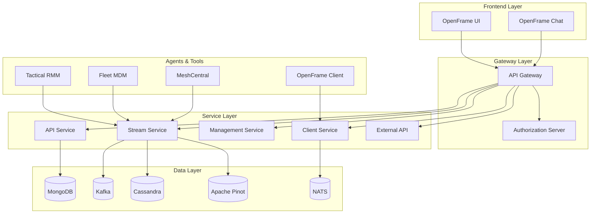

# OpenFrame Introduction

OpenFrame is Flamingo's unified AI-powered MSP platform that replaces expensive proprietary software with open-source alternatives enhanced by intelligent automation. This tutorial introduces you to the core concepts, architecture, and capabilities of OpenFrame.

## What is OpenFrame?

OpenFrame is a **multi-tenant, open-source MSP control plane** that provides:

- **Unified Platform**: Single interface integrating multiple MSP tools (RMM, MDM, PSA, security)
- **AI-Powered Automation**: Mingo AI for technicians and Fae for clients
- **Open Source Foundation**: Replace proprietary stacks with extensible, community-driven solutions
- **Real-time Operations**: Event-driven architecture supporting live monitoring and management

## Key Features

### 🤖 AI Integration
- **Mingo AI**: Intelligent technician assistant with enterprise guardrails
- **Fae**: Client-facing AI for automated support
- **Autonomous Agents**: Independent AI agents for incident triage and alert management

### 🔧 Tool Integration
- **Tactical RMM**: Remote monitoring and management
- **Fleet MDM**: Mobile device management
- **MeshCentral**: Remote access and file management
- **Authentik**: Identity provider integration

### 📊 Unified Data Layer
- **Device Management**: Centralized device monitoring across tools
- **Log Aggregation**: Unified logging from all integrated systems
- **Ticket Management**: AI-powered ticket routing and resolution
- **Organization Management**: Multi-tenant organizational structure

### 🛡️ Security & Identity
- **Multi-tenant Architecture**: Secure isolation between organizations
- **OAuth2/OIDC**: Enterprise-grade authentication
- **JWT Security**: Token-based authorization with cookie support
- **API Key Management**: Secure external API access

## Architecture Overview

```mermaid
flowchart TD
    subgraph "Frontend Layer"
        UI[OpenFrame UI]
        Chat[OpenFrame Chat]
    end
    
    subgraph "Gateway Layer"
        GW[API Gateway]
        AUTH[Authorization Server]
    end
    
    subgraph "Service Layer"
        API[API Service]
        CLIENT[Client Service]
        MGMT[Management Service]
        STREAM[Stream Service]
        EXT[External API]
    end
    
    subgraph "Data Layer"
        MONGO[(MongoDB)]
        KAFKA[(Kafka)]
        CASS[(Cassandra)]
        PINOT[(Apache Pinot)]
        NATS[(NATS)]
    end
    
    subgraph "Agents & Tools"
        AGENT[OpenFrame Client]
        RMM[Tactical RMM]
        MDM[Fleet MDM]
        MESH[MeshCentral]
    end
    
    UI --> GW
    Chat --> GW
    GW --> AUTH
    GW --> API
    GW --> CLIENT
    GW --> MGMT
    GW --> STREAM
    GW --> EXT
    
    API --> MONGO
    CLIENT --> NATS
    STREAM --> KAFKA
    STREAM --> CASS
    STREAM --> PINOT
    
    AGENT --> CLIENT
    RMM --> STREAM
    MDM --> STREAM
    MESH --> STREAM
```

## Target Audience

OpenFrame is designed for:

### MSP Providers
- **Small to Enterprise MSPs** looking to modernize their stack
- **Technology Leaders** seeking open-source alternatives to proprietary tools
- **DevOps Teams** implementing scalable MSP infrastructure

### Developers
- **Backend Developers** working with Java/Spring Boot microservices
- **Frontend Developers** using Vue.js/TypeScript and React/Next.js
- **DevOps Engineers** deploying Kubernetes-based solutions
- **Open Source Contributors** extending platform capabilities

### IT Professionals
- **System Administrators** managing multi-tenant environments
- **Security Engineers** implementing zero-trust architectures
- **Data Engineers** working with streaming and analytics platforms

## Key Benefits

| Benefit | Description |
|---------|-------------|
| **Cost Reduction** | Replace expensive proprietary MSP software with open-source alternatives |
| **Vendor Independence** | Avoid vendor lock-in with modular, extensible architecture |
| **AI Enhancement** | Leverage AI to automate routine tasks and improve efficiency |
| **Scalability** | Kubernetes-native design scales from single tenant to enterprise |
| **Customization** | Open source enables custom integrations and workflows |
| **Community Support** | Active community and commercial support available |

## Technology Stack

### Backend Services
- **Java 21** with Spring Boot 3.3.0
- **GraphQL** (Netflix DGS) and REST APIs
- **JWT Security** with OAuth2/OIDC
- **MongoDB** for system of record
- **Apache Kafka** for event streaming
- **Cassandra** and **Apache Pinot** for analytics

### Frontend Applications
- **Vue.js 3** with TypeScript and Composition API
- **React/Next.js** alternative implementation
- **PrimeVue** and custom component libraries
- **Apollo Client** for GraphQL integration

### Infrastructure
- **Docker** and **Docker Compose** for development
- **Kubernetes** with Helm charts for production
- **Istio** service mesh for traffic management
- **Prometheus/Grafana** for monitoring

## What's Next?

After understanding the OpenFrame ecosystem, continue with these guides:

1. **[Prerequisites Guide](prerequisites.md)** - Set up your development environment
2. **[Quick Start Guide](quick-start.md)** - Get OpenFrame running in 5 minutes
3. **[First Steps Guide](first-steps.md)** - Explore key features and functionality

## Community & Support

- **Slack Community**: Join our [OpenMSP Slack](https://join.slack.com/t/openmsp/shared_invite/zt-36bl7mx0h-3~U2nFH6nqHqoTPXMaHEHA) for discussions
- **GitHub Issues**: Report issues and feature requests on the repository
- **Documentation**: Comprehensive guides and API reference available
- **Commercial Support**: Enterprise support available through Flamingo

> **Note**: We don't use GitHub Issues or GitHub Discussions. All community interaction happens on our OpenMSP Slack community.

---

Ready to get started? Move on to the **Prerequisites Guide** to set up your development environment.