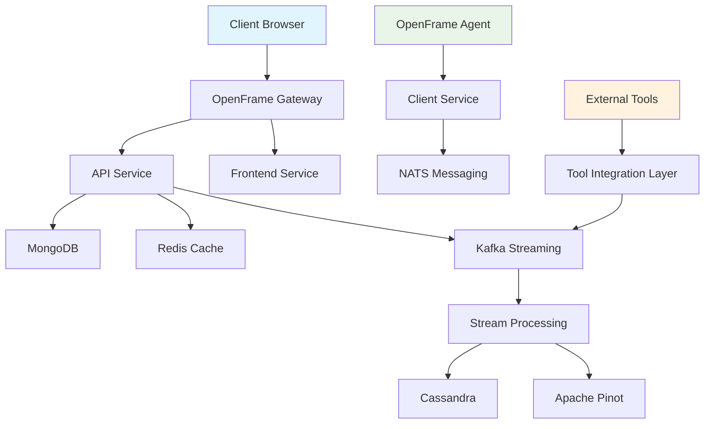

# OpenFrame Introduction

Welcome to **OpenFrame** — the unified AI-powered MSP platform that replaces expensive proprietary software with open-source alternatives enhanced by intelligent automation.

## What is OpenFrame?

OpenFrame is a comprehensive IT service management platform built by [Flamingo](https://flamingo.run) that integrates multiple MSP tools into a single, AI-driven interface. It automates IT support operations across your entire technology stack while providing significant cost savings over traditional enterprise solutions.

## Key Features

### 🤖 AI-Powered Automation
- **Mingo AI**: Intelligent assistant for technicians that automates routine tasks
- **Fae**: AI-powered client interface for streamlined support interactions
- Automated issue detection, diagnosis, and resolution

### 🔧 Unified Tool Integration
OpenFrame integrates with popular open-source and commercial MSP tools:

| Tool Category | Supported Platforms |
|---------------|-------------------|
| **Remote Monitoring & Management** | Tactical RMM, Fleet MDM |
| **Remote Access** | MeshCentral |
| **Authentication** | Authentik, Google SSO, Microsoft SSO |
| **Device Management** | Cross-platform agent support |

### 🏢 Multi-Tenant Architecture
- Secure tenant isolation
- Per-organization configuration
- Role-based access control
- SSO integration

### 📊 Advanced Analytics
- Real-time device monitoring
- Event correlation and enrichment
- Custom reporting and dashboards
- Audit trails and compliance tracking

## Platform Overview

```mermaid
graph TD
    A[Client Browser] --> B[OpenFrame Gateway]
    B --> C[API Service]
    B --> D[Frontend Service]
    
    C --> E[MongoDB]
    C --> F[Redis Cache]
    C --> G[Kafka Streaming]
    
    G --> H[Stream Processing]
    H --> I[Cassandra]
    H --> J[Apache Pinot]
    
    K[OpenFrame Agent] --> L[Client Service]
    L --> M[NATS Messaging]
    
    N[External Tools] --> O[Tool Integration Layer]
    O --> G
    
    style A fill:#e1f5fe
    style K fill:#e8f5e8
    style N fill:#fff3e0
```

## Target Audience

OpenFrame is designed for:

- **Managed Service Providers (MSPs)** seeking to consolidate their toolchain
- **IT Teams** wanting to reduce vendor costs and complexity  
- **System Administrators** looking for AI-enhanced automation
- **Organizations** requiring scalable, multi-tenant IT management

## Benefits Over Traditional Solutions

### 💰 Cost Reduction
- Replace expensive enterprise licenses with open-source alternatives
- Reduce training and maintenance overhead
- Lower total cost of ownership

### ⚡ Improved Efficiency  
- Single interface for multiple tools
- AI-powered automation reduces manual tasks
- Streamlined workflows and processes

### 🔒 Enhanced Security
- OAuth2 + PKCE authentication
- JWT-based security with HTTP-only cookies
- Per-tenant encryption and isolation

### 🎯 Better User Experience
- Modern React-based interface
- Real-time updates via WebSocket
- Mobile-responsive design

## Getting Started Journey

Ready to dive in? Follow these essential guides:

1. **[Prerequisites](prerequisites.md)** - System requirements and dependencies
2. **[Quick Start](quick-start.md)** - 5-minute setup guide
3. **[First Steps](first-steps.md)** - Essential configuration and initial setup

## Architecture Highlights

OpenFrame follows modern microservices architecture principles:

- **Event-Driven**: Kafka-based messaging for real-time processing
- **Cloud-Native**: Kubernetes-ready with Docker containers
- **API-First**: REST + GraphQL interfaces
- **Secure by Default**: OAuth2, JWT, and encryption throughout
- **Scalable**: Multi-tenant with horizontal scaling capabilities

## Technology Stack

**Backend**: Java 21, Spring Boot 3.3, Netflix DGS (GraphQL), MongoDB, Cassandra, Redis, Apache Kafka

**Frontend**: React 18, TypeScript, Apollo GraphQL Client, PrimeReact UI

**Client Agent**: Rust for cross-platform system monitoring

**Infrastructure**: Docker, Kubernetes, Helm, Prometheus, Grafana

## Community & Support

Join the OpenFrame community for support and collaboration:

- 💬 **Slack Community**: [OpenMSP Slack](https://join.slack.com/t/openmsp/shared_invite/zt-36bl7mx0h-3~U2nFH6nqHqoTPXMaHEHA)
- 🌐 **Website**: [flamingo.run/openframe](https://www.flamingo.run/openframe)
- 📧 **Community**: [openmsp.ai](https://www.openmsp.ai/)

> **Note**: We don't use GitHub Issues or GitHub Discussions. All community support and development discussions happen on our OpenMSP Slack community.

---

**Next Steps**: Ready to install OpenFrame? Check out the [Prerequisites Guide](prerequisites.md) to ensure your environment is ready for deployment.