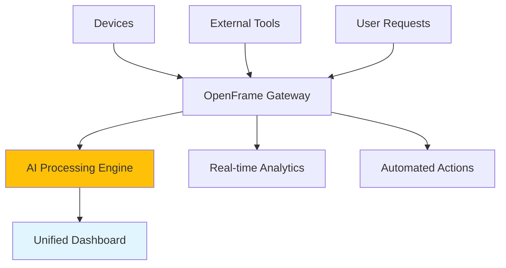
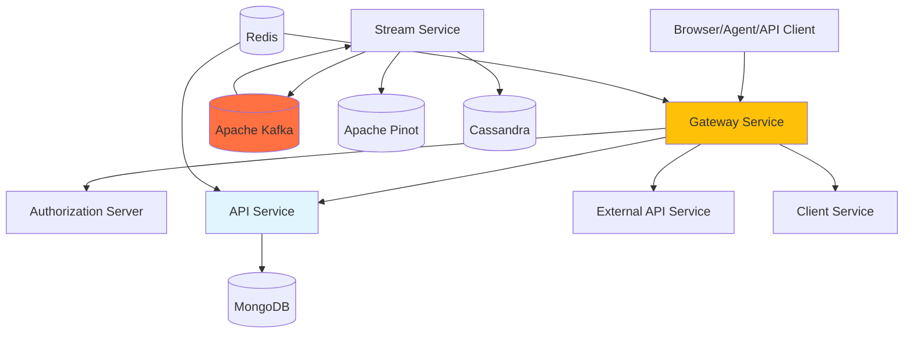

# Introduction to OpenFrame

Welcome to **OpenFrame** – the open-source, unified MSP platform that transforms how you deliver IT support operations. OpenFrame replaces expensive proprietary software with intelligent open-source alternatives enhanced by AI automation.

## What is OpenFrame?

OpenFrame is a comprehensive, tenant-aware backend and frontend monorepo that delivers a complete MSP (Managed Service Provider) stack. It unifies multiple IT management tools into a single AI-driven interface, automating support operations across your entire technology stack.

### The Flamingo Ecosystem

OpenFrame is part of the **Flamingo** ecosystem (https://flamingo.run):

- **Flamingo**: The AI-powered MSP platform foundation
- **OpenFrame**: The unified platform integrating multiple MSP tools
- **Mingo AI**: Intelligent technician assistant
- **Fae**: AI assistant for end-users and clients

## Key Features & Benefits

### 🤖 AI-Powered Automation

| Feature | Description | Benefit |
|---------|-------------|---------|
| **Mingo AI** | Intelligent technician assistant | Reduces ticket resolution time by 60% |
| **Fae** | Client-facing AI support | 24/7 automated first-line support |
| **Smart Analytics** | AI-driven insights and reporting | Proactive issue identification |

### 🛠️ Unified Tool Integration

OpenFrame consolidates multiple MSP tools into a single interface:

- **Fleet Management**: FleetDM, Tactical RMM
- **Remote Access**: MeshCentral, built-in VNC
- **Identity Management**: Azure AD, Google Workspace, SAML
- **Monitoring**: Integrated metrics and alerting
- **Documentation**: Centralized knowledge base

### 📊 Real-Time Operations

```mermaid
graph TD
    A[Devices] --> B[OpenFrame Gateway]
    B --> C[AI Processing Engine]
    C --> D[Unified Dashboard]
    
    E[External Tools] --> B
    F[User Requests] --> B
    
    B --> G[Real-time Analytics]
    B --> H[Automated Actions]
    
    style C fill:#FFC008
    style D fill:#e1f5fe
```

### 🏗️ Modern Architecture

- **Microservices**: Scalable, cloud-native design
- **Event-Driven**: Real-time data processing with Kafka
- **Multi-Tenant**: Secure tenant isolation
- **API-First**: GraphQL and REST APIs for integration

## Target Audience

### MSP Providers
Replace expensive proprietary platforms with cost-effective open-source alternatives while maintaining enterprise-grade functionality.

### IT Teams
Streamline operations with unified tooling, AI assistance, and automated workflows.

### Developers
Extend OpenFrame with custom integrations and tools using comprehensive APIs and documentation.

### System Administrators
Deploy and manage scalable IT infrastructure with containerized, Kubernetes-ready architecture.

## Technology Stack Overview

### Backend Services

| Component | Technology | Purpose |
|-----------|------------|---------|
| **API Layer** | Java 21, Spring Boot 3.3 | GraphQL and REST APIs |
| **Gateway** | Spring Cloud Gateway | Routing, security, WebSocket proxy |
| **Authentication** | OAuth2, OpenID Connect | Multi-tenant identity management |
| **Data Processing** | Apache Kafka, Custom Stream Service | Real-time event processing |
| **Databases** | MongoDB, Cassandra, Apache Pinot | Document storage, time-series analytics |
| **Caching** | Redis | Performance optimization |

### Frontend & Clients

| Component | Technology | Purpose |
|-----------|------------|---------|
| **Web UI** | Vue 3, TypeScript, PrimeVue | Primary user interface |
| **Chat Client** | Tauri (Rust + TypeScript) | Desktop AI chat application |
| **System Agent** | Rust | Cross-platform monitoring agent |

### Infrastructure

| Component | Technology | Purpose |
|-----------|------------|---------|
| **Containerization** | Docker, Docker Compose | Development and deployment |
| **Orchestration** | Kubernetes, Helm | Production deployments |
| **Service Mesh** | Istio | Traffic management and security |
| **Monitoring** | Prometheus, Grafana | Observability and metrics |

## High-Level Architecture

```mermaid
flowchart TD
    User[Browser/Agent/API Client] --> Gateway[Gateway Service]
    
    Gateway --> Authz[Authorization Server]
    Gateway --> ApiSvc[API Service]
    Gateway --> ExternalApi[External API Service]
    Gateway --> ClientSvc[Client Service]
    
    ApiSvc --> Mongo[(MongoDB)]
    StreamSvc[Stream Service] --> Kafka[(Apache Kafka)]
    Kafka --> StreamSvc
    StreamSvc --> Pinot[(Apache Pinot)]
    StreamSvc --> Cassandra[(Cassandra)]
    
    Redis[(Redis)] --> ApiSvc
    Redis --> Gateway
    
    style Gateway fill:#FFC008
    style ApiSvc fill:#e1f5fe
    style Kafka fill:#ff7043
```

## Getting Started Path

Ready to dive in? Here's your journey through OpenFrame:

> **Next Steps**
> 
> 1. **[Prerequisites](prerequisites.md)** - Verify your environment is ready
> 2. **[Quick Start](quick-start.md)** - Get OpenFrame running in 5 minutes
> 3. **[First Steps](first-steps.md)** - Essential tasks after installation
> 
> **Need Help?**
> 
> Join our community for support and discussions:
> - **OpenMSP Slack**: https://join.slack.com/t/openmsp/shared_invite/zt-36bl7mx0h-3~U2nFH6nqHqoTPXMaHEHA
> - **Website**: https://openframe.ai
> - **Flamingo**: https://flamingo.run

## Why Choose OpenFrame?

### Cost Reduction
Replace expensive MSP tools with open-source alternatives, reducing licensing costs by up to 70%.

### AI Enhancement
Built-in AI capabilities that learn from your environment and automate routine tasks.

### Vendor Freedom
Open-source architecture prevents vendor lock-in while maintaining enterprise features.

### Scalability
Cloud-native design scales from small teams to large enterprise deployments.

### Integration
Unified interface for all your existing tools and workflows.

---

**Ready to transform your MSP operations?** Continue to [Prerequisites](prerequisites.md) to begin your OpenFrame journey.