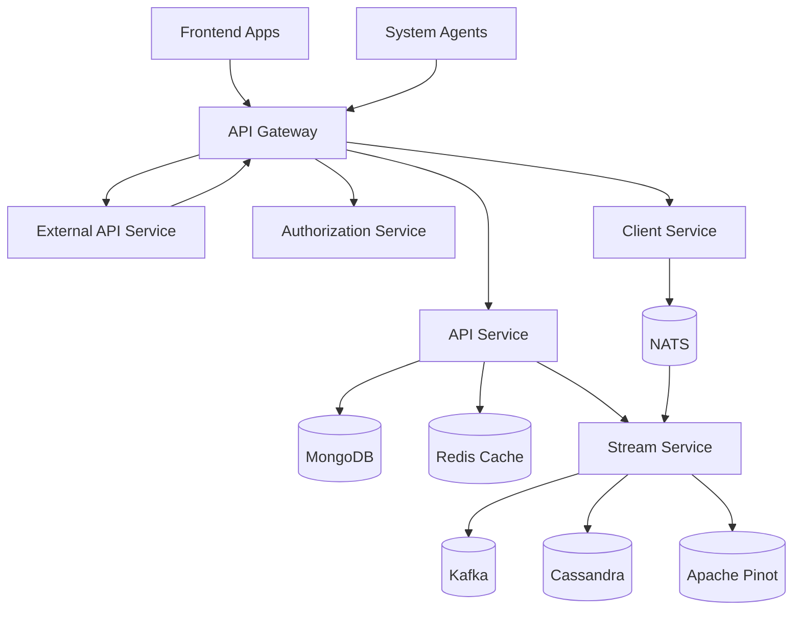

# OpenFrame Introduction

Welcome to **OpenFrame**, the unified AI-powered MSP platform that replaces expensive proprietary software with open-source alternatives enhanced by intelligent automation.

## What is OpenFrame?

OpenFrame is the unified platform that integrates multiple MSP tools into a single AI-driven interface, automating IT support operations across the stack. It's built by [Flamingo](https://flamingo.run), an AI-powered MSP platform that helps MSPs cut vendor costs and increase margins through intelligent automation.

## Key Features

### 🤖 AI-Powered Automation
- **Mingo AI** for technicians: Autonomous incident triage and alert management
- **Fae AI** for clients: Intelligent client portal interactions
- Autonomous agent architecture that handles complex workflows

### 🔧 Unified Tool Integration
- **Device Management**: Fleet MDM, Tactical RMM, MeshCentral
- **Authentication**: OAuth2/OIDC with multi-tenant SSO support
- **Monitoring**: Comprehensive logging and event streaming
- **Communication**: Real-time chat and ticketing system

### 💰 Cost Optimization
- Replace expensive proprietary MSP tools
- Open-source foundation with commercial enhancements
- Transparent pricing with no vendor lock-in

### 🏢 Enterprise-Ready
- Multi-tenant architecture
- Role-based access control
- API-first design with GraphQL and REST endpoints
- Kubernetes-native deployment

## Architecture Overview

OpenFrame follows a modern microservices architecture designed for scalability and reliability:

```mermaid
flowchart TD
    Browser[Frontend Apps] --> Gateway[API Gateway]
    Agents[System Agents] --> Gateway
    External[External APIs] --> Gateway

    Gateway --> Auth[Authorization Service]
    Gateway --> API[API Service]
    Gateway --> Client[Client Service]
    Gateway --> External[External API Service]

    API --> Mongo[(MongoDB)]
    API --> Redis[(Redis Cache)]
    API --> Stream[Stream Service]

    Client --> NATS[(NATS)]
    NATS --> Stream

    Stream --> Kafka[(Kafka)]
    Stream --> Cassandra[(Cassandra)]
    Stream --> Pinot[(Apache Pinot)]
```

## Core Components

| Component | Purpose | Technology |
|-----------|---------|------------|
| **API Gateway** | Request routing, authentication, WebSocket proxy | Spring Boot, JWT |
| **Authorization Server** | Multi-tenant OAuth2/OIDC identity provider | Spring Security OAuth2 |
| **API Service** | GraphQL/REST APIs for core business logic | Netflix DGS, MongoDB |
| **Stream Service** | Real-time event processing and analytics | Kafka Streams, Cassandra |
| **Client Service** | System agent management and communication | NATS, Spring Boot |
| **Frontend** | Web interface with AI chat integration | Vue 3, TypeScript |
| **System Agent** | Cross-platform monitoring and management | Rust |

## Target Audience

OpenFrame is designed for:

- **MSP Owners** looking to reduce vendor costs and increase margins
- **IT Administrators** who need unified tool management
- **Developers** building on top of OpenFrame's APIs
- **Organizations** seeking open-source alternatives to proprietary MSP tools

## Benefits

### For MSPs
- **Reduced Costs**: Replace multiple expensive tools with a single platform
- **Increased Efficiency**: AI-powered automation handles routine tasks
- **Better Client Experience**: Unified interface with intelligent assistance
- **Improved Margins**: Lower operational costs with higher service quality

### For IT Teams
- **Unified Dashboard**: Single pane of glass for all IT operations
- **Real-time Insights**: Advanced analytics and monitoring
- **Flexible Integration**: API-first design supports custom workflows
- **Scalable Architecture**: Grows with your organization

### For Developers
- **Open Source**: Full access to source code and customization
- **Modern Stack**: Built with current technologies and best practices
- **Extensive APIs**: GraphQL and REST endpoints for all functionality
- **Active Community**: Growing ecosystem of contributors and users

## Getting Started Paths

Choose your path based on your role and goals:

### Quick Start (5 minutes)
Perfect for exploring OpenFrame's capabilities without a full setup.
→ Continue to [Quick Start Guide](quick-start.md)

### Full Installation
Complete setup for development or production use.
→ Start with [Prerequisites](prerequisites.md)

### First Steps
Essential configuration and initial setup after installation.
→ Jump to [First Steps](first-steps.md)

## Community and Support

- **Slack Community**: Join our [OpenMSP Slack](https://join.slack.com/t/openmsp/shared_invite/zt-36bl7mx0h-3~U2nFH6nqHqoTPXMaHEHA) for support and discussions
- **Documentation**: Comprehensive guides and API documentation
- **GitHub**: Submit issues, contribute code, or request features
- **Website**: Visit [OpenFrame.ai](https://openframe.ai) for the latest updates

## What's Next?

Ready to get started? Here are your next steps:

1. **Check Prerequisites** - Ensure your system meets the requirements
2. **Quick Start** - Get OpenFrame running in 5 minutes
3. **First Steps** - Configure your initial setup
4. **Explore Features** - Discover OpenFrame's capabilities

Welcome to the future of MSP automation! 🚀

---

> **Note**: OpenFrame is actively developed with regular updates and new features. Join our community to stay updated on the latest developments.