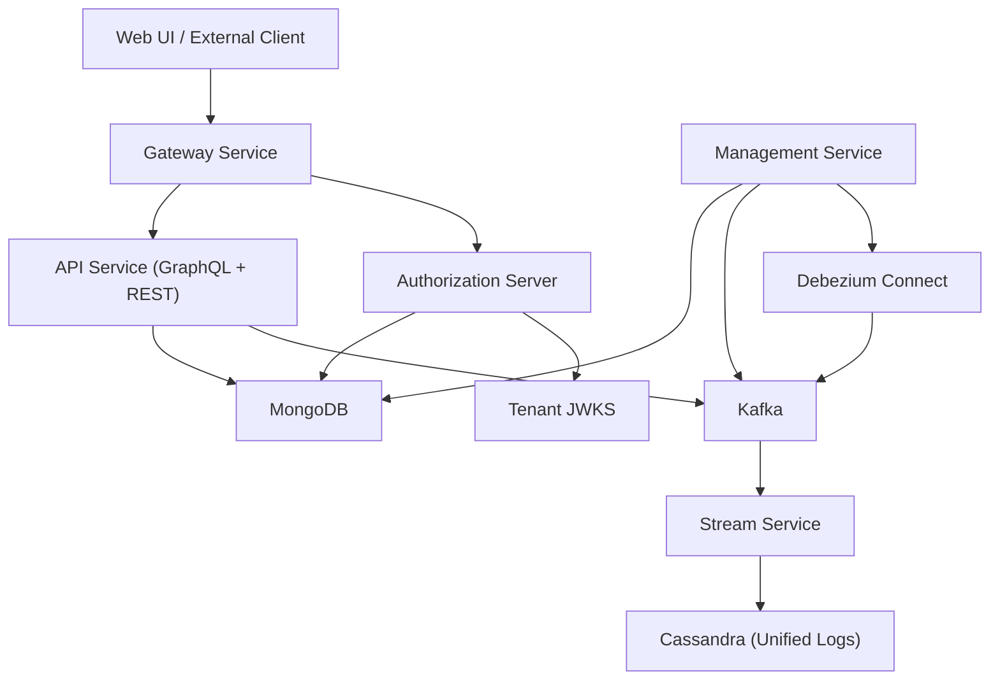

# Introduction to OpenFrame OSS Tenant

**OpenFrame OSS Tenant** is the open-source, multi-tenant backend platform that powers [OpenFrame](https://openframe.ai) — an AI-driven unified platform for Managed Service Providers (MSPs). It replaces expensive proprietary software with open-source alternatives enhanced by intelligent automation.

---

## What is OpenFrame?

[OpenFrame](https://www.flamingo.run/openframe) is the unified platform built by [Flamingo](https://flamingo.run) that integrates multiple MSP tools into a single AI-driven interface. It automates IT support operations across the entire stack — from device monitoring and remote access to ticketing, knowledge management, and AI-powered chat.

The **OpenFrame OSS Tenant** repository provides the complete, production-ready backend stack for this platform, including:

- Multi-tenant identity and OAuth2/OIDC authentication
- Secure edge routing and API gateway
- GraphQL + REST APIs
- Event-driven data processing with Kafka and Debezium
- MongoDB-backed multi-tenant domain modeling
- Distributed orchestration and scheduler management
- Tool integrations (Tactical RMM, MeshCentral, FleetDM, and more)

---

## Key Features and Benefits

| Feature | Description |
|---------|-------------|
| **Multi-Tenant Architecture** | Tenant-scoped data, signing keys, and OAuth2 flows — complete isolation per client |
| **OAuth2 / OIDC Compliant** | Full authorization server with PKCE, SSO (Google, Microsoft), and per-tenant RSA keys |
| **GraphQL + Relay** | Netflix DGS-powered GraphQL with cursor-based pagination and DataLoader N+1 mitigation |
| **Event-Driven CDC** | Kafka + Debezium change data capture for real-time tool synchronization |
| **Reactive Gateway** | Spring WebFlux-based edge layer with JWT validation, API key rate limiting, and WebSocket proxying |
| **AI-Powered Assistance** | Mingo AI for technicians, Fae for clients — built into the platform fabric |
| **Open Source** | Apache-licensed, community-driven, and designed to replace expensive vendor lock-in |
| **Pluggable Tool Routing** | Support for Tactical RMM, MeshCentral, FleetDM, and custom tool upstreams |

---

## Target Audience

This project is designed for:

- **MSP engineers** building or customizing their own managed services platform
- **Backend developers** extending the OpenFrame API and service layer
- **DevOps engineers** deploying and operating the OpenFrame infrastructure
- **Open-source contributors** who want to improve the MSP tooling ecosystem

---

## Platform Architecture Overview

The OpenFrame OSS Tenant is a modular microservice architecture. At runtime, services communicate through a layered, event-driven topology:

```mermaid
flowchart TD
    Browser["Web UI / External Client"] --> Gateway["Gateway Service"]
    Gateway --> Api["API Service (GraphQL + REST)"]
    Gateway --> Authz["Authorization Server"]

    Api --> Mongo["MongoDB"]
    Api --> Kafka["Kafka"]

    Authz --> Mongo
    Authz --> JWKS["Tenant JWKS"]

    Kafka --> Stream["Stream Service"]
    Stream --> Cassandra["Cassandra (Unified Logs)"]

    Management["Management Service"] --> Mongo
    Management --> Kafka
    Management --> Debezium["Debezium Connect"]

    Debezium --> Kafka
```

### Core Services

| Service | Purpose |
|---------|---------|
| **Gateway** | Reactive edge routing, JWT validation, API key auth, WebSocket proxy |
| **API Service** | GraphQL + REST business API surface |
| **Authorization Server** | OAuth2 / OIDC identity provider, multi-tenant SSO |
| **Stream Service** | Kafka-based event processing and CDC |
| **Management Service** | Operational control plane, schedulers, migrations |
| **External API** | Public REST API for integrations |
| **Config Server** | Centralized Spring Cloud Config |

---

## Technology Stack

**Backend (Java)**
- Java 21
- Spring Boot 3.3 (Spring Framework 6)
- Spring Cloud Gateway (reactive edge)
- Spring Authorization Server (OAuth2 / OIDC)
- Netflix DGS (GraphQL)
- Apache Kafka + Debezium (CDC)
- MongoDB (primary datastore)
- Redis (caching, rate limiting, distributed locks)
- NATS (messaging for agents)
- Apache Cassandra (unified log storage)
- Apache Pinot (analytics)

**AI & Automation Layer (Node.js)**
- `@voltagent/core` (agent orchestration)
- `@ai-sdk/anthropic` + `@anthropic-ai/sdk` (Claude AI)
- `zod` (schema validation)

**Frontend (Next.js)**
- Next.js 15 (React 19 App Router)
- `@flamingo-stack/openframe-frontend-core` (shared UI library)
- Relay (GraphQL client)
- TanStack Query

---

## Community and Support

OpenFrame is developed by [Flamingo](https://flamingo.run) and an active open-source community. All discussions, issues, and feature requests are managed through the **OpenMSP Slack community**.

> **Join the Community:** [OpenMSP Slack](https://join.slack.com/t/openmsp/shared_invite/zt-36bl7mx0h-3~U2nFH6nqHqoTPXMaHEHA)
> 
> Website: [https://www.openmsp.ai/](https://www.openmsp.ai/)

---

## Quick Navigation

After reading this introduction, continue with:

- [Prerequisites](prerequisites.md) — Required software, tools, and accounts
- [Quick Start](quick-start.md) — Get running in 5 minutes
- [First Steps](first-steps.md) — What to do after your first setup
