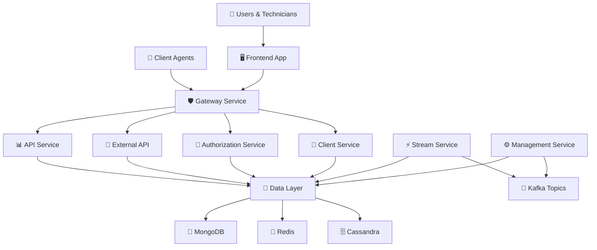

# OpenFrame - Introduction

Welcome to OpenFrame, the open-source unified MSP platform that replaces expensive proprietary software with intelligent automation and AI-powered tools.

## What is OpenFrame?

OpenFrame is a **distributed microservices platform** designed for Managed Service Providers (MSPs) to consolidate their entire technology stack into a single, AI-driven interface. Built by [Flamingo](https://flamingo.run), OpenFrame integrates multiple MSP tools and automates IT support operations across the stack.

### Key Components

OpenFrame consists of two main AI assistants and a unified platform:

- **Mingo AI** - AI technician for IT professionals
- **Fae** - AI assistant for clients  
- **OpenFrame Platform** - Unified interface that integrates multiple MSP tools

## Core Features and Benefits

### 🤖 AI-Powered Automation
- Autonomous incident triage and alert management
- Intelligent device monitoring and maintenance
- Automated script execution and policy management
- Smart log analysis and troubleshooting

### 🔧 Unified Tool Integration
- Replace expensive proprietary software with open-source alternatives
- Integrate existing tools (TacticalRMM, Fleet, MeshCentral, Authentik)
- Single pane of glass for all MSP operations
- Standardized APIs and GraphQL interface

### 👥 Multi-Tenant Architecture
- Secure tenant isolation
- OAuth2/OpenID Connect authentication
- Role-based access controls
- Enterprise SSO integration

### 📊 Real-Time Monitoring
- Live device status and health metrics
- Event streaming with Kafka
- Real-time alerts and notifications  
- Comprehensive audit logging

## Target Audience

OpenFrame is designed for:

- **MSPs** seeking to reduce software costs and improve efficiency
- **IT Professionals** managing multiple client environments
- **Organizations** wanting unified IT management
- **Developers** building MSP tools and integrations

## Architecture Overview

OpenFrame follows a microservices architecture with clear separation of concerns:

```mermaid
flowchart TD
    User[👤 Users & Technicians] --> Frontend[🖥️ Frontend App]
    Agent[🤖 Client Agents] --> Gateway[🛡️ Gateway Service]

    Frontend --> Gateway
    Gateway --> Api[📊 API Service]
    Gateway --> ExternalApi[🔌 External API]
    Gateway --> Auth[🔐 Authorization Service]
    Gateway --> Client[📱 Client Service]

    Api --> Data[💾 Data Layer]
    ExternalApi --> Data
    Auth --> Data
    Client --> Data

    Stream[⚡ Stream Service] --> Data
    Stream --> Kafka[📨 Kafka Topics]

    Management[⚙️ Management Service] --> Data
    Management --> Kafka

    Data --> MongoDB[🍃 MongoDB]
    Data --> Redis[🔴 Redis]
    Data --> Cassandra[🗄️ Cassandra]
```

### Technology Stack

| Layer | Technologies |
|-------|--------------|
| **Frontend** | React/Next.js 16, TypeScript, Apollo GraphQL, Tailwind CSS |
| **Backend** | Java 21, Spring Boot 3.3, Spring Cloud, Netflix DGS GraphQL |
| **Authentication** | OAuth2, OpenID Connect, JWT, Spring Security |
| **Data** | MongoDB 7.x, Cassandra 4.x, Redis, Apache Pinot |
| **Messaging** | Apache Kafka 3.6 |
| **Client Agent** | Rust (cross-platform) |

## Key Design Principles

### 🛡️ Gateway-First Security
All traffic flows through the API Gateway where authentication, authorization, CORS, rate limits, and tenant isolation are enforced.

### 🔧 Thin Services, Strong Cores  
Service entrypoints contain minimal logic - all business logic lives in reusable service-core libraries.

### 🏢 Multi-Tenant by Default
Tenant context is enforced across OAuth, JWTs, Kafka, MongoDB, Redis, and all caching layers.

### ⚡ Event-Driven Architecture
Kafka, Debezium, and Stream Service normalize events across tools and agents for real-time processing.

## Benefits Over Traditional MSP Stacks

| Traditional MSP Tools | OpenFrame |
|----------------------|-----------|
| Multiple expensive licenses | Single open-source platform |
| Disconnected tools | Unified interface |
| Manual processes | AI-powered automation |
| Vendor lock-in | Open ecosystem |
| High complexity | Simplified operations |

## Getting Started

Ready to explore OpenFrame? Check out these essential guides:

- **[Prerequisites](prerequisites.md)** - System requirements and dependencies
- **[Quick Start](quick-start.md)** - 5-minute setup guide
- **[First Steps](first-steps.md)** - Essential configuration after installation

## Community and Support

OpenFrame is developed by the OpenMSP community. Join us for discussions, support, and contributions:

- 🗣️ **OpenMSP Slack**: [https://www.openmsp.ai/](https://www.openmsp.ai/)
- 💬 **Join Community**: [https://join.slack.com/t/openmsp/shared_invite/zt-36bl7mx0h-3~U2nFH6nqHqoTPXMaHEHA](https://join.slack.com/t/openmsp/shared_invite/zt-36bl7mx0h-3~U2nFH6nqHqoTPXMaHEHA)

> **Note**: We don't use GitHub Issues or GitHub Discussions. All coordination happens in the OpenMSP Slack community.

## What's Next?

Now that you understand what OpenFrame is, let's get your environment ready:

1. Review the **[Prerequisites](prerequisites.md)** to ensure your system is compatible
2. Follow the **[Quick Start Guide](quick-start.md)** for a rapid deployment
3. Complete the **[First Steps](first-steps.md)** to configure your first tenant

OpenFrame represents the future of MSP platforms - intelligent, unified, and built for the modern IT landscape.