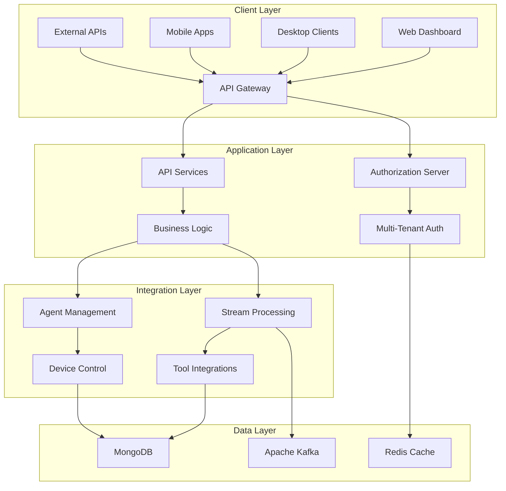

# Introduction to OpenFrame

OpenFrame is an AI-powered unified MSP (Managed Service Provider) platform that replaces expensive proprietary software with open-source alternatives enhanced by intelligent automation. It integrates multiple MSP tools into a single AI-driven interface, automating IT support operations across the entire technology stack.

## What is OpenFrame?

OpenFrame serves as the backbone platform powering **Flamingo** (https://flamingo.run), providing:

- **Unified Platform Integration**: Consolidates multiple MSP tools into a single interface
- **AI-Powered Automation**: Features Mingo AI for technicians and Fae for client interactions  
- **Multi-Tenant Architecture**: Supports multiple organizations with isolated data and configurations
- **Open Source Foundation**: Built on proven open-source technologies with enterprise enhancements

## Key Features and Benefits

### 🚀 **Unified Management Interface**
- Single dashboard for all IT operations
- Consolidated device, organization, and user management
- Real-time monitoring and alerting
- Integrated logging and audit trails

### 🤖 **AI-Driven Automation** 
- Mingo AI assistant for technical operations
- Automated event processing and correlation
- Intelligent incident response and remediation
- Predictive maintenance and optimization

### 🔧 **Integrated Tool Support**
- Native integration with FleetDM, TacticalRMM, MeshCentral
- Tool-agnostic agent management
- Centralized authentication and authorization
- Seamless data synchronization across platforms

### 🏢 **Multi-Tenant Architecture**
- Organization-level data isolation
- Role-based access control
- SSO integration (Google, Microsoft, custom OIDC)
- Scalable tenant provisioning

### 📊 **Real-Time Data Processing**
- Event streaming and normalization
- CDC (Change Data Capture) processing
- Real-time device status monitoring
- Automated compliance reporting

## Target Audience

OpenFrame is designed for:

- **Managed Service Providers (MSPs)** seeking unified operations
- **IT Departments** requiring consolidated management tools  
- **System Administrators** managing diverse technology stacks
- **Organizations** wanting to reduce vendor lock-in and licensing costs
- **Developers** building on open MSP infrastructure

## Technology Overview

OpenFrame is built on a modern, scalable architecture:

```mermaid
graph TD
    subgraph "Client Layer"
        A[Web Dashboard] --> B[API Gateway]
        C[Desktop Clients] --> B
        D[Mobile Apps] --> B
        E[External APIs] --> B
    end

    subgraph "Application Layer" 
        B --> F[API Services]
        B --> G[Authorization Server]
        F --> H[Business Logic]
        G --> I[Multi-Tenant Auth]
    end

    subgraph "Integration Layer"
        H --> J[Stream Processing]
        H --> K[Agent Management] 
        J --> L[Tool Integrations]
        K --> M[Device Control]
    end

    subgraph "Data Layer"
        L --> N[MongoDB]
        M --> N
        J --> O[Apache Kafka]
        I --> P[Redis Cache]
    end
```

### Core Technologies

- **Backend**: Spring Boot 3.3.0 with Java 21
- **Frontend**: AI-enhanced web interface with VoltAgent automation
- **Database**: MongoDB for primary persistence
- **Messaging**: Apache Kafka for event streaming, NATS for real-time communication
- **Caching**: Redis for distributed caching and session management
- **Security**: OAuth2/OIDC with multi-tenant JWT validation
- **Client Agent**: Rust-based cross-platform agent (Windows, macOS, Linux)

## Getting Started

Ready to explore OpenFrame? Here's your path forward:

1. **[Prerequisites](./prerequisites.md)** - System requirements and setup preparation
2. **[Quick Start](./quick-start.md)** - 5-minute installation and first run
3. **[First Steps](./first-steps.md)** - Initial configuration and basic operations

## Product Walkthrough

Get a comprehensive overview of OpenFrame's capabilities:

## Community and Support

OpenFrame is developed openly with community collaboration:

- **OpenMSP Community**: Join our Slack community at https://www.openmsp.ai/
- **Slack Invite**: https://join.slack.com/t/openmsp/shared_invite/zt-36bl7mx0h-3~U2nFH6nqHqoTPXMaHEHA
- **Website**: https://openframe.ai and https://www.flamingo.run/openframe

> **Important**: We don't use GitHub Issues or GitHub Discussions. All support, feature requests, and community interaction happens through our OpenMSP Slack community.

## What's Next?

- Explore the [Prerequisites](./prerequisites.md) to prepare your environment
- Jump into the [Quick Start Guide](./quick-start.md) for immediate hands-on experience
- Review our development documentation for deeper technical insights

OpenFrame represents the future of MSP automation - unified, intelligent, and built on open-source foundations. Welcome aboard!