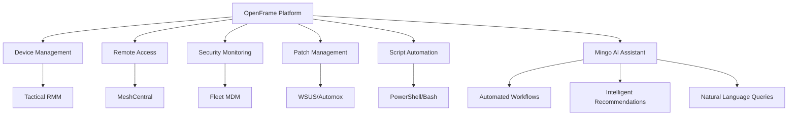
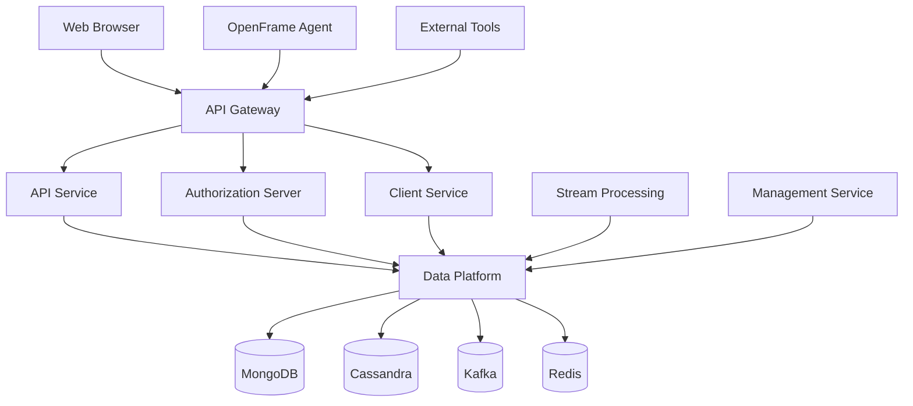

# OpenFrame Introduction

## What is OpenFrame?

**OpenFrame** is the unified platform that integrates multiple MSP (Managed Service Provider) tools into a single AI-driven interface, automating IT support operations across the entire technology stack. Built by **Flamingo** (https://flamingo.run), OpenFrame replaces expensive proprietary software with open-source alternatives enhanced by intelligent automation.

## The Problem We Solve

MSPs traditionally face three major challenges:

- **Fragmented tooling**: Jumping between multiple interfaces reduces efficiency
- **High vendor costs**: Proprietary solutions drain profit margins
- **Manual processes**: Repetitive tasks consume valuable technician time

## OpenFrame's Solution

OpenFrame provides a **unified control plane** that brings all your tools together with AI assistance:

```mermaid
graph TD
    A[OpenFrame Platform] --> B[Device Management]
    A --> C[Remote Access]
    A --> D[Security Monitoring]
    A --> E[Patch Management]
    A --> F[Script Automation]
    
    B --> G[Tactical RMM]
    C --> H[MeshCentral]
    D --> I[Fleet MDM]
    E --> J[WSUS/Automox]
    F --> K[PowerShell/Bash]
    
    A --> L[Mingo AI Assistant]
    L --> M[Automated Workflows]
    L --> N[Intelligent Recommendations]
    L --> O[Natural Language Queries]
```

## Key Features

### 🤖 AI-Powered Assistance
- **Mingo**: Your AI technician assistant for automated troubleshooting
- **Fae**: Client-facing AI for end-user support
- Natural language device queries and automation

### 🔧 Unified Tool Integration
- **Tactical RMM**: Remote monitoring and management
- **MeshCentral**: Remote desktop and file management
- **Fleet MDM**: Device lifecycle and compliance
- **Authentik**: Identity and access management

### 📊 Centralized Management
- Single dashboard for all devices and organizations
- Real-time monitoring and alerting
- Automated patch management and compliance

### 💰 Cost Optimization
- Replace expensive proprietary tools with open-source alternatives
- Reduce licensing costs by up to 80%
- Maximize profit margins through automation

## Architecture Overview

OpenFrame is built as a modern microservices platform:

```mermaid
flowchart TD
    Browser[Web Browser] --> Gateway[API Gateway]
    Agent[OpenFrame Agent] --> Gateway
    Tools[External Tools] --> Gateway
    
    Gateway --> API[API Service]
    Gateway --> Auth[Authorization Server]
    Gateway --> Client[Client Service]
    
    API --> Data[Data Platform]
    Auth --> Data
    Client --> Data
    
    Stream[Stream Processing] --> Data
    Management[Management Service] --> Data
    
    Data --> MongoDB[(MongoDB)]
    Data --> Cassandra[(Cassandra)]
    Data --> Kafka[(Kafka)]
    Data --> Redis[(Redis)]
```

## Target Audience

OpenFrame is designed for:

- **MSPs** looking to modernize their technology stack
- **IT professionals** managing multiple client environments
- **System administrators** seeking automation and efficiency
- **Technology leaders** focused on cost optimization

## Technology Stack

### Backend Services
- **Java 21** with Spring Boot 3.3.0
- **GraphQL** API with Netflix DGS
- **MongoDB** for data persistence
- **Apache Kafka** for event streaming
- **Redis** for caching and sessions

### Frontend
- **Vue 3** with TypeScript
- **PrimeVue** component library
- **Apollo Client** for GraphQL
- **Pinia** for state management

### Client Agent
- **Rust** for cross-platform system monitoring
- Secure agent authentication and registration
- Real-time metrics and heartbeat reporting

## Getting Started Paths

Depending on your role and needs, choose your path:

| Path | Description | Next Steps |
|------|-------------|------------|
| **Quick Demo** | Try OpenFrame in under 5 minutes | [Quick Start Guide](quick-start.md) |
| **Development Setup** | Set up local development environment | [Prerequisites](prerequisites.md) |
| **Production Deployment** | Deploy OpenFrame for your MSP | [Prerequisites](prerequisites.md) → [First Steps](first-steps.md) |

## Community and Support

- **OpenMSP Slack**: Join our community at https://join.slack.com/t/openmsp/shared_invite/zt-36bl7mx0h-3~U2nFH6nqHqoTPXMaHEHA
- **GitHub Issues**: For bug reports and feature requests
- **Documentation**: Comprehensive guides and API references

## What's Next?

1. **Check Prerequisites**: Ensure your environment meets the requirements
2. **Quick Start**: Get OpenFrame running in minutes
3. **First Steps**: Explore key features and configuration options
4. **Deep Dive**: Learn about architecture and development patterns

Ready to transform your MSP operations? Let's get started!

---

> **Note**: OpenFrame is actively developed open-source software. Join our community to stay updated on new features and releases.