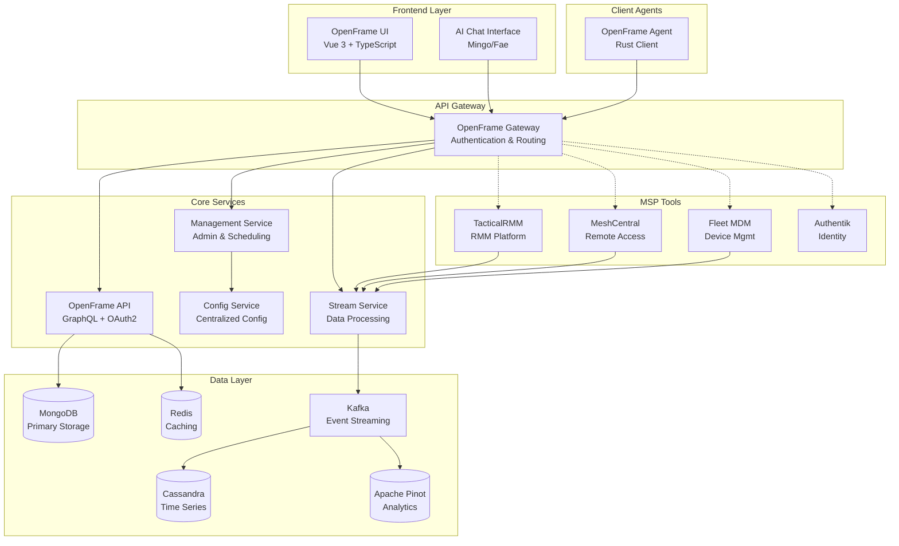

# OpenFrame Introduction

Welcome to OpenFrame - the AI-powered MSP (Managed Service Provider) platform that replaces expensive proprietary software with open-source alternatives enhanced by intelligent automation.

## What is OpenFrame?

OpenFrame is a unified platform that integrates multiple MSP tools into a single AI-driven interface, automating IT support operations across your entire technology stack. Developed by Flamingo (https://flamingo.run), OpenFrame combines the power of open-source tools with intelligent automation through Mingo AI for technicians and Fae for clients.

## Key Features

### 🤖 AI-Powered Automation
- **Mingo AI**: Intelligent assistant for IT technicians with tool execution capabilities
- **Fae**: Client-facing AI assistant for support ticket management
- Automated incident detection and resolution
- Intelligent device monitoring and alerting

### 🔧 Integrated MSP Tools
- **TacticalRMM**: Complete remote monitoring and management
- **MeshCentral**: Secure remote access and file management
- **Fleet MDM**: Mobile device management and compliance
- **Authentik**: Identity and access management

### 🏗️ Modern Architecture
- **Microservices**: Distributed Java/Spring Boot services
- **Real-time**: WebSocket-based live updates
- **Scalable**: Kubernetes-native with Helm charts
- **Secure**: JWT-based authentication with OAuth2/OIDC

### 💻 Cross-Platform Support
- **Backend**: Java 21 with Spring Boot 3.x
- **Frontend**: Vue 3 + TypeScript with modern UI
- **Client Agent**: Rust-based cross-platform agent
- **Deployment**: Docker, Kubernetes, cloud-ready

## System Architecture Overview

```mermaid
graph TB
    subgraph "Frontend Layer"
        UI[OpenFrame UI<br/>Vue 3 + TypeScript]
        Chat[AI Chat Interface<br/>Mingo/Fae]
    end
    
    subgraph "API Gateway"
        Gateway[OpenFrame Gateway<br/>Authentication & Routing]
    end
    
    subgraph "Core Services"
        API[OpenFrame API<br/>GraphQL + OAuth2]
        Management[Management Service<br/>Admin & Scheduling]
        Stream[Stream Service<br/>Data Processing]
        Config[Config Service<br/>Centralized Config]
    end
    
    subgraph "Data Layer"
        MongoDB[(MongoDB<br/>Primary Storage)]
        Cassandra[(Cassandra<br/>Time Series)]
        Pinot[(Apache Pinot<br/>Analytics)]
        Redis[(Redis<br/>Caching)]
        Kafka[Kafka<br/>Event Streaming]
    end
    
    subgraph "MSP Tools"
        Tactical[TacticalRMM<br/>RMM Platform]
        Mesh[MeshCentral<br/>Remote Access]
        Fleet[Fleet MDM<br/>Device Mgmt]
        Auth[Authentik<br/>Identity]
    end
    
    subgraph "Client Agents"
        Rust[OpenFrame Agent<br/>Rust Client]
    end
    
    UI --> Gateway
    Chat --> Gateway
    Gateway --> API
    Gateway --> Management
    Gateway --> Stream
    API --> MongoDB
    Stream --> Kafka
    Kafka --> Cassandra
    Kafka --> Pinot
    API --> Redis
    Management --> Config
    
    Gateway -.-> Tactical
    Gateway -.-> Mesh
    Gateway -.-> Fleet
    Gateway -.-> Auth
    
    Rust --> Gateway
    Tactical --> Stream
    Mesh --> Stream
    Fleet --> Stream
```

## Target Audience

### MSP Providers
- Small to medium MSP businesses looking to reduce software costs
- IT service companies wanting to modernize their tech stack
- Organizations requiring unified tool management

### Developers
- Java/Spring Boot developers working on enterprise platforms
- Frontend developers experienced with Vue.js/TypeScript
- DevOps engineers managing microservices architectures
- Open-source contributors interested in MSP technology

### System Administrators
- IT professionals managing multiple client environments
- Infrastructure engineers deploying scalable platforms
- Security administrators implementing zero-trust architectures

## Benefits

### Cost Reduction
- Replace expensive proprietary MSP tools with open-source alternatives
- Reduce licensing costs by up to 80% compared to traditional solutions
- Eliminate vendor lock-in with open standards

### AI Enhancement
- Automate routine support tasks with intelligent assistants
- Improve response times with automated incident detection
- Enhance client satisfaction with 24/7 AI support

### Unified Management
- Single dashboard for all MSP tools and services
- Consistent user experience across different platforms
- Streamlined workflows and reduced training time

### Enterprise Scale
- Support for thousands of devices and users
- High availability with 99.9% uptime SLA
- Performance optimized for 100,000+ events per second

## Getting Started

Ready to explore OpenFrame? Here's your recommended learning path:

1. **Prerequisites**: Review system requirements and dependencies
2. **Quick Start**: Get OpenFrame running in under 10 minutes
3. **First Steps**: Explore key features and basic configuration
4. **Development**: Set up your development environment for customization

> 📚 **Next Steps**: Continue with the [Prerequisites Guide](prerequisites.md) to ensure your system is ready for OpenFrame installation.

## Community and Support

- **OpenMSP Slack**: Join our community at https://www.openmsp.ai/
- **GitHub**: Contribute to the project and report issues
- **Documentation**: Comprehensive guides for all skill levels
- **Flamingo Platform**: Commercial support and hosted options

OpenFrame represents the future of MSP platforms - combining the flexibility of open source with the intelligence of AI to deliver exceptional value to service providers and their clients.