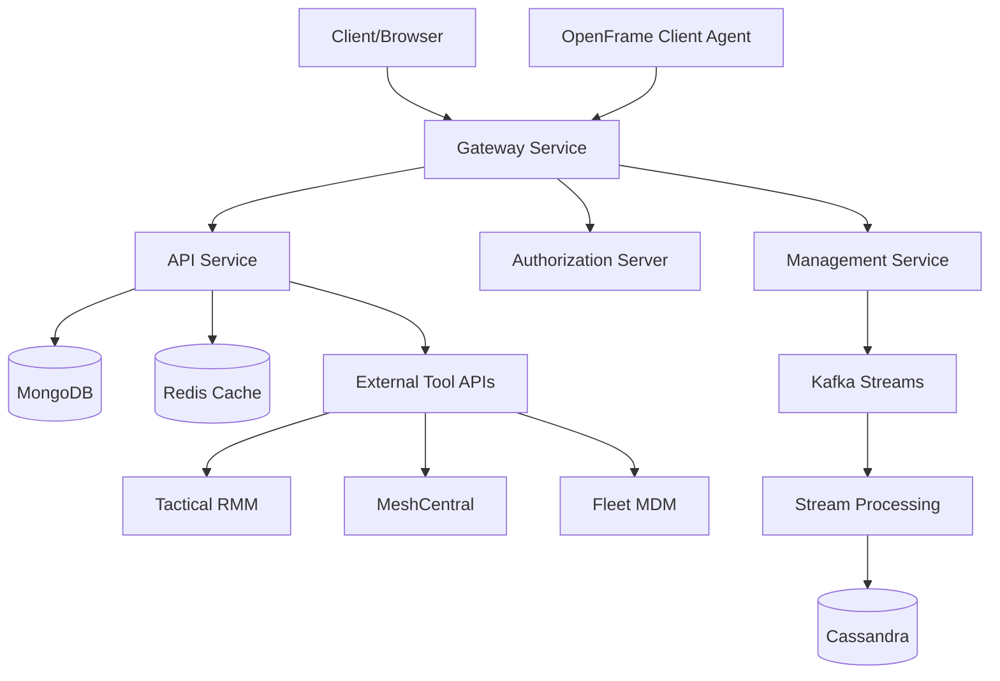

# Introduction to OpenFrame

Welcome to **OpenFrame** - an AI-powered, open-source MSP (Managed Service Provider) platform that revolutionizes IT operations through intelligent automation and unified tooling.

## What is OpenFrame?

OpenFrame is a comprehensive platform designed to replace expensive proprietary MSP software with powerful open-source alternatives enhanced by AI automation. Built by **Flamingo** (https://flamingo.run), it provides MSPs with everything they need to manage client environments efficiently and profitably.

## Key Features

### 🤖 AI-Powered Automation
- **Mingo AI**: Intelligent assistant for technicians that automates routine tasks
- **Fae**: AI companion for clients that handles basic support requests
- Automated incident response and escalation management

### 🔧 Unified Tool Integration
- Seamless integration with popular MSP tools (Tactical RMM, Fleet MDM, MeshCentral, etc.)
- Single dashboard for all your client environments
- Real-time device monitoring and management

### 💰 Cost Reduction
- Replace expensive proprietary solutions with open-source alternatives
- Reduce vendor licensing costs by up to 70%
- Improve profit margins through automation and efficiency

### 🛡️ Enterprise Security
- OAuth2/OpenID Connect authentication
- JWT-based security with HTTP-only cookies
- Multi-tenant architecture with proper data isolation
- Role-based access control (RBAC)

### 📊 Comprehensive Monitoring
- Real-time device health and status monitoring
- Centralized log aggregation and analysis
- Custom dashboards and reporting
- Automated alerting and notifications

## Target Audience

OpenFrame is designed for:

- **MSP Technicians**: Streamline daily operations with AI assistance
- **MSP Business Owners**: Reduce costs and improve margins
- **IT Administrators**: Manage multi-client environments efficiently
- **DevOps Engineers**: Deploy and scale MSP infrastructure

## Architecture Overview

OpenFrame follows a modern microservices architecture with clear separation of concerns:

```mermaid
graph TD
    A[Client/Browser] --> B[Gateway Service]
    C[OpenFrame Client Agent] --> B
    
    B --> D[API Service]
    B --> E[Authorization Server]
    B --> F[Management Service]
    
    D --> G[(MongoDB)]
    D --> H[(Redis Cache)]
    
    F --> I[Kafka Streams]
    I --> J[Stream Processing]
    J --> K[(Cassandra)]
    
    D --> L[External Tool APIs]
    L --> M[Tactical RMM]
    L --> N[MeshCentral]
    L --> O[Fleet MDM]
```

### Core Components

| Component | Purpose | Technology |
|-----------|---------|------------|
| **Gateway Service** | API routing, authentication, WebSocket proxy | Java 21, Spring Boot |
| **API Service** | Main business logic, GraphQL endpoint | Java 21, Spring Boot, Netflix DGS |
| **Authorization Server** | OAuth2/OIDC identity provider | Java 21, Spring Authorization Server |
| **Management Service** | System administration, scheduled tasks | Java 21, Spring Boot |
| **Stream Processing** | Real-time event processing | Java 21, Apache Kafka |
| **Frontend** | Web-based user interface | Vue 3, TypeScript, PrimeVue |
| **Client Agent** | Cross-platform system monitoring | Rust, Tokio |

## Benefits

### For MSP Business Owners
- **Cost Savings**: Reduce licensing costs by 50-70%
- **Improved Margins**: Automation increases efficiency
- **Competitive Edge**: Offer AI-powered services to clients
- **Scalability**: Handle more clients with existing staff

### For Technicians
- **AI Assistant**: Mingo helps with routine tasks and troubleshooting
- **Unified Interface**: Single dashboard for all client tools
- **Automated Workflows**: Reduce manual, repetitive tasks
- **Better Insights**: Comprehensive monitoring and alerting

### For Clients
- **24/7 AI Support**: Fae handles basic requests instantly
- **Faster Resolution**: Automated incident response
- **Proactive Monitoring**: Issues detected before they impact business
- **Transparent Reporting**: Real-time visibility into IT environment

## Open Source Advantage

OpenFrame is built on the principle that MSPs should own their tools, not rent them:

- **No Vendor Lock-in**: Complete control over your platform
- **Customizable**: Extend and modify to fit your needs
- **Community-Driven**: Benefit from shared improvements
- **Transparent**: Full visibility into how your data is handled
- **Future-Proof**: Adapt to changing business needs

## Getting Started

Ready to transform your MSP operations? Here's your path forward:

1. **[Check Prerequisites](prerequisites.md)** - Ensure your environment is ready
2. **[Quick Start Guide](quick-start.md)** - Get OpenFrame running in 5 minutes
3. **[First Steps](first-steps.md)** - Configure your initial setup
4. **[Development Setup](../development/setup/environment.md)** - For customization and extensions

## Community and Support

Join the growing OpenFrame community:

- **Slack Community**: [OpenMSP Slack](https://join.slack.com/t/openmsp/shared_invite/zt-36bl7mx0h-3~U2nFH6nqHqoTPXMaHEHA)
- **Documentation**: Comprehensive guides and API references
- **GitHub**: [OpenFrame Repository](https://github.com/flamingo-stack/openframe-oss-tenant)
- **Website**: [OpenFrame.ai](https://openframe.ai)

## What's Next?

- Explore the [Prerequisites](prerequisites.md) to prepare your environment
- Follow the [Quick Start Guide](quick-start.md) for a rapid deployment
- Learn about the [Development Setup](../development/setup/environment.md) for customizations
- Join our community to share experiences and get support

---

**Ready to revolutionize your MSP operations?** OpenFrame provides the foundation for building a modern, AI-powered managed service practice that delivers exceptional value to clients while maximizing profitability.