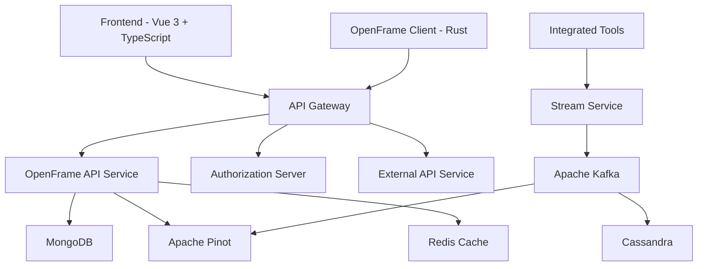

# Introduction to OpenFrame

Welcome to **OpenFrame**, the unified platform that integrates multiple MSP tools into a single AI-driven interface, automating IT support operations across the stack.

## What is OpenFrame?

OpenFrame is part of Flamingo's AI-powered MSP platform that replaces expensive proprietary software with open-source alternatives enhanced by intelligent automation. Built on a modern cloud-native architecture, OpenFrame provides:

- **Unified Device Management** - Monitor and manage devices across your entire IT infrastructure
- **AI-Powered Automation** - Intelligent agents (Mingo AI) that automate ticket triage and infrastructure fixes  
- **Multi-Tenant Architecture** - Secure, scalable platform supporting multiple organizations
- **Open-Source First** - Built on proven open-source technologies with vendor-neutral approach
- **Real-Time Streaming** - Event-driven architecture using Apache Kafka for instant insights
- **Comprehensive APIs** - Both REST and GraphQL APIs for seamless integrations

## Key Features

### 🤖 Autonomous AI Agents
OpenFrame v0.5.2 introduces autonomous AI agents that can actually fix your infrastructure, eliminating the 12+ hours MSPs waste weekly on ticket triage.

### 🏗️ Modern Architecture
Built with cutting-edge technologies for scalability and performance:

```mermaid
graph TD
    A[Frontend - Vue 3 + TypeScript] --> B[API Gateway]
    B --> C[OpenFrame API Service]
    B --> D[Authorization Server]
    B --> E[External API Service]
    
    C --> F[MongoDB]
    C --> G[Apache Pinot]
    C --> H[Redis Cache]
    
    I[Stream Service] --> J[Apache Kafka]
    J --> K[Cassandra]
    J --> G
    
    L[OpenFrame Client - Rust] --> B
    M[Integrated Tools] --> I
```

### 🔒 Enterprise Security
- **Multi-tenant OAuth2/OpenID Connect** with per-tenant signing keys
- **JWT-based authentication** with secure HTTP-only cookies
- **API key management** for external integrations
- **SSO support** for Google, Microsoft, and custom providers

### 📊 Comprehensive Monitoring
- **Real-time device status** and health monitoring
- **Centralized logging** with advanced filtering and search
- **Event streaming** for instant notifications and alerts
- **Performance analytics** with Apache Pinot

### 🔧 Tool Integration
Seamlessly integrate with popular MSP tools:
- **Fleet MDM** for device management
- **Tactical RMM** for remote monitoring
- **MeshCentral** for remote access
- **Custom integrations** via open APIs

## Target Audience

OpenFrame is designed for:

- **Managed Service Providers (MSPs)** looking to modernize their tool stack
- **IT Teams** who want unified device and infrastructure management
- **System Administrators** needing automated monitoring and maintenance
- **DevOps Engineers** seeking cloud-native, scalable solutions
- **Developers** building integrations with MSP platforms

## Architecture Overview

OpenFrame follows a distributed microservices architecture:

| Component | Technology | Purpose |
|-----------|------------|---------|
| **Frontend** | Vue 3 + TypeScript | Modern web interface with real-time updates |
| **API Gateway** | Spring Cloud Gateway | Unified ingress, JWT auth, WebSocket proxying |
| **API Service** | Spring Boot + Netflix DGS | GraphQL/REST APIs, business logic |
| **Authorization Server** | Spring Authorization Server | OAuth2/OIDC, tenant management |
| **Stream Service** | Apache Kafka + Spring | Real-time event processing |
| **Client Agent** | Rust | Cross-platform system agent |
| **Data Layer** | MongoDB + Cassandra + Pinot | Multi-model data storage |

## Getting Started Path

To get started with OpenFrame, follow these guides in order:

1. **[Prerequisites](prerequisites.md)** - System requirements and dependencies
2. **[Quick Start](quick-start.md)** - 5-minute setup and first steps
3. **[First Steps](first-steps.md)** - Essential configuration and exploration

## Community and Support

Join the OpenMSP community for support and collaboration:

- **Slack Community**: [OpenMSP Slack](https://join.slack.com/t/openmsp/shared_invite/zt-36bl7mx0h-3~U2nFH6nqHqoTPXMaHEHA)
- **Website**: [OpenMSP.ai](https://www.openmsp.ai/)
- **OpenFrame**: [openframe.ai](https://openframe.ai)
- **Flamingo Platform**: [flamingo.run](https://flamingo.run)

> **Note**: We manage all development coordination through our OpenMSP Slack community rather than GitHub Issues or Discussions.

## What's Next?

Ready to dive in? Continue with the [Prerequisites Guide](prerequisites.md) to ensure your environment is ready for OpenFrame installation and deployment.