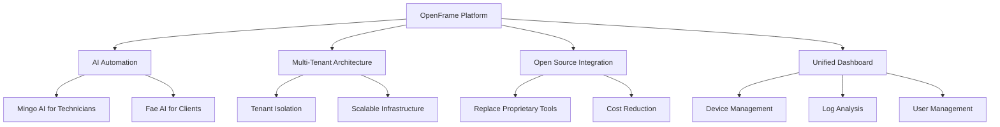
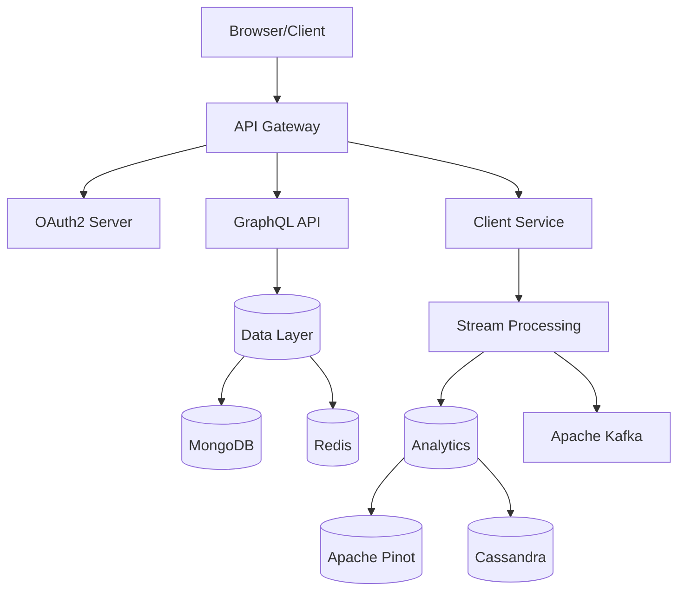

# OpenFrame Introduction

Welcome to **OpenFrame** - the unified AI-powered MSP platform that replaces expensive proprietary software with open-source alternatives enhanced by intelligent automation.

## What is OpenFrame?

OpenFrame is a comprehensive **multi-tenant MSP (Managed Service Provider) platform** that serves as the foundation for the Flamingo AI ecosystem. It provides a complete, production-grade backend stack that integrates multiple MSP tools into a single AI-driven interface, automating IT support operations across the entire technology stack.

```mermaid
graph TD
    A[OpenFrame Platform] --> B[AI Automation]
    A --> C[Multi-Tenant Architecture]
    A --> D[Open Source Integration]
    A --> E[Unified Dashboard]
    
    B --> F[Mingo AI for Technicians]
    B --> G[Fae AI for Clients]
    C --> H[Tenant Isolation]
    C --> I[Scalable Infrastructure]
    D --> J[Replace Proprietary Tools]
    D --> K[Cost Reduction]
    E --> L[Device Management]
    E --> M[Log Analysis]
    E --> N[User Management]
```

## Key Features

### 🤖 **AI-Powered Automation**
- **Mingo AI**: Intelligent assistant for IT technicians
- **Fae AI**: Client-facing support automation
- **Smart Alerting**: AI-driven incident detection and response
- **Automated Remediation**: Self-healing infrastructure capabilities

### 🏢 **Multi-Tenant Architecture** 
- **Strict tenant isolation** at identity, data, and messaging layers
- **Horizontal scalability** for growing MSP businesses
- **Per-tenant OAuth2/OIDC** with custom branding support
- **Independent configuration** per tenant organization

### 🔧 **Unified Tool Integration**
- **Device Management**: Fleet MDM, Tactical RMM, MeshCentral
- **Identity & Access**: SSO with Google, Microsoft, custom OIDC providers
- **Monitoring & Analytics**: Apache Pinot, Kafka streaming, real-time dashboards
- **Security**: JWT-based authentication, API key management, role-based access

### 📊 **Real-Time Data Processing**
- **Event-driven architecture** using Apache Kafka
- **Stream processing** for live data enrichment
- **Analytics-first design** with Apache Pinot and Cassandra
- **WebSocket support** for real-time UI updates

### 🛡️ **Enterprise Security**
- **Gateway-first security model** with JWT validation
- **API key authentication** for external integrations
- **Multi-issuer OAuth2** support for complex tenant scenarios
- **AES-256 encryption** for sensitive data

## Target Audience

### MSP Owners & Operators
- **Reduce vendor costs** by replacing expensive proprietary tools
- **Increase margins** through automation and efficiency gains
- **Scale operations** without proportional staff increases
- **Improve client satisfaction** with AI-powered support

### IT Professionals & Technicians
- **Streamline workflows** with unified dashboard and AI assistance
- **Reduce manual tasks** through intelligent automation
- **Focus on high-value work** while AI handles routine operations
- **Access comprehensive device and log management** in one platform

### Developers & System Integrators
- **Extend platform functionality** through open APIs and SDKs
- **Integrate existing tools** using standard protocols
- **Build custom workflows** with event-driven architecture
- **Deploy on-premises or cloud** with Kubernetes support

## Technology Stack Overview

### Backend Services (Java 21 + Spring Boot)
- **API Gateway**: Security enforcement and routing
- **GraphQL API**: Rich data queries and mutations
- **OAuth2 Server**: Multi-tenant identity provider
- **Stream Processing**: Real-time event handling
- **Management Service**: Platform automation and maintenance

### Frontend (TypeScript + Vue 3)
- **Modern UI**: PrimeVue components with custom design system
- **Real-time Updates**: WebSocket connections for live data
- **Responsive Design**: Works on desktop, tablet, and mobile
- **Progressive Web App**: Offline capability and native feel

### Data Layer
- **MongoDB**: Primary document storage
- **Apache Kafka**: Event streaming and messaging
- **Apache Pinot**: Real-time analytics
- **Cassandra**: Time-series data and logs
- **Redis**: Caching and session management

### Infrastructure
- **Docker**: Containerized deployments
- **Kubernetes**: Container orchestration with Helm charts
- **Istio**: Service mesh for traffic management
- **Prometheus & Grafana**: Monitoring and observability

## Platform Benefits

| Benefit | Description |
|---------|-------------|
| **Cost Reduction** | Replace multiple expensive SaaS tools with single open-source platform |
| **AI Enhancement** | Intelligent automation reduces manual work and improves accuracy |
| **Vendor Independence** | No lock-in to proprietary systems or pricing models |
| **Scalability** | Grows with your business from single tenant to enterprise scale |
| **Customization** | Open source allows modification to fit specific needs |
| **Integration** | Unified API and event system connects all your existing tools |

## Use Cases

### 🏢 **MSP Operations**
- **Client Management**: Multi-tenant isolation with per-client branding
- **Device Monitoring**: Unified view across all client endpoints
- **Incident Response**: AI-powered alert triage and automated remediation
- **Reporting**: Real-time dashboards and historical analytics

### 🔧 **IT Infrastructure**
- **Asset Management**: Complete device lifecycle tracking
- **Log Analysis**: Centralized log collection and AI-powered insights
- **Security Monitoring**: Real-time threat detection and response
- **Compliance Reporting**: Automated compliance checks and documentation

### 👥 **Team Collaboration**  
- **Unified Dashboard**: Single pane of glass for all operations
- **Role-Based Access**: Granular permissions and access control
- **Communication**: Integrated chat and notification systems
- **Knowledge Base**: AI-powered documentation and troubleshooting

## Architecture Highlights

```mermaid
flowchart TD
    Browser[Browser/Client] --> Gateway[API Gateway]
    Gateway --> Auth[OAuth2 Server]
    Gateway --> API[GraphQL API]
    Gateway --> Client[Client Service]
    
    API --> Data[(Data Layer)]
    Client --> Stream[Stream Processing]
    Stream --> Analytics[(Analytics)]
    
    Data --> MongoDB[(MongoDB)]
    Data --> Redis[(Redis)]
    Analytics --> Pinot[(Apache Pinot)]
    Analytics --> Cassandra[(Cassandra)]
    
    Stream --> Kafka[Apache Kafka]
```

## Getting Started Journey

Ready to explore OpenFrame? Here's your next steps:

1. **[Prerequisites](prerequisites.md)** - Ensure your environment is ready
2. **[Quick Start](quick-start.md)** - Get OpenFrame running in 5 minutes  
3. **[First Steps](first-steps.md)** - Explore key features and capabilities
4. **[Development Setup](../development/setup/environment.md)** - Set up for development work

## Community & Support

OpenFrame is built by the team at **Flamingo** (https://flamingo.run) and powered by the **OpenMSP community** (https://www.openmsp.ai/).

- **Slack Community**: Join our OpenMSP Slack for support and discussions
- **Documentation**: Comprehensive guides and API references
- **GitHub**: Open source repositories and issue tracking
- **Video Tutorials**: Step-by-step walkthrough videos

> **Important**: We don't use GitHub Issues or GitHub Discussions. All support and community interaction happens in our OpenMSP Slack community: https://join.slack.com/t/openmsp/shared_invite/zt-36bl7mx0h-3~U2nFH6nqHqoTPXMaHEHA

---

**Next**: Ready to check your system requirements? Continue to [Prerequisites](prerequisites.md) →