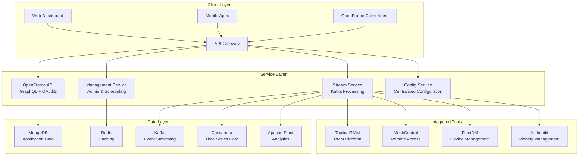

# Introduction to OpenFrame

Welcome to OpenFrame, the unified AI-powered MSP platform that transforms how managed service providers deliver IT support and infrastructure management.

## What is OpenFrame?

OpenFrame is a comprehensive, open-source platform that integrates multiple MSP tools into a single AI-driven interface, automating IT support operations across your entire technology stack. Built with modern microservices architecture and powered by Flamingo's intelligent automation, OpenFrame replaces expensive proprietary software with enhanced open-source alternatives.

## Key Features

### 🤖 AI-Powered Automation
- **Mingo AI**: Intelligent technician assistant for automated troubleshooting and support
- **Fae AI**: Client-facing assistant for streamlined customer interactions
- **Smart Analytics**: AI-driven insights for proactive issue resolution

### 🔧 Unified Tool Integration
- **RMM (Remote Monitoring & Management)**: TacticalRMM integration for endpoint management
- **Remote Access**: MeshCentral for secure device connectivity
- **MDM (Mobile Device Management)**: FleetDM for comprehensive device oversight
- **Identity Management**: Authentik for SSO and user authentication

### 📊 Comprehensive Monitoring
- **Real-time Device Monitoring**: Live status updates and health metrics
- **Centralized Logging**: Unified log collection and analysis across all tools
- **Event Processing**: Kafka-powered stream processing for real-time data ingestion
- **Custom Dashboards**: Configurable views for operational insights

### 🔒 Enterprise Security
- **JWT Authentication**: Secure token-based authentication with HTTP-only cookies
- **OAuth2/OpenID Connect**: Industry-standard authentication protocols
- **Role-Based Access Control**: Granular permissions management
- **Multi-Tenant Architecture**: Secure isolation between client environments

## Platform Architecture

```mermaid
graph TB
    subgraph "Client Layer"
        A[Web Dashboard] --> B[API Gateway]
        C[Mobile Apps] --> B
        D[OpenFrame Client Agent] --> B
    end
    
    subgraph "Service Layer"
        B --> E[OpenFrame API<br/>GraphQL + OAuth2]
        B --> F[Management Service<br/>Admin & Scheduling]
        B --> G[Stream Service<br/>Kafka Processing]
        B --> H[Config Service<br/>Centralized Configuration]
    end
    
    subgraph "Data Layer"
        E --> I[MongoDB<br/>Application Data]
        G --> J[Kafka<br/>Event Streaming]
        G --> K[Cassandra<br/>Time Series Data]
        G --> L[Apache Pinot<br/>Analytics]
        F --> M[Redis<br/>Caching]
    end
    
    subgraph "Integrated Tools"
        N[TacticalRMM<br/>RMM Platform]
        O[MeshCentral<br/>Remote Access]
        P[FleetDM<br/>Device Management]
        Q[Authentik<br/>Identity Management]
    end
    
    G --> N
    G --> O
    G --> P
    G --> Q
```

## Target Audience

OpenFrame is designed for:

### 🏢 Managed Service Providers (MSPs)
- Looking to modernize their technology stack
- Seeking to reduce vendor lock-in and licensing costs
- Wanting to leverage AI for operational efficiency
- Need comprehensive monitoring and management capabilities

### 🔧 IT Departments
- Managing complex multi-vendor environments
- Requiring centralized visibility across infrastructure
- Implementing automation for routine tasks
- Scaling operations without proportional staffing increases

### 💼 Technology Consultants
- Delivering standardized solutions across clients
- Building competitive advantages through modern tooling
- Reducing deployment complexity and time-to-value

## Core Benefits

| Benefit | Description | Impact |
|---------|-------------|--------|
| **Cost Reduction** | Replace expensive proprietary tools with open-source alternatives | 60-80% reduction in tool licensing costs |
| **Operational Efficiency** | AI-powered automation reduces manual intervention | 50% decrease in routine support tickets |
| **Unified Experience** | Single interface for all MSP operations | 40% improvement in technician productivity |
| **Scalability** | Kubernetes-native architecture supports growth | Handle 10x more devices without infrastructure changes |
| **Vendor Independence** | Open-source foundation eliminates vendor lock-in | Full control over roadmap and customization |

## Technology Stack Highlights

### Backend Services
- **Java 21** with Spring Boot 3.3.0 for enterprise-grade reliability
- **GraphQL** API with Netflix DGS for efficient data fetching
- **Apache Kafka 3.6.0** for real-time event processing
- **MongoDB 7.x** for application data with **Apache Pinot 1.2.0** for analytics

### Frontend Experience
- **Vue 3** with TypeScript and Composition API
- **PrimeVue 3.45.0** component library for consistent UI
- **Apollo Client** for GraphQL integration
- **Real-time updates** via WebSocket connections

### Infrastructure
- **Kubernetes 1.28+** with Helm charts for orchestration
- **Docker** containerization for consistent deployments
- **Istio 1.20** service mesh for traffic management
- **Prometheus/Grafana** for comprehensive observability

## Getting Started Path

Ready to begin your OpenFrame journey? Follow this recommended learning path:

1. **[Prerequisites](prerequisites.md)** - Verify your environment is ready
2. **[Quick Start](quick-start.md)** - Get OpenFrame running in 5 minutes
3. **[First Steps](first-steps.md)** - Explore key features and initial configuration

## Community and Support

Join the OpenMSP community for support, discussions, and contributions:

- **Slack Community**: [OpenMSP Slack](https://join.slack.com/t/openmsp/shared_invite/zt-36bl7mx0h-3~U2nFH6nqHqoTPXMaHEHA)
- **Website**: [flamingo.run/openframe](https://www.flamingo.run/openframe)
- **Platform**: [flamingo.run](https://flamingo.run)

> **Note**: OpenFrame follows a community-driven development model. All issues, feature requests, and discussions are managed through our OpenMSP Slack community rather than GitHub Issues.

---

**Next Steps**: Continue to [Prerequisites](prerequisites.md) to prepare your environment for OpenFrame installation.