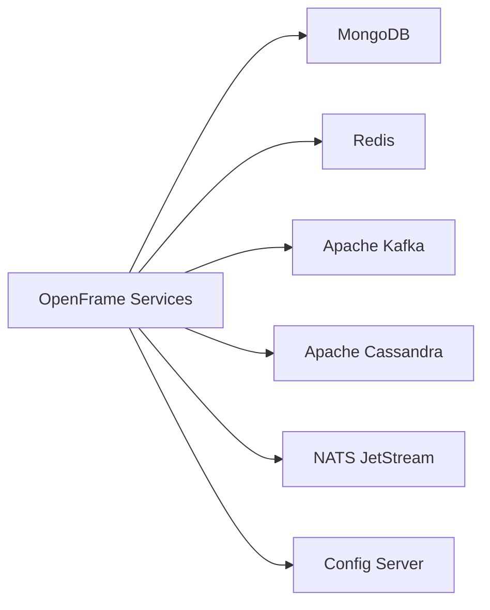

# Prerequisites

Before setting up OpenFrame OSS Tenant, ensure your development or deployment environment meets the following requirements.

---

## Required Software

| Tool | Minimum Version | Purpose |
|---|---|---|
| **Java (JDK)** | 21 | Backend microservices runtime |
| **Maven** | 3.9+ | Build tool for all Java modules |
| **Node.js** | 18+ | Frontend (Next.js) and documentation tooling |
| **npm** or **pnpm** | npm 9+ / pnpm 8+ | Frontend package management |
| **MongoDB** | 6.0+ | Primary persistence layer |
| **Redis** | 7.0+ | Distributed locking, caching, rate limiting |
| **Apache Kafka** | 3.6+ | Durable event messaging |
| **Apache Cassandra** | 4.0+ | Unified log storage (stream processing) |
| **NATS** (with JetStream) | 2.10+ | Real-time agent messaging |
| **Rust** (optional) | 1.75+ | Required only for building the `openframe-client` agent |
| **kubectl** | 1.28+ | Kubernetes deployment (optional) |

---

## System Requirements

### Minimum (Development)

| Resource | Minimum |
|---|---|
| CPU | 4 cores |
| RAM | 8 GB |
| Disk | 20 GB free |
| OS | Linux, macOS, or Windows (with WSL2) |

### Recommended (Production)

| Resource | Recommended |
|---|---|
| CPU | 8+ cores per service node |
| RAM | 16 GB+ per service node |
| Disk | 100 GB+ (SSD) for databases |
| Network | 1 Gbps internal |

---

## Infrastructure Dependencies

OpenFrame OSS Tenant requires the following infrastructure services to be running:



### MongoDB

- Used as the primary data store for all domain entities (tenants, users, devices, tickets, etc.)
- Multi-tenant data with `tenantId` scoping on all collections
- Requires replica set configuration for Debezium CDC support

### Redis

- Powers the distributed scheduler locking (ShedLock)
- Caches machine and organization info
- Used for API key stats and rate limit tracking

### Apache Kafka

- Receives Debezium CDC events from MongoDB
- Used for durable event processing (stream service)
- Topic auto-creation is managed by the Management service

### Apache Cassandra

- Stores unified log events from stream processing
- Designed for time-series querying of audit/activity logs

### NATS JetStream

- Real-time messaging between OpenFrame services and the Rust agent (`openframe-client`)
- Streams provisioned at startup by the Management service

---

## Environment Variables

OpenFrame services are configured via Spring Cloud Config Server. Key environment variable categories:

| Category | Examples |
|---|---|
| **MongoDB** | `SPRING_DATA_MONGODB_URI`, `SPRING_DATA_MONGODB_DATABASE` |
| **Redis** | `SPRING_REDIS_HOST`, `SPRING_REDIS_PORT` |
| **Kafka** | `SPRING_KAFKA_BOOTSTRAP_SERVERS` |
| **NATS** | `NATS_URL` |
| **Cassandra** | `SPRING_CASSANDRA_CONTACT_POINTS` |
| **Security** | `JWT_ISSUER_URI`, `JWT_PUBLIC_KEY` |
| **External Tools** | Tool-specific API keys and URLs (configured at runtime via the management API) |

> Refer to your environment configuration files for actual values. Defaults for local development are typically set in the Config Server's configuration repository.

---

## Account & Access Requirements

| Requirement | Description |
|---|---|
| **GitHub Access** | To clone this repository and `openframe-oss-lib` dependency |
| **Maven Repository Access** | For OpenFrame OSS library artifacts (`com.openframe.oss`) |
| **OpenMSP Slack (optional)** | For community support and questions |

The OpenFrame OSS library artifacts are published to a Maven repository. Ensure your `~/.m2/settings.xml` has credentials configured if the repository requires authentication.

---

## Kubernetes (Optional)

If deploying to Kubernetes, you will additionally need:

| Tool | Minimum Version |
|---|---|
| **kubectl** | 1.28+ |
| **Helm** | 3.14+ |
| **A running K8s cluster** | 1.28+ (e.g., kind, k3s, GKE, EKS, AKS) |

Kubernetes manifests are available under the `manifests/` directory.

---

## Verification Checklist

Run these commands to verify your environment is ready:

```bash
# Java 21
java --version
# Expected: openjdk 21.x.x or similar

# Maven
mvn --version
# Expected: Apache Maven 3.9.x

# Node.js
node --version
# Expected: v18.x.x or higher

# npm
npm --version
# Expected: 9.x.x or higher

# MongoDB (if running locally)
mongosh --eval "db.version()"

# Redis (if running locally)
redis-cli ping
# Expected: PONG

# Kafka (if running locally)
kafka-topics.sh --version

# NATS (if running locally)
nats-server --version
```

---

## OpenFrame OSS Library

This repository depends on `openframe-oss-lib` which provides shared libraries. Ensure the following version is available in your Maven repository:

| Library | Version |
|---|---|
| `com.openframe.oss:openframe-core` | `5.64.0` |
| `com.openframe.oss:openframe-api-lib` | `5.64.0` |
| `com.openframe.oss:openframe-security-core` | `5.64.0` |
| `com.openframe.oss:openframe-data-mongo-*` | `5.64.0` |

The parent POM (`pom.xml`) manages all library versions via the `openframe.libs.version` property.

---

## Next Steps

Once your environment is ready:

- Follow the [Quick Start](quick-start.md) guide to get the platform running
- Review the [First Steps](first-steps.md) guide to explore key features
