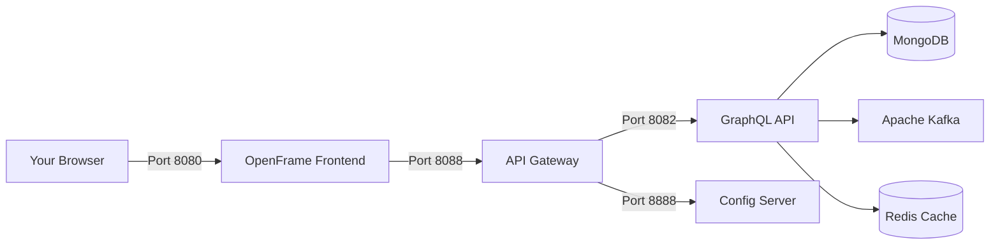

# Quick Start Guide

Get OpenFrame up and running in just 5 minutes! This guide provides the fastest path to a working OpenFrame installation.

[](https://www.youtube.com/watch?v=a45pzxtg27k)

## Before You Begin

Ensure you have completed the [Prerequisites](prerequisites.md) setup:
- ✅ Java 21 and Maven 3.9+ installed
- ✅ Docker and Docker Compose running  
- ✅ GitHub Personal Access Token ready
- ✅ Required ports (8080, 8088, 8082) available

## 1. Clone the Repository

```bash
# Clone the main repository
git clone https://github.com/flamingo-stack/openframe-oss-tenant.git
cd openframe-oss-tenant

# Set your GitHub token
export GITHUB_TOKEN=your_github_personal_access_token_here
```

## 2. Quick Setup Script

OpenFrame includes platform-specific startup scripts for instant deployment:

### macOS
```bash
./scripts/run-mac.sh --silent
```

### Linux
```bash
./scripts/run-linux.sh --silent
```

### Windows (PowerShell)
```powershell
.\scripts\run-windows.ps1 -Silent
```

The `--silent` flag skips interactive prompts and uses sensible defaults.

## 3. Build the Platform

While the setup script configures your environment, build OpenFrame:

```bash
# Build all Java services and libraries
mvn clean install -DskipTests

# This will take 3-5 minutes on first run
# Subsequent builds are much faster due to Maven cache
```

## 4. Start Core Services

Launch the essential services using Docker Compose:

```bash
# Start data platform (MongoDB, Kafka, Redis)
docker-compose -f integrated-tools/docker-compose.openframe-data.yml up -d

# Start OpenFrame services
docker-compose -f docker-compose.yml up -d

# Check service status
docker-compose ps
```

Expected output:
```text
Name                    Command               State           Ports
------------------------------------------------------------------------
openframe-gateway      java -jar gateway.jar    Up      0.0.0.0:8088->8088/tcp
openframe-api          java -jar api.jar        Up      0.0.0.0:8082->8082/tcp
openframe-frontend     nginx                    Up      0.0.0.0:8080->80/tcp
```

## 5. Verify Installation

Check that all services are healthy:

```bash
# Test API Gateway
curl http://localhost:8088/health
# Expected: {"status":"UP"}

# Test GraphQL API  
curl http://localhost:8082/actuator/health
# Expected: {"status":"UP"}

# Test Frontend
curl -I http://localhost:8080
# Expected: HTTP/1.1 200 OK
```

## 6. Access the Dashboard

Open your browser and navigate to:

**🌐 OpenFrame Dashboard**: http://localhost:8080

You should see the OpenFrame welcome screen with options to:
- Create your first tenant organization
- Set up user authentication
- Configure integrated tools

## 7. First Login

### Create Initial User Account

1. Click **"Sign Up"** on the login screen
2. Fill in your details:
   - **Email**: `admin@your-domain.com`
   - **Password**: Choose a secure password
   - **Organization**: Your MSP company name
3. Click **"Create Account"**

### Complete Organization Setup

After registration, you'll be guided through:
- Organization profile completion
- Initial user role assignment  
- Basic configuration preferences

## Expected Results

After successful setup, you should have:

- ✅ **OpenFrame Dashboard** accessible at http://localhost:8080
- ✅ **GraphQL Playground** accessible at http://localhost:8082/graphql
- ✅ **API Gateway** routing traffic at http://localhost:8088
- ✅ **Config Server** managing settings at http://localhost:8888
- ✅ **Data services** (MongoDB, Kafka, Redis) running
- ✅ **Your first organization** created and configured

## Service Architecture

Your running OpenFrame instance includes:



## Quick Validation Tests

Run these commands to verify everything works:

```bash
# Test GraphQL endpoint
curl -X POST http://localhost:8082/graphql \
  -H "Content-Type: application/json" \
  -d '{"query":"{ organizations { id name } }"}'

# Test API Gateway routing
curl http://localhost:8088/api/health

# Check Docker container status
docker-compose logs --tail=20 openframe-api
docker-compose logs --tail=20 openframe-gateway
```

## Quick Troubleshooting

### Services Won't Start

```bash
# Check port conflicts
netstat -an | grep :8080

# View service logs
docker-compose logs openframe-api
docker-compose logs openframe-gateway

# Restart specific service
docker-compose restart openframe-api
```

### Build Failures

```bash
# Clean Maven cache
rm -rf ~/.m2/repository

# Retry with verbose output
mvn clean install -X

# Skip tests if needed for quick setup
mvn clean install -DskipTests
```

### Can't Access Dashboard

```bash
# Check frontend logs
docker-compose logs openframe-frontend

# Verify port binding
docker port openframe-frontend

# Test direct access
curl -v http://localhost:8080
```

## Next Steps

Congratulations! You now have OpenFrame running locally. Continue with:

- [First Steps](first-steps.md) - Essential configuration and setup
- Development guides for customization and integration
- Production deployment for live environments

## Get Help

If you encounter issues:

1. **Check the logs**: `docker-compose logs [service-name]`
2. **Join OpenMSP Slack**: [Community support](https://join.slack.com/t/openmsp/shared_invite/zt-36bl7mx0h-3~U2nFH6nqHqoTPXMaHEHA)
3. **Review troubleshooting**: Common solutions in our docs
4. **GitHub Issues**: Report bugs and request features

---

**🎉 Success!** You've successfully deployed OpenFrame in under 5 minutes. Your unified MSP platform is ready for configuration and customization!