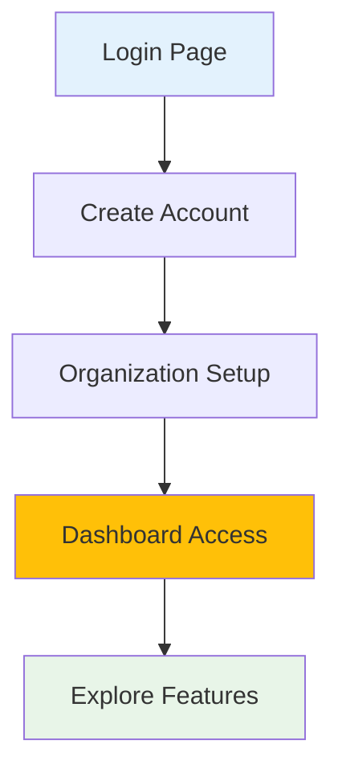

# Quick Start Guide

Get OpenFrame up and running in under 5 minutes with this streamlined setup guide. This will get you a working development environment suitable for exploring OpenFrame's capabilities.

> **Prerequisites Check**  
> ✅ Ensure you've completed the [Prerequisites Guide](prerequisites.md) before proceeding.

## TL;DR - 5-Minute Setup

For experienced developers who want to jump straight in:

```bash
# 1. Clone the repository
git clone https://github.com/flamingo-stack/openframe-oss-tenant.git
cd openframe-oss-tenant

# 2. Run platform-specific startup script
./scripts/run-mac.sh --silent     # macOS
# ./scripts/run-linux.sh --silent  # Linux
# ./scripts/run-windows.ps1        # Windows

# 3. Access the application
open http://localhost:8080
```

Expected result: OpenFrame login screen accessible at http://localhost:8080

---

## Step-by-Step Setup

### Step 1: Clone the Repository

```bash
# Clone the main repository
git clone https://github.com/flamingo-stack/openframe-oss-tenant.git
cd openframe-oss-tenant

# Verify the structure
ls -la
# Expected: openframe/, client/, scripts/, manifests/, etc.
```

### Step 2: Environment Configuration

Create your local environment configuration:

```bash
# Copy the example environment file
cp .env.example .env

# Edit with your GitHub token (required)
nano .env
# or
vim .env
```

**Required environment variables:**

```bash
# GitHub Authentication (REQUIRED)
GITHUB_TOKEN=ghp_your_github_personal_access_token_here

# Development Database URLs (Auto-configured by scripts)
MONGODB_URI=mongodb://localhost:27017/openframe
REDIS_URL=redis://localhost:6379
KAFKA_BOOTSTRAP_SERVERS=localhost:9092

# JWT Secrets (Development - Auto-generated)
JWT_SECRET=development-jwt-secret-32-chars-minimum
ENCRYPTION_KEY=development-encryption-key-32-chars
```

### Step 3: Run Startup Script

Choose your platform-specific startup script:

#### macOS
```bash
# Interactive mode (recommended for first-time setup)
./scripts/run-mac.sh

# Silent mode (no prompts)
./scripts/run-mac.sh --silent
```

#### Linux
```bash
# Interactive mode
./scripts/run-linux.sh

# Silent mode
./scripts/run-linux.sh --silent
```

#### Windows PowerShell
```powershell
# Run in PowerShell as Administrator
./scripts/run-windows.ps1
```

### Step 4: What the Script Does

The startup script automatically:

1. **Validates Prerequisites**: Checks Java, Maven, Node.js, Docker
2. **Starts Infrastructure**: MongoDB, Redis, Kafka via Docker Compose
3. **Builds Backend Services**: Maven build of all Java components
4. **Installs Frontend Dependencies**: npm install for Vue.js UI
5. **Starts All Services**: Launches the complete OpenFrame stack

### Step 5: Verify Installation

#### Check Service Status

```bash
# Check Docker containers
docker compose ps

# Expected output:
# mongodb         running     27017/tcp
# redis           running     6379/tcp  
# kafka           running     9092/tcp
# zookeeper       running     2181/tcp
```

#### Verify Service URLs

| Service | URL | Expected Response |
|---------|-----|-------------------|
| **Frontend UI** | http://localhost:8080 | OpenFrame login page |
| **GraphQL API** | http://localhost:8080/graphql | GraphQL Playground |
| **Health Check** | http://localhost:8080/actuator/health | `{"status":"UP"}` |
| **Configuration Server** | http://localhost:8888 | Spring Cloud Config |

#### Test Basic Functionality

```bash
# Test API health
curl http://localhost:8080/actuator/health

# Expected response:
# {"status":"UP","components":{"diskSpace":{"status":"UP"},...}}

# Test GraphQL endpoint
curl -X POST http://localhost:8080/graphql \
  -H "Content-Type: application/json" \
  -d '{"query":"query { __schema { queryType { name } } }"}'

# Expected: GraphQL schema information
```

## First Login

### Create Admin Account

1. **Access the UI**: Open http://localhost:8080
2. **Registration Flow**: Click "Sign Up" (first user becomes admin)
3. **Fill Details**:
   - **Email**: admin@localhost.dev
   - **Password**: Choose a secure password
   - **Organization**: Your Company Name
4. **Complete Setup**: Follow the onboarding wizard

### Verify Dashboard Access

After login, you should see:

- **Dashboard**: Overview of system status
- **Devices**: Device management interface (initially empty)
- **Organizations**: Your organization details
- **Settings**: Configuration options



## Quick Feature Exploration

### Explore the Dashboard

1. **Navigation**: Use the left sidebar to explore sections
2. **Organizations**: View and edit your organization
3. **Settings**: Configure integrations and preferences
4. **API Keys**: Generate keys for external access

### Test Real-Time Features

1. **Live Data**: Dashboard updates in real-time
2. **WebSocket Connection**: Check browser developer tools for active WebSocket
3. **Event Streaming**: Background Kafka processing

## Basic Configuration

### Enable Tool Integrations

OpenFrame includes several integrated tools for testing:

```bash
# Start Tactical RMM (optional)
cd integrated-tools/tactical-rmm
docker compose up -d

# Start MeshCentral (optional)  
cd ../meshcentral
docker compose up -d

# Return to main directory
cd ../..
```

### Configure External Tools

1. Go to **Settings** → **Integrations**
2. Add tool connections:
   - **Tactical RMM**: http://localhost:8001
   - **MeshCentral**: http://localhost:443

## Troubleshooting Quick Start

### Common Issues & Solutions

#### Port Conflicts
**Error**: `Port 8080 already in use`

```bash
# Check what's using the port
sudo lsof -i :8080

# Kill the process or change OpenFrame port
export SERVER_PORT=8081
./scripts/run-mac.sh --silent
```

#### Database Connection Issues
**Error**: `Cannot connect to MongoDB`

```bash
# Restart database containers
docker compose down
docker compose up -d mongodb redis kafka

# Wait 30 seconds, then restart OpenFrame
./scripts/run-mac.sh --silent
```

#### Build Failures
**Error**: `Maven build failed`

```bash
# Clean and retry
mvn clean
./scripts/run-mac.sh --silent

# Check Java version
java --version  # Should be 21+
```

#### Frontend Issues
**Error**: `npm install failed`

```bash
# Clear npm cache
npm cache clean --force

# Reinstall dependencies
cd openframe/services/openframe-frontend
rm -rf node_modules package-lock.json
npm install
```

### Getting Help

If you encounter issues:

1. **Check logs**: `docker compose logs` for infrastructure
2. **Review console output**: Script output shows detailed error messages
3. **Community support**: Join our OpenMSP Slack community

## Next Steps

🎉 **Congratulations!** You have OpenFrame running locally.

### Immediate Next Steps

> **Recommended Path**
> 
> 1. **[First Steps Guide](first-steps.md)** - Essential configuration and initial tasks
> 2. **Development Setup** - [Environment Setup](../development/setup/environment.md) for advanced development
> 3. **Feature Exploration** - Try device management, user administration, and integrations

### Production Considerations

This quick start creates a **development environment**. For production deployment:

- Use external databases (not Docker containers)
- Configure proper SSL/TLS certificates
- Set up monitoring and logging
- Follow security hardening guidelines

### Learning Resources

- **API Documentation**: http://localhost:8080/graphql for GraphQL exploration
- **Architecture Overview**: Review the [system architecture](../development/architecture/overview.md)
- **Video Walkthrough**: 

[](https://www.youtube.com/watch?v=awc-yAnkhIo)

---

**Quick start complete!** Continue to [First Steps](first-steps.md) to begin configuring your OpenFrame installation.