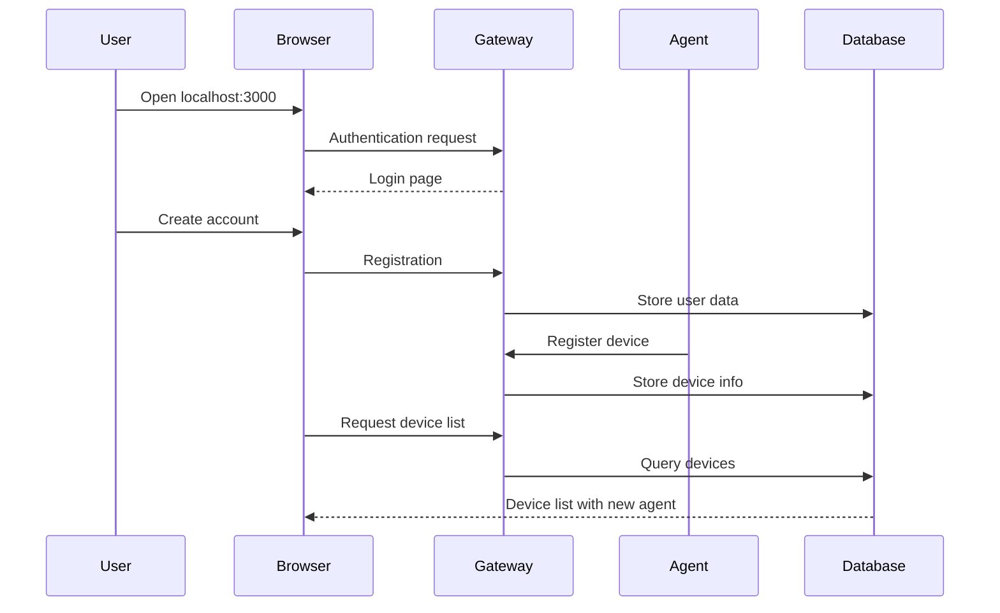

# Quick Start Guide

Get OpenFrame up and running in under 10 minutes with this streamlined installation guide. This guide uses Docker Compose for the fastest setup experience.

## TL;DR - 5-Minute Setup

```bash
# Clone the repository
git clone https://github.com/flamingo-stack/openframe-oss-tenant.git
cd openframe-oss-tenant

# Run setup script (automatically detects your OS)
./scripts/run-linux.sh --silent    # Linux
./scripts/run-mac.sh --silent      # macOS  
./scripts/run-windows.ps1 -Silent  # Windows PowerShell

# Wait for services to start (2-3 minutes)
# Access OpenFrame at http://localhost:3000
```

> **Prerequisites**: Ensure [Docker](https://docs.docker.com/get-docker/) and [Docker Compose](https://docs.docker.com/compose/install/) are installed. See our [Prerequisites Guide](prerequisites.md) for details.

## Step-by-Step Installation

### Step 1: Clone the Repository

```bash
# Clone the main repository
git clone https://github.com/flamingo-stack/openframe-oss-tenant.git

# Navigate to the project directory
cd openframe-oss-tenant

# Verify repository structure
ls -la
# Should show: openframe/, clients/, integrated-tools/, scripts/, etc.
```

### Step 2: Choose Your Platform

OpenFrame provides platform-specific startup scripts for optimal experience:

#### Linux Setup
```bash
# Make script executable
chmod +x scripts/run-linux.sh

# Run with guided setup (recommended for first time)
./scripts/run-linux.sh

# Or run silently (uses defaults)
./scripts/run-linux.sh --silent
```

#### macOS Setup  
```bash
# Make script executable
chmod +x scripts/run-mac.sh

# Run with guided setup
./scripts/run-mac.sh

# Or run silently
./scripts/run-mac.sh --silent
```

#### Windows Setup (PowerShell)
```powershell
# Run with guided setup
.\scripts\run-windows.ps1

# Or run silently
.\scripts\run-windows.ps1 -Silent
```

### Step 3: Wait for Services to Initialize

The startup script will:

1. **Pull required Docker images** (2-3 minutes)
2. **Start data layer services** (MongoDB, Kafka, Redis, etc.)
3. **Initialize databases and topics**
4. **Build and start OpenFrame services**
5. **Start the frontend application**

Watch for this success message:
```text
✅ OpenFrame is ready!
🌐 Frontend: http://localhost:3000
🔧 API Gateway: http://localhost:8080
📊 Management: http://localhost:8083
```

### Step 4: Access OpenFrame

1. **Open your browser** to [http://localhost:3000](http://localhost:3000)
2. **Create your admin account** when prompted
3. **Set up your organization** details
4. **Explore the OpenFrame dashboard**

## Default Configuration

The quick start uses these default settings:

| Component | URL | Credentials |
|-----------|-----|-------------|
| **OpenFrame Frontend** | http://localhost:3000 | Create during setup |
| **API Gateway** | http://localhost:8080 | JWT authentication |
| **MongoDB** | mongodb://localhost:27017 | No authentication |
| **Redis** | redis://localhost:6379 | No authentication |
| **Kafka UI** | http://localhost:8081 | No authentication |

> **Security Note**: These defaults are for development only. Production deployments require proper authentication and SSL certificates.

## "Hello World" Example

Once OpenFrame is running, try these basic operations:

### 1. Create Your First Organization

```bash
# Access the Organizations page
open http://localhost:3000/organizations

# Click "New Organization" and fill in:
# - Name: "My Test Organization" 
# - Type: "Internal IT"
# - Contact: Your email
```

### 2. Deploy the Client Agent

```bash
# Download the OpenFrame CLI
curl -L https://github.com/flamingo-stack/openframe-cli/releases/latest/download/openframe-linux -o openframe
chmod +x openframe

# Register this machine with your OpenFrame instance
./openframe register --url http://localhost:8080 --org "My Test Organization"

# Verify agent connection
./openframe status
```

### 3. View Device in Dashboard

After agent registration, you should see:

1. **New device** appears in the Devices tab
2. **System metrics** start populating  
3. **Live status** updates every 30 seconds



## Expected Output

After successful installation, you should see:

### 1. Running Services
```bash
docker ps --format "table {{.Names}}\t{{.Status}}\t{{.Ports}}"
# Should show containers for:
# - openframe-gateway
# - openframe-api  
# - openframe-frontend
# - mongodb
# - kafka
# - redis
# - cassandra
# - pinot
```

### 2. Healthy Service Status
```bash
# Check gateway health
curl http://localhost:8080/actuator/health
# Response: {"status":"UP"}

# Check API service health  
curl http://localhost:8082/actuator/health
# Response: {"status":"UP"}
```

### 3. Accessible Frontend
- **Login page** loads at http://localhost:3000
- **Registration flow** works for new users
- **Dashboard** displays after login
- **Navigation menu** shows all main sections

## Troubleshooting Quick Start

### Issue: Services Won't Start

```bash
# Check Docker daemon is running
systemctl status docker

# Check available ports
sudo netstat -tlnp | grep :3000
sudo netstat -tlnp | grep :8080

# Check system resources
docker stats
free -h
```

### Issue: Frontend Connection Errors

```bash
# Verify gateway is running
curl -v http://localhost:8080/health

# Check browser console for errors
# Open Developer Tools > Console

# Verify environment configuration
grep -r "localhost:8080" openframe/services/openframe-frontend/
```

### Issue: Database Connection Errors

```bash
# Check MongoDB status
docker logs openframe-mongodb

# Check Kafka status  
docker logs openframe-kafka

# Restart data services
docker compose -f integrated-tools/docker-compose.yml restart
```

### Issue: Agent Registration Fails

```bash
# Check network connectivity
curl -v http://localhost:8080/actuator/health

# Verify organization exists
curl -H "Authorization: Bearer YOUR_TOKEN" \
  http://localhost:8080/api/organizations

# Check agent logs
./openframe logs
```

## Performance Tips

For optimal quick start experience:

### System Optimization
```bash
# Increase Docker memory limit (macOS/Windows)
# Docker Desktop > Settings > Resources > Memory: 8GB+

# Use SSD storage for Docker volumes
# Improves database startup time significantly

# Close unnecessary applications
# Frees RAM for OpenFrame services
```

### Startup Acceleration
```bash
# Pre-pull Docker images
docker compose -f integrated-tools/docker-compose.yml pull

# Use local Maven repository
# Speeds up Java service builds
export M2_HOME=/usr/share/maven
export MAVEN_OPTS="-Xmx2g"
```

## Next Steps

Congratulations! OpenFrame is now running locally. Here's what to explore next:

### Immediate Next Steps
1. **Complete Setup**: Follow the [First Steps Guide](first-steps.md) to configure your environment
2. **Add Devices**: Deploy agents to additional machines you want to manage
3. **Explore Features**: Try device management, log aggregation, and script execution

### Advanced Configuration
1. **SSL Setup**: Configure HTTPS for production-like testing
2. **External Databases**: Connect to external MongoDB/Kafka instances  
3. **SSO Integration**: Set up OAuth with Google, Microsoft, or other providers

### Development
1. **Local Development**: Set up the [development environment](../development/setup/local-development.md)
2. **API Exploration**: Use the GraphQL playground at http://localhost:8080/graphiql
3. **Custom Scripts**: Create automation scripts for your environment

## Resources

- **Documentation**: Full API and configuration documentation
- **Examples**: Sample integrations and automation scripts
- **Community**: Join our [Slack workspace](https://join.slack.com/t/openmsp/shared_invite/zt-36bl7mx0h-3~U2nFH6nqHqoTPXMaHEHA)
- **Support**: GitHub issues for bug reports and feature requests

---

**Ready for the next step?** Continue with our [First Steps Guide](first-steps.md) to configure your OpenFrame instance for production use.