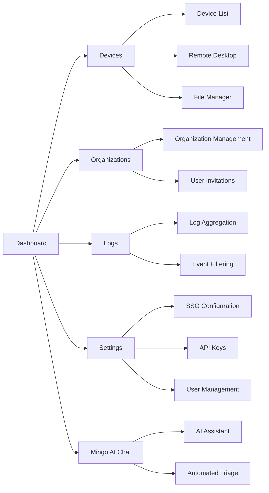

# Quick Start Guide

Get OpenFrame running locally in under 5 minutes! This guide provides the fastest path to a working development environment.

## TL;DR - One-Command Setup

For the impatient developers:

```bash
# Clone and start everything
git clone https://github.com/flamingo-stack/openframe-oss-tenant.git
cd openframe-oss-tenant
./scripts/run-mac.sh --silent    # macOS
# OR
./scripts/run-linux.sh --silent  # Linux  
# OR
./scripts/run-windows.ps1 -Silent # Windows PowerShell
```

This will:
- ✅ Validate prerequisites
- ✅ Build all Java services  
- ✅ Start MongoDB and Redis
- ✅ Launch the development stack
- ✅ Open the frontend at `http://localhost:3000`

[](https://www.youtube.com/watch?v=O8hbBO5Mym8)

## Manual Step-by-Step Setup

If you prefer understanding each step:

### 1. Clone the Repository

```bash
git clone https://github.com/flamingo-stack/openframe-oss-tenant.git
cd openframe-oss-tenant
```

### 2. Environment Configuration  

Create your local environment file:

```bash
# Copy example environment file
cp .env.example .env

# Edit with your preferred values
nano .env
```

Basic `.env` configuration:

```bash
# Database
MONGODB_URI=mongodb://localhost:27017/openframe_dev
REDIS_URL=redis://localhost:6379

# Authentication  
JWT_SECRET=dev-secret-change-in-production
OAUTH2_CLIENT_ID=openframe-dev
OAUTH2_CLIENT_SECRET=dev-secret

# Ports
API_SERVICE_PORT=8080
GATEWAY_SERVICE_PORT=8081  
FRONTEND_PORT=3000

# Mode
SPRING_PROFILES_ACTIVE=dev
NODE_ENV=development
```

### 3. Start Dependencies

Start MongoDB and Redis (if not already running):

```bash
# macOS with Homebrew
brew services start mongodb-community
brew services start redis

# Ubuntu/Debian with systemctl  
sudo systemctl start mongod
sudo systemctl start redis

# Or use Docker for isolated setup
docker-compose -f docker-compose.dev.yml up -d mongo redis
```

### 4. Build Java Services

```bash
# Build all Java services and libraries
mvn clean install -DskipTests

# This creates executable JARs in target/ directories
```

Expected output:
```text
[INFO] ------------------------------------------------------------------------
[INFO] BUILD SUCCESS
[INFO] ------------------------------------------------------------------------
[INFO] Total time:  02:15 min
[INFO] Finished at: 2024-02-20T10:30:00Z
[INFO] ------------------------------------------------------------------------
```

### 5. Install Frontend Dependencies

```bash
cd openframe/services/openframe-frontend
npm install
cd ../../../
```

### 6. Start the Services

Open multiple terminal tabs/windows:

#### Terminal 1: API Gateway

```bash
java -jar openframe/services/openframe-gateway/target/openframe-gateway-*.jar
```

#### Terminal 2: Authorization Server

```bash
java -jar openframe/services/openframe-authorization-server/target/openframe-authorization-server-*.jar
```

#### Terminal 3: API Service

```bash
java -jar openframe/services/openframe-api/target/openframe-api-*.jar
```

#### Terminal 4: Frontend

```bash
cd openframe/services/openframe-frontend
npm run dev
```

### 7. Verify Installation

Check that all services are running:

```bash
# Gateway health check
curl http://localhost:8081/actuator/health

# API service health check  
curl http://localhost:8080/actuator/health

# Authorization server
curl http://localhost:8082/.well-known/openid_configuration

# Frontend (should open in browser)
open http://localhost:3000
```

## First Login

### 1. Access the Frontend

Navigate to `http://localhost:3000` in your browser.

### 2. Create Admin Account

On first run, you'll see the tenant setup wizard:

1. **Tenant Information**
   - Organization Name: `Your MSP Name`
   - Tenant Domain: `your-msp` (will create your-msp.localhost)
   - Admin Email: `admin@example.com`

2. **Admin User Setup**
   - Full Name: `Admin User`
   - Password: Choose a secure password
   - Confirm Password: Re-enter password

3. **Complete Setup**
   - Click "Create Tenant"
   - Wait for initialization to complete

### 3. Explore the Dashboard

After login, you'll see:



## Sample Operations

### Register Your First Device

1. Navigate to **Devices** → **Add Device**
2. Choose your platform (Windows/macOS/Linux)
3. Download the installer script
4. Run on target machine:

```bash
# Example for Linux
curl -sSL https://localhost:3000/api/install/linux | bash
```

### Test Mingo AI Assistant

1. Click on **Mingo AI** in the sidebar
2. Start a conversation:

```text
"Show me all devices that are offline"
"What are the latest critical alerts?"  
"Generate a health report for my infrastructure"
```

### Configure an Integration

1. Go to **Settings** → **Integrations**
2. Select **Tactical RMM** or **Fleet MDM**
3. Enter connection details
4. Test connection and save

## Expected Results

After successful setup, you should have:

✅ **Working Services**
- API Gateway running on port 8081
- Authorization Server on port 8082  
- API Service on port 8080
- Frontend accessible at http://localhost:3000

✅ **Functional Features**
- User authentication and authorization
- Tenant management
- Device registration capability
- Mingo AI chat interface
- Basic MSP operations

✅ **Monitoring & Health**
- All services reporting healthy status
- Database connections established
- Real-time event processing working

## Quick Health Check

Run this comprehensive health check:

```bash
#!/bin/bash
echo "🔍 OpenFrame Health Check"
echo "========================="

# Service endpoints
GATEWAY="http://localhost:8081"
API="http://localhost:8080" 
AUTH="http://localhost:8082"
FRONTEND="http://localhost:3000"

# Check services
echo "Gateway:     $(curl -s ${GATEWAY}/actuator/health | jq -r '.status // "DOWN"')"
echo "API:         $(curl -s ${API}/actuator/health | jq -r '.status // "DOWN"')"  
echo "Auth:        $(curl -s ${AUTH}/actuator/health | jq -r '.status // "DOWN"')"
echo "Frontend:    $(curl -s -o /dev/null -w '%{http_code}' ${FRONTEND} | grep -q 200 && echo 'UP' || echo 'DOWN')"

# Database connectivity
echo "MongoDB:     $(mongosh --quiet --eval 'db.adminCommand("ismaster").ok ? "UP" : "DOWN"' 2>/dev/null)"
echo "Redis:       $(redis-cli ping 2>/dev/null | grep -q PONG && echo 'UP' || echo 'DOWN')"
```

## Troubleshooting Common Issues

### Services Won't Start

```bash
# Check if ports are already in use
lsof -i :8080  # API Service
lsof -i :8081  # Gateway
lsof -i :3000  # Frontend

# Kill conflicting processes
kill -9 <PID>
```

### Database Connection Errors

```bash
# Check MongoDB status
brew services list | grep mongodb  # macOS
systemctl status mongod            # Linux

# Test direct connection
mongosh "mongodb://localhost:27017/openframe_dev"
```

### Frontend Build Errors

```bash
# Clear npm cache and reinstall
cd openframe/services/openframe-frontend
rm -rf node_modules package-lock.json
npm cache clean --force
npm install
```

### Maven Build Failures

```bash
# Clean and rebuild
mvn clean
mvn install -DskipTests -X  # -X for verbose output

# Check Java version
java --version  # Should be Java 21
mvn --version   # Should use Java 21
```

## Performance Tips

### Faster Builds

```bash
# Skip tests during development
mvn install -DskipTests

# Parallel builds
mvn install -T 4  # Use 4 threads

# Build specific modules only
mvn install -pl openframe-api-service-core -am
```

### Reduced Memory Usage  

```bash
# Start services with limited heap
java -Xmx512m -jar openframe-gateway-*.jar

# Use development profile
export SPRING_PROFILES_ACTIVE=dev,low-memory
```

## Next Steps

Now that OpenFrame is running:

1. **[First Steps Guide](first-steps.md)** - Explore key features systematically
2. **[Development Setup](../development/setup/local-development.md)** - Set up for code contributions
3. **Join the Community** - Connect with other OpenFrame developers on [OpenMSP Slack](https://join.slack.com/t/openmsp/shared_invite/zt-36bl7mx0h-3~U2nFH6nqHqoTPXMaHEHA)

## Getting Help

If you encounter issues:

1. Check the **troubleshooting** section above
2. Review service logs for error messages
3. Ask questions in **#openframe-support** on OpenMSP Slack
4. Search existing discussions for similar issues

Happy exploring! 🚀