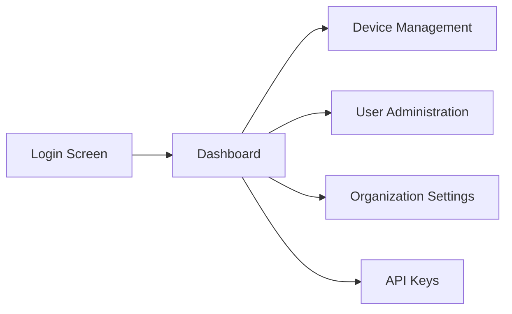

# Quick Start Guide

Get OpenFrame running in under 5 minutes with this streamlined setup guide.

## TL;DR - One Command Setup

```bash
# Clone and start OpenFrame
git clone https://github.com/flamingo-stack/openframe-oss-tenant.git
cd openframe-oss-tenant
./scripts/run-mac.sh --silent
```

> **Platform Scripts**: Use `run-linux.sh` for Linux or `run-windows.ps1` for Windows

## Step 1: Clone the Repository

```bash
git clone https://github.com/flamingo-stack/openframe-oss-tenant.git
cd openframe-oss-tenant
```

## Step 2: Environment Setup

### Quick Configuration

The setup script will create default configuration automatically, but you can customize:

```bash
# Optional: Set custom tenant name
export TENANT_DOMAIN="mycompany.openframe.local"
export TENANT_NAME="My Company MSP"

# Optional: Enable development mode
export OPENFRAME_DEV_MODE="true"
```

### Database Setup

OpenFrame includes Docker Compose configurations for all dependencies:

```bash
# Start core services
docker compose -f integrated-tools/docker-compose.core.yml up -d
```

This starts:
- MongoDB (port 27017)
- Redis (port 6379) 
- Apache Kafka (port 9092)

## Step 3: Build and Start OpenFrame

### Using Platform Scripts (Recommended)

```bash
# macOS
./scripts/run-mac.sh

# Linux 
./scripts/run-linux.sh

# Windows PowerShell
./scripts/run-windows.ps1
```

### Manual Build (Advanced)

```bash
# Build Java services
mvn clean install -DskipTests

# Build frontend
cd openframe/services/openframe-frontend
npm install
npm run build
cd ../../..

# Start services
docker compose up -d
```

## Step 4: Access OpenFrame

### Web Interface

Once services are running, access OpenFrame at:

**URL**: https://localhost:8443  
**Default Login**: Will be created on first access

### Service Health Check

Verify all services are running:

```bash
# Check service status
docker compose ps

# View logs
docker compose logs -f openframe-gateway
```

Expected output:
```text
NAME                    IMAGE                    STATUS
openframe-gateway       openframe-gateway:latest Up 
openframe-api          openframe-api:latest     Up
openframe-auth         openframe-auth:latest    Up
mongodb                 mongo:7                  Up
redis                  redis:7                  Up
kafka                  confluentinc/cp-kafka    Up
```

## Step 5: Initial Setup

### First Login

1. Navigate to https://localhost:8443
2. Click "Sign Up" for tenant registration
3. Enter your organization details:
   - **Organization Name**: Your company name
   - **Admin Email**: Your email address
   - **Password**: Secure password (8+ characters)

### Security Note

⚠️ **Development Setup**: The quick start uses self-signed certificates. For production, configure proper SSL certificates.

## Expected Results

After successful setup, you should see:

### Dashboard Overview



### Sample Dashboard

The initial dashboard displays:

- **0 Devices** (ready to add)
- **1 User** (your admin account)
- **1 Organization** (your company)
- **System Health**: All services green

### API Access

Test the GraphQL API:

```bash
# Get authentication token first
TOKEN=$(curl -s -X POST https://localhost:8443/auth/login \
  -H "Content-Type: application/json" \
  -d '{"email":"admin@yourcompany.com","password":"yourpassword"}' \
  | jq -r '.access_token')

# Query devices
curl -X POST https://localhost:8443/graphql \
  -H "Authorization: Bearer $TOKEN" \
  -H "Content-Type: application/json" \
  -d '{"query": "{ devices { edges { node { id name status } } } }"}'
```

## Adding Your First Device

### Option 1: Agent Registration

```bash
# Download agent for your platform
curl -O https://localhost:8443/api/downloads/openframe-client-latest.tar.gz

# Extract and install (Linux example)
tar -xzf openframe-client-latest.tar.gz
sudo ./install.sh --server https://localhost:8443
```

### Option 2: Tool Integration

Connect existing RMM tools:

1. Go to **Settings** → **Integrations**
2. Select your tool (Tactical RMM, MeshCentral, etc.)
3. Enter connection details
4. Click **Test Connection**

## Video Walkthrough

See OpenFrame v0.3.0 in action with unified authentication:

[](https://www.youtube.com/watch?v=mibUHvcVIHs)

## Troubleshooting

### Services Won't Start

```bash
# Check Docker resources
docker system df

# Restart services
docker compose down
docker compose up -d

# Check logs for errors
docker compose logs openframe-gateway
```

### Port Conflicts

```bash
# Check port usage
sudo netstat -tlnp | grep ':8443'

# Stop conflicting services
sudo systemctl stop nginx  # Example
```

### Memory Issues

```bash
# Increase Docker memory limit to 4GB minimum
# Check current usage
docker stats
```

### Connection Issues

```bash
# Verify network connectivity
curl -k https://localhost:8443/health

# Check firewall
sudo ufw status
```

## Configuration Files

Key configuration locations:

```text
├── docker-compose.yml              # Main service definitions
├── integrated-tools/
│   ├── docker-compose.core.yml     # Core dependencies
│   └── tactical-rmm/               # External tool configs
├── scripts/
│   ├── run-mac.sh                  # macOS startup
│   ├── run-linux.sh               # Linux startup  
│   └── run-windows.ps1            # Windows startup
└── openframe/services/
    └── */application.yml           # Service configurations
```

## Performance Notes

### Resource Usage

Typical resource consumption:

- **CPU**: 2-4 cores during normal operation
- **RAM**: 4-6 GB total for all services
- **Storage**: 10-20 GB for logs and data
- **Network**: Minimal after initial setup

### Optimization Tips

```bash
# Limit log retention
export LOG_RETENTION_DAYS=7

# Reduce Java heap size for development
export JAVA_OPTS="-Xmx1g -Xms512m"

# Use production database for better performance
export MONGODB_URL="mongodb://production-server:27017/openframe"
```

## Next Steps

Now that OpenFrame is running:

1. **[First Steps Guide](first-steps.md)** — Essential configuration and exploration
2. **[Development Setup](../development/setup/environment.md)** — If you plan to contribute
3. **[Architecture Overview](../development/architecture/overview.md)** — Understanding the platform

## Support

Having issues? Get help:

- **Logs**: Check `docker compose logs` for detailed error information
- **Community**: Join [OpenMSP Slack](https://join.slack.com/t/openmsp/shared_invite/zt-36bl7mx0h-3~U2nFH6nqHqoTPXMaHEHA)
- **Documentation**: Browse our comprehensive guides
- **GitHub**: Report issues or contribute improvements

---

Congratulations! You now have a running OpenFrame instance. Ready to explore? Check out the [First Steps Guide](first-steps.md).