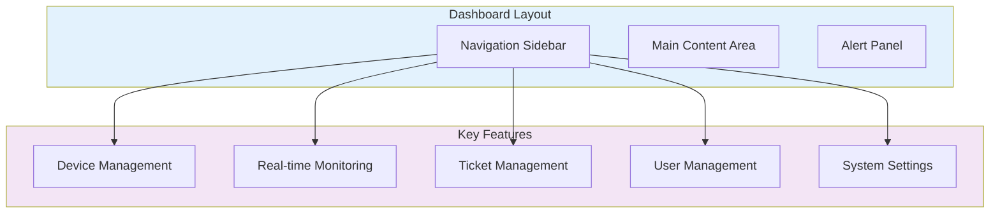

# Quick Start Guide

Get OpenFrame up and running in 5 minutes with our automated setup scripts. This guide will have you exploring the platform with sample data in no time.

[](https://www.youtube.com/watch?v=O8hbBO5Mym8)

## TL;DR - 5 Minute Setup

```bash
# 1. Clone the repository
git clone https://github.com/your-org/openframe-oss-tenant.git
cd openframe-oss-tenant

# 2. Run the platform setup script (choose your OS)
./scripts/run-mac.sh          # macOS
./scripts/run-linux.sh        # Linux  
./scripts/run-windows.ps1     # Windows PowerShell

# 3. Access OpenFrame Dashboard
open http://localhost:8080
```

That's it! OpenFrame will be running with sample data for you to explore.

## Step-by-Step Installation

### Step 1: Prerequisites Check

Verify you have the minimum requirements installed:

```bash
# Check Java version (need Java 21+)
java --version

# Check Maven version (need 3.9+)
mvn --version

# Check Docker version (need 24.0+)
docker --version

# Check Node.js version (need 18.0+)
node --version
```

> **Missing Requirements?** See our [Prerequisites Guide](./prerequisites.md) for detailed installation instructions.

### Step 2: Clone the Repository

```bash
git clone https://github.com/your-org/openframe-oss-tenant.git
cd openframe-oss-tenant
```

### Step 3: Environment Setup

The setup scripts will automatically:
- Build all Java services and libraries
- Install frontend dependencies
- Start required databases (MongoDB, Kafka, Redis)
- Initialize sample data
- Launch all microservices

#### For macOS:
```bash
./scripts/run-mac.sh
```

#### For Linux:
```bash
./scripts/run-linux.sh
```

#### For Windows:
```powershell
# Run in PowerShell as Administrator
./scripts/run-windows.ps1
```

#### Silent Mode (No Prompts):
```bash
# Skip interactive prompts - uses defaults
./scripts/run-mac.sh --silent
```

### Step 4: Wait for Services to Start

The script will show progress as services start up:

```bash
[INFO] Building OpenFrame services...
[INFO] Installing frontend dependencies...
[INFO] Starting databases with Docker Compose...
[INFO] Initializing sample data...
[INFO] Starting microservices...

✅ OpenFrame is ready!
🌐 Dashboard: http://localhost:8080
📊 GraphQL Playground: http://localhost:8080/graphql
⚙️  Config Server: http://localhost:8888
```

## Accessing the Platform

### Web Dashboard

Open your browser and navigate to: **http://localhost:8080**

Default login credentials:
- **Email**: `admin@example.com`
- **Password**: `admin123`

### Key URLs

| Service | URL | Description |
|---------|-----|-------------|
| **Main Dashboard** | http://localhost:8080 | Web UI and primary interface |
| **GraphQL Playground** | http://localhost:8080/graphql | Interactive GraphQL API explorer |
| **API Gateway Health** | http://localhost:8080/actuator/health | Service health monitoring |
| **Config Server** | http://localhost:8888 | Centralized configuration |

## Exploring the Sample Data

OpenFrame starts with sample data to help you understand its capabilities:

### 🖥️ **Device Management**
- **Sample Devices**: 5 pre-configured devices (Windows, Linux, macOS)
- **Device Status**: Online/offline simulation with real-time updates
- **Installed Agents**: Fleet MDM and Tactical RMM agent examples

### 👥 **Organization & Users**
- **Sample Organization**: "Demo MSP Company"
- **User Accounts**: Admin and technician user examples
- **Roles & Permissions**: Different access levels demonstrated

### 📊 **Monitoring Data**  
- **System Metrics**: CPU, memory, disk usage samples
- **Event History**: Sample system events and alerts
- **Log Entries**: Simulated application and system logs

### 🔧 **Tool Integrations**
- **Fleet MDM**: Sample device management queries
- **Tactical RMM**: Example scripts and policies
- **MeshCentral**: Remote access configurations

## First Steps Tutorial

Now that OpenFrame is running, let's walk through the key features:

### 1. Dashboard Overview



#### Navigation Tour:
1. **Devices** - View and manage all connected devices
2. **Monitoring** - Real-time system metrics and alerts
3. **Tickets** - Support ticket management with AI assistance
4. **Organizations** - Multi-tenant organization management
5. **Settings** - System configuration and user management

### 2. Device Management

Click on **Devices** in the sidebar to see:

- **Device List**: All registered devices with status indicators
- **Device Details**: Click any device to see detailed information
- **Remote Access**: Built-in remote desktop and file management
- **Agent Status**: Real-time agent health and version info

### 3. Real-time Monitoring

Navigate to **Monitoring** to explore:

- **Live Metrics**: CPU, memory, disk usage charts
- **Alert Dashboard**: Active alerts and historical data
- **Event Stream**: Real-time system events
- **Performance Analytics**: Trends and patterns

### 4. AI Chat Interface (Mingo)

Access the AI assistant:

1. Click the **Chat** icon in the top navigation
2. Try sample queries:
   - "Show me device status summary"
   - "What alerts need attention?"
   - "Help me troubleshoot the offline devices"

## Configuration Options

### Environment Variables

Key configuration options you can modify:

```bash
# Database connections
export MONGO_CONNECTION_STRING="mongodb://localhost:27017/openframe"
export KAFKA_BOOTSTRAP_SERVERS="localhost:9092"
export REDIS_URL="redis://localhost:6379"

# Authentication settings
export JWT_SECRET_KEY="your-secret-key"
export OAUTH_CLIENT_ID="your-oauth-client-id"

# Feature flags
export ENABLE_CHAT_AI=true
export ENABLE_DEVICE_MANAGEMENT=true
export ENABLE_REAL_TIME_MONITORING=true
```

### Service Ports

Default port configuration:

```yaml
services:
  api-gateway: 8080      # Main entry point
  api-service: 8081      # GraphQL API
  auth-service: 8082     # OAuth/Authentication
  client-service: 8083   # Agent management
  management: 8084       # Tool integration
  external-api: 8085     # Public API
  stream-processing: 8086 # Event processing
  config-server: 8888    # Configuration
```

### Docker Services

The setup automatically starts these Docker services:

```bash
# View running containers
docker ps

# Check service health
docker compose ps

# View service logs
docker compose logs -f mongodb
docker compose logs -f kafka
```

## Troubleshooting Quick Fixes

### Services Won't Start

```bash
# Check port conflicts
sudo lsof -i :8080

# Restart Docker services
docker compose down
docker compose up -d

# Check service logs
docker compose logs
```

### Frontend Build Issues

```bash
# Clear npm cache and reinstall
cd openframe/services/openframe-frontend
rm -rf node_modules package-lock.json
npm install
npm run build
```

### Database Connection Issues

```bash
# Verify MongoDB is running
docker exec -it openframe-mongo mongosh

# Check Kafka topics
docker exec -it openframe-kafka kafka-topics --list --bootstrap-server localhost:9092
```

### Permission Issues (Linux/macOS)

```bash
# Fix Docker permission issues
sudo usermod -aG docker $USER
newgrp docker

# Fix file permissions
sudo chown -R $USER:$USER .
```

## Performance Optimization

### Development Environment

```bash
# Increase Java heap size for faster builds
export MAVEN_OPTS="-Xmx4g -Xms2g"

# Enable Docker BuildKit for faster builds
export DOCKER_BUILDKIT=1
```

### Resource Allocation

Recommended Docker resource limits:

```yaml
# In docker-compose.yml
services:
  mongodb:
    deploy:
      resources:
        limits:
          memory: 1G
        reservations:
          memory: 512M
```

## Next Steps

Now that OpenFrame is running, explore these areas:

### 🚀 **Immediate Next Steps**
1. **[First Steps Guide](./first-steps.md)** - Configure your first real environment
2. **[User Management](../development/setup/environment.md)** - Set up additional users and organizations
3. **[Device Integration](../development/setup/local-development.md)** - Connect your first real devices

### 🛠️ **Development Path**
1. **[Development Setup](../development/setup/local-development.md)** - Set up development environment
2. **[Architecture Overview](../development/architecture/overview.md)** - Understand the system design
3. **[API Reference](../development/testing/overview.md)** - Explore the GraphQL and REST APIs

### 🏢 **Production Deployment**
1. **Security Configuration** - Set up OAuth providers and SSL certificates
2. **Database Setup** - Configure production databases
3. **Monitoring Setup** - Configure observability and alerting

## Expected Results

After completing the quick start, you should see:

- ✅ OpenFrame dashboard accessible at http://localhost:8080
- ✅ 5 sample devices with monitoring data
- ✅ Working AI chat interface (Mingo)
- ✅ Real-time metrics and alerting
- ✅ Multi-tenant organization structure
- ✅ Integrated tool connections (Fleet MDM, Tactical RMM)

## Getting Help

If you encounter issues during the quick start:

### 🗨️ **Community Support**
- **OpenMSP Slack**: [Join our community](https://join.slack.com/t/openmsp/shared_invite/zt-36bl7mx0h-3~U2nFH6nqHqoTPXMaHEHA)
- **Community Hub**: Visit [OpenMSP.ai](https://www.openmsp.ai/)

### 📖 **Documentation**
- **[Prerequisites](./prerequisites.md)** - Detailed installation requirements
- **[Development Guide](../development/README.md)** - Complete development setup
- **[Troubleshooting](../development/testing/overview.md)** - Common issues and solutions

### 🐛 **Issue Reporting**
- Report issues in our [OpenMSP Slack](https://join.slack.com/t/openmsp/shared_invite/zt-36bl7mx0h-3~U2nFH6nqHqoTPXMaHEHA) community
- Include system information and error logs
- Provide steps to reproduce the issue

---

**Congratulations!** 🎉 You now have OpenFrame running locally. Ready to dive deeper? Check out our [First Steps Guide](./first-steps.md) to start configuring your environment.