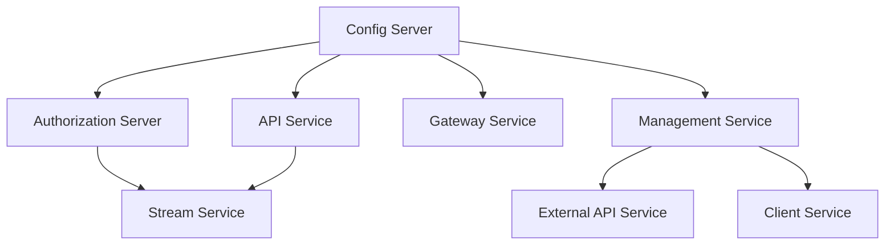

# Quick Start

Get OpenFrame OSS Tenant up and running in under 10 minutes.

> **Prerequisites**: Ensure you have Java 21, Maven 3.9+, MongoDB, Redis, Kafka, NATS, and Cassandra available. See the [Prerequisites](prerequisites.md) guide for details.

---

## TL;DR

```bash
# 1. Clone the repository
git clone https://github.com/openframeai/openframe-oss-tenant.git
cd openframe-oss-tenant

# 2. Build all Java services
mvn clean install -DskipTests

# 3. Start the Config Server first
cd openframe/services/openframe-config
mvn spring-boot:run

# 4. Start remaining services (in separate terminals)
# Terminal 2 - Authorization Server
cd openframe/services/openframe-authorization-server
mvn spring-boot:run

# Terminal 3 - API Service
cd openframe/services/openframe-api
mvn spring-boot:run

# Terminal 4 - Gateway
cd openframe/services/openframe-gateway
mvn spring-boot:run

# Terminal 5 - Management Service
cd openframe/services/openframe-management
mvn spring-boot:run
```

---

## Step-by-Step Setup

### Step 1: Clone the Repository

```bash
git clone https://github.com/openframeai/openframe-oss-tenant.git
cd openframe-oss-tenant
```

### Step 2: Build the Project

The project uses a multi-module Maven build. Run from the root to build all modules:

```bash
mvn clean install -DskipTests
```

> The `-DskipTests` flag speeds up the initial build. Run tests separately once your environment is fully configured.

### Step 3: Configure Infrastructure

Ensure your infrastructure services are running. OpenFrame expects the following defaults for local development (override via Config Server):

| Service | Default Host | Default Port |
|---|---|---|
| MongoDB | localhost | 27017 |
| Redis | localhost | 6379 |
| Kafka | localhost | 9092 |
| NATS | localhost | 4222 |
| Cassandra | localhost | 9042 |

### Step 4: Start the Config Server

The Config Server must start first — all other services depend on it for configuration:

```bash
cd openframe/services/openframe-config
mvn spring-boot:run
```

Wait until you see the Spring Boot banner and a log line like:
```text
Started ConfigServerApplication in X.XXX seconds
```

### Step 5: Start Core Services

Start these services in order (each in its own terminal):

**Authorization Server** (handles login, OAuth2, JWT):
```bash
cd openframe/services/openframe-authorization-server
mvn spring-boot:run
```

**API Service** (GraphQL + REST):
```bash
cd openframe/services/openframe-api
mvn spring-boot:run
```

**Gateway Service** (edge routing, security):
```bash
cd openframe/services/openframe-gateway
mvn spring-boot:run
```

**Management Service** (initializers, schedulers):
```bash
cd openframe/services/openframe-management
mvn spring-boot:run
```

### Step 6: (Optional) Start Supporting Services

**Stream Service** (event processing):
```bash
cd openframe/services/openframe-stream
mvn spring-boot:run
```

**External API Service** (third-party integrations):
```bash
cd openframe/services/openframe-external-api
mvn spring-boot:run
```

**Client Service** (agent-facing API):
```bash
cd openframe/services/openframe-client
mvn spring-boot:run
```

### Step 7: Start the Frontend

```bash
cd openframe/services/openframe-frontend
npm install
npm run dev
```

The frontend development server starts on `http://localhost:3000` by default.

---

## Service Startup Order



> **Important**: Always start the Config Server before any other service.

---

## Verify the Platform is Running

After starting the core services, verify health endpoints:

```bash
# Gateway health
curl http://localhost:8080/actuator/health

# API health
curl http://localhost:8081/health

# Authorization Server
curl http://localhost:9000/.well-known/openid-configuration
```

Expected response for health endpoints:
```json
{"status": "UP"}
```

---

## Service Ports (Default)

| Service | Default Port |
|---|---|
| Config Server | 8888 |
| Gateway | 8080 |
| Authorization Server | 9000 |
| API Service | 8081 |
| Management Service | 8082 |
| Stream Service | 8083 |
| External API Service | 8084 |
| Client Service | 8085 |
| Frontend (dev) | 3000 |

> Port assignments may vary based on your Config Server configuration. Check your environment configuration for actual ports.

---

## Development Init Script

A development initialization script is available for configuring the client service environment:

```bash
# Initialize development configuration for the client service
bash clients/openframe-client/scripts/setup_dev_init_config.sh
```

---

## What Happens at Startup

When the **Management Service** starts, it automatically:

1. Creates an initial **agent registration secret**
2. Initializes **integrated tool agent configurations** from classpath resources
3. Provisions required **NATS JetStream streams** (TOOL_INSTALLATION, CLIENT_UPDATE, etc.)
4. Loads the **OpenFrame client configuration** baseline
5. Synchronizes **Tactical RMM scripts** if configured

---

## Next Steps

After completing this quick start:

- Follow the [First Steps](first-steps.md) guide to explore key platform features
- Review the [Prerequisites](prerequisites.md) if you encounter setup issues
- Join the [OpenMSP Slack community](https://join.slack.com/t/openmsp/shared_invite/zt-36bl7mx0h-3~U2nFH6nqHqoTPXMaHEHA) for support
