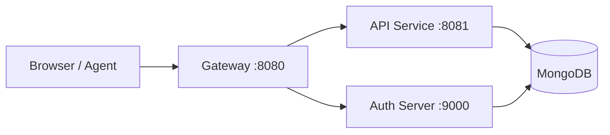

# Quick Start

Get up and running with OpenFrame OSS Tenant in minutes.

[](https://www.youtube.com/watch?v=-_56_qYvMWk)

---

## TL;DR — What You're Setting Up

OpenFrame OSS Tenant is a multi-service microservices platform. The quick start covers:

1. Cloning the repository
2. Building the Java backend services
3. Reviewing the Kubernetes manifests for infrastructure
4. Starting the platform

---

## Step 1: Clone the Repository

```bash
git clone https://github.com/openframehq/openframe-oss-tenant.git
cd openframe-oss-tenant
```

---

## Step 2: Build the Backend Services

The backend is a Maven multi-module project with Spring Boot 3.3 (Java 21):

```bash
# Build all services (skipping tests for faster first build)
mvn clean install -DskipTests
```

The Maven parent POM at `pom.xml` defines all 9 modules:

```text
openframe/services/
  ├── openframe-config          # Spring Cloud Config Server
  ├── openframe-api             # GraphQL + REST API Service
  ├── openframe-client          # Agent Client Service
  ├── openframe-stream          # Kafka Stream Processing
  ├── openframe-management      # Management Control Plane
  ├── openframe-gateway         # Reactive Gateway
  ├── openframe-external-api    # External REST API
  ├── openframe-authorization-server  # OAuth2/OIDC Server
  └── openframe-test            # Test Runner
```

---

## Step 3: Set Up Infrastructure

OpenFrame requires MongoDB, Redis, Kafka, NATS, Cassandra, and Pinot.

### Kubernetes Deployment (Recommended)

The repository provides Kubernetes manifests for integrated tool setup:

```bash
# Review available manifest scripts
ls manifests/
ls manifests/integrated-tools/
ls manifests/datasources/
```

For the MongoDB + MeshCentral integration:

```bash
# Initialize MongoDB for MeshCentral integration
bash manifests/integrated-tools/mongodb-meshcentral/scripts/mongodb-entrypoint.sh
```

> Refer to your cluster configuration for complete infrastructure deployment. The manifests in `manifests/` provide the baseline configurations.

---

## Step 4: Configure Environment

Set up the required environment variables for each service. At minimum for a local test run:

```bash
# MongoDB connection
export SPRING_DATA_MONGODB_URI="mongodb://localhost:27017/openframe"

# Kafka brokers
export SPRING_KAFKA_BOOTSTRAP_SERVERS="localhost:9092"

# Redis
export SPRING_REDIS_HOST="localhost"

# NATS
export NATS_URL="nats://localhost:4222"
```

> Replace these with your actual infrastructure endpoints. For production, use Kubernetes Secrets or an external secrets manager.

---

## Step 5: Start the Services

Services should start in this order to respect dependencies:

```bash
# 1. Config server first (provides configuration to all services)
cd openframe/services/openframe-config
mvn spring-boot:run

# 2. Authorization server (identity provider)
cd ../openframe-authorization-server
mvn spring-boot:run

# 3. API service (business logic)
cd ../openframe-api
mvn spring-boot:run

# 4. Gateway (edge layer - start last)
cd ../openframe-gateway
mvn spring-boot:run
```

---

## Step 6: Verify the Stack

Once services are running, verify the health endpoints:

```bash
# Gateway health
curl http://localhost:8080/actuator/health

# API health
curl http://localhost:8081/health

# Authorization server
curl http://localhost:9000/.well-known/openid-configuration
```

**Expected response from gateway health:**

```json
{
  "status": "UP"
}
```

---

## Platform Architecture at a Glance



---

## Node.js Tooling (Documentation)

The repository includes a `package.json` at the root for documentation tooling using `@voltagent/core` and the Anthropic SDK. This is used for AI-powered documentation generation and is **not** the application runtime:

```bash
# Install documentation tooling dependencies
npm install
```

---

## What's Next?

After this quick start:

- Follow the **First Steps** guide to configure your first tenant and explore key features
- Read the **Development Architecture** documentation to understand component relationships
- Review the **Security** documentation for authentication patterns
- Join the [OpenMSP Slack community](https://join.slack.com/t/openmsp/shared_invite/zt-36bl7mx0h-3~U2nFH6nqHqoTPXMaHEHA) for help
