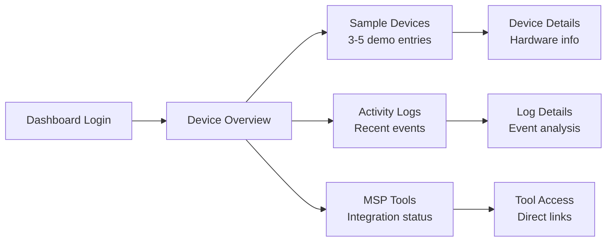

# Quick Start Guide

Get OpenFrame up and running in under 10 minutes with this streamlined installation process. This guide provides the fastest path to a working OpenFrame deployment for evaluation and development purposes.

## TL;DR - 5-Minute Setup

For experienced developers who want to get started immediately:

```bash
# 1. Clone and setup
git clone https://github.com/flamingo-run/openframe.git
cd openframe
export GITHUB_TOKEN="your_token_here"

# 2. Quick start (choose your platform)
./scripts/run-mac.sh --silent      # macOS
./scripts/run-linux.sh --silent    # Linux  
./scripts/run-windows.ps1 -Silent  # Windows

# 3. Access the dashboard
open http://localhost:8080
```

Expected result: OpenFrame dashboard loads within 5-10 minutes with sample data and MSP tools available.

## Detailed Quick Start

### Step 1: Environment Preparation

First, ensure your system meets the basic requirements:

```bash
# Verify prerequisites (should all return version numbers)
java --version      # Should show Java 21+
mvn --version       # Should show Maven 3.9+
node --version      # Should show Node.js 18+
docker --version    # Should show Docker 24.0+
```

If any command fails, please complete the [Prerequisites Guide](prerequisites.md) first.

### Step 2: Clone the Repository

```bash
# Clone the OpenFrame repository
git clone https://github.com/flamingo-run/openframe.git
cd openframe

# Verify the structure
ls -la
```

You should see directories including:
- `openframe/` - Java services and libraries
- `clients/` - Rust client agents
- `scripts/` - Setup and deployment scripts
- `integrated-tools/` - Docker configurations for MSP tools

### Step 3: Configure GitHub Access

OpenFrame requires access to private repositories during setup:

```bash
# Set your GitHub token (replace with your actual token)
export GITHUB_TOKEN="ghp_your_personal_access_token_here"

# Verify token is set
echo "Token configured: ${GITHUB_TOKEN:0:10}..."
```

> 🔑 **GitHub Token Required**: If you don't have a token, create one at https://github.com/settings/tokens with `repo` and `read:packages` permissions.

### Step 4: Platform-Specific Quick Start

Choose the script that matches your operating system:

#### macOS Setup
```bash
# Standard interactive setup
./scripts/run-mac.sh

# Silent mode (no prompts, uses defaults)
./scripts/run-mac.sh --silent

# With specific configuration
./scripts/run-mac.sh --env development --port 8080
```

#### Linux Setup
```bash
# Standard interactive setup
./scripts/run-linux.sh

# Silent mode (no prompts, uses defaults)
./scripts/run-linux.sh --silent

# With Docker Compose override
./scripts/run-linux.sh --compose-file docker-compose.override.yml
```

#### Windows Setup
```powershell
# Open PowerShell as Administrator and run:

# Standard interactive setup
.\scripts\run-windows.ps1

# Silent mode (no prompts, uses defaults)
.\scripts\run-windows.ps1 -Silent

# With custom configuration
.\scripts\run-windows.ps1 -Environment "development" -Port 8080
```

### Step 5: Monitor the Startup Process

The startup script will:

1. **Download Dependencies** (2-3 minutes)
   ```bash
   [INFO] Downloading Maven dependencies...
   [INFO] Installing npm packages...
   [INFO] Pulling Docker images...
   ```

2. **Start Infrastructure** (2-3 minutes)
   ```bash
   [INFO] Starting MongoDB...
   [INFO] Starting Redis...
   [INFO] Starting Kafka...
   [INFO] Starting integrated MSP tools...
   ```

3. **Build and Start Services** (3-5 minutes)
   ```bash
   [INFO] Building OpenFrame services...
   [INFO] Starting openframe-gateway...
   [INFO] Starting openframe-api...
   [INFO] Starting openframe-frontend...
   ```

4. **Health Check and Ready** (30 seconds)
   ```bash
   [INFO] All services healthy
   [SUCCESS] OpenFrame is ready!
   [INFO] Dashboard: http://localhost:8080
   ```

### Step 6: Access the Dashboard

Once the setup completes successfully:

1. **Open your browser** to: http://localhost:8080

2. **Expected initial screen**:
   - OpenFrame login page with Flamingo branding
   - "Get Started" or "Sign Up" options
   - Links to integrated MSP tools

3. **Create your first account**:
   - Click "Sign Up" 
   - Use email: `admin@example.com`
   - Password: `OpenFrame2024!`
   - Organization: `Demo MSP`

4. **Explore the dashboard**:
   - Devices overview with sample data
   - Logs and events from integrated tools
   - AI chat interface (Mingo) in the bottom right
   - Navigation to MSP tools and settings

## Verifying Your Installation

### Health Check Commands

```bash
# Check all services are running
docker compose ps

# Verify API connectivity
curl http://localhost:8080/actuator/health

# Check frontend build
curl -I http://localhost:8080

# Test GraphQL API
curl -X POST http://localhost:8080/graphql \
  -H "Content-Type: application/json" \
  -d '{"query":"{ __typename }"}'
```

Expected responses:
- All services showing "Up" status
- Health endpoint returns `{"status":"UP"}`
- Frontend returns `200 OK`
- GraphQL returns `{"data":{"__typename":"Query"}}`

### Service URLs

| Service | URL | Purpose |
|---------|-----|---------|
| **Main Dashboard** | http://localhost:8080 | Primary OpenFrame interface |
| **GraphQL Playground** | http://localhost:8080/graphql | API exploration |
| **Config Server** | http://localhost:8888 | Configuration management |
| **TacticalRMM** | http://localhost:8081 | RMM platform (if enabled) |
| **MeshCentral** | http://localhost:8082 | Remote access (if enabled) |

### Sample Data Verification

After login, you should see:



## Troubleshooting Quick Issues

### Common Startup Problems

#### Services Won't Start
```bash
# Check for port conflicts
netstat -tuln | grep -E ':(8080|8081|8888)'

# Kill conflicting processes
sudo lsof -ti:8080 | xargs kill -9

# Restart with clean state
docker compose down --volumes
./scripts/run-mac.sh --silent
```

#### Database Connection Errors
```bash
# Check MongoDB is running
docker compose logs mongodb

# Verify connection string
echo $MONGODB_URI

# Restart database services
docker compose restart mongodb redis
```

#### Build Failures
```bash
# Clean Maven cache
mvn clean install -DskipTests

# Clear npm cache
cd openframe/services/openframe-frontend
npm cache clean --force
npm install

# Restart build
cd ../../..
./scripts/run-mac.sh --silent
```

#### Memory Issues
```bash
# Check available memory
free -h

# Increase Docker memory (Docker Desktop)
# Go to Docker Desktop -> Settings -> Resources -> Memory
# Increase to 8GB+ for OpenFrame

# Set Java heap size
export JAVA_OPTS="-Xmx2g -Xms1g"
```

### Getting Help

If quick start fails:

1. **Check Prerequisites**: Ensure all [prerequisites](prerequisites.md) are met
2. **View Logs**: `docker compose logs -f --tail=100`
3. **Check GitHub Token**: Verify `echo $GITHUB_TOKEN` returns your token
4. **Platform-Specific Issues**: Windows users may need to run PowerShell as Administrator

## Next Steps

Congratulations! You now have OpenFrame running locally. Here's what to explore next:

### Immediate Exploration
1. **Device Management**: Add your first device or explore sample data
2. **AI Assistant**: Try the Mingo AI chat for device queries
3. **MSP Tools**: Access integrated TacticalRMM or MeshCentral
4. **User Management**: Create additional users and organizations

### Configuration
1. **Environment Settings**: Review configuration in the Settings tab
2. **Tool Integration**: Connect your existing MSP tools
3. **Authentication**: Configure SSO or LDAP integration
4. **Monitoring**: Enable Prometheus and Grafana dashboards

### Development
1. **API Exploration**: Use the GraphQL Playground at http://localhost:8080/graphql
2. **Code Changes**: Modify services and see hot-reload in action
3. **Custom Tools**: Integrate your own MSP tools or scripts
4. **Deployment**: Prepare for production with Kubernetes

> 🎉 **Success!** You've successfully deployed OpenFrame. Continue with [First Steps](first-steps.md) to learn key features and basic configuration, or jump into the [Development Guide](../development/README.md) to start customizing your deployment.

---

**Having Issues?** Join our OpenMSP Slack community at https://www.openmsp.ai/ for real-time support from the OpenFrame community.