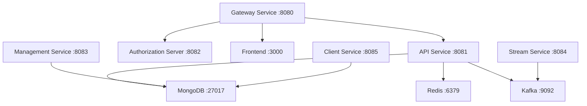

# Quick Start Guide

Get OpenFrame running in just 5 minutes! This guide provides the fastest path to a working OpenFrame environment.

[](https://www.youtube.com/watch?v=O8hbBO5Mym8)

## TL;DR - 5-Minute Setup

```bash
# 1. Clone the repository
git clone https://github.com/flamingo-stack/openframe-oss-tenant.git
cd openframe-oss-tenant

# 2. Run the platform setup script (choose your OS)
./scripts/run-mac.sh        # macOS
./scripts/run-linux.sh      # Linux  
./scripts/run-windows.ps1   # Windows

# 3. Access OpenFrame
open http://localhost:8080
```

That's it! OpenFrame will be running with a complete development environment.

## Step-by-Step Setup

### Step 1: Clone the Repository

```bash
git clone https://github.com/flamingo-stack/openframe-oss-tenant.git
cd openframe-oss-tenant
```

### Step 2: Platform-Specific Setup

The setup scripts will automatically:
- Check prerequisites and install missing dependencies
- Start required services (databases, message queues)
- Build and launch OpenFrame services
- Initialize sample data

Choose your platform:

#### macOS Setup
```bash
./scripts/run-mac.sh

# For silent mode (no prompts)
./scripts/run-mac.sh --silent
```

#### Linux Setup
```bash
./scripts/run-linux.sh

# For silent mode (no prompts)  
./scripts/run-linux.sh --silent
```

#### Windows Setup
```powershell
# Run in PowerShell as Administrator
./scripts/run-windows.ps1

# For silent mode (no prompts)
./scripts/run-windows.ps1 -Silent
```

### Step 3: Wait for Services to Start

The script will display startup progress. Wait for this message:
```text
✅ OpenFrame is ready!
🌐 Access the dashboard at: http://localhost:8080
🔧 GraphQL API available at: http://localhost:8080/graphql  
📊 Management console at: http://localhost:8888
```

### Step 4: Access OpenFrame

Open your browser and navigate to:
- **Main Dashboard**: [http://localhost:8080](http://localhost:8080)
- **GraphQL Playground**: [http://localhost:8080/graphql](http://localhost:8080/graphql)

## Default Login Credentials

OpenFrame starts with these default accounts:

| Role | Email | Password | Access Level |
|------|-------|----------|--------------|
| **System Admin** | `admin@openframe.local` | `admin123` | Full platform access |
| **MSP Owner** | `owner@demo.com` | `demo123` | Organization management |
| **Technician** | `tech@demo.com` | `demo123` | Device and incident management |

> ⚠️ **Security Note**: Change these default credentials immediately in production environments!

## What Gets Installed

The quick start process installs and configures:

### Core Services


### Integrated Tools (Optional)
The following external tools can be automatically configured:

- **TacticalRMM**: Open-source RMM platform
- **FleetDM**: Device management and vulnerability scanning  
- **MeshCentral**: Remote access and file management
- **Authentik**: Identity and access management

## Verify Installation

### Check Service Health

```bash
# Check all services are running
curl -f http://localhost:8080/health
curl -f http://localhost:8081/health  
curl -f http://localhost:8082/health

# Check database connections
curl -f http://localhost:8080/api/health/mongo
curl -f http://localhost:8080/api/health/redis
```

### Test Core Functionality

1. **Login Test**: Visit [http://localhost:8080](http://localhost:8080) and login with default credentials

2. **API Test**: Query the GraphQL API at [http://localhost:8080/graphql](http://localhost:8080/graphql):
   ```graphql
   query {
     me {
       email
       status
       organizations {
         name
       }
     }
   }
   ```

3. **Device Test**: Navigate to Devices section and verify the sample devices are visible

## Expected Output

After successful setup, you should see:

### OpenFrame Dashboard
- **Device Overview**: Sample devices with health status
- **Organization Management**: Demo organizations and users
- **Mingo AI Chat**: Interactive AI assistant
- **Settings Panel**: Configuration options

### System Health
```text
✅ Gateway Service: Running (Port 8080)
✅ API Service: Running (Port 8081) 
✅ Authorization Server: Running (Port 8082)
✅ MongoDB: Connected
✅ Redis: Connected
✅ Kafka: Connected
```

## Common Issues and Solutions

### Port Already in Use
```bash
# Find process using port 8080
lsof -i :8080

# Kill the process
kill -9 <PID>

# Or use a different port set
export OPENFRAME_PORT=8090
./scripts/run-mac.sh
```

### Docker Issues
```bash
# Restart Docker service
sudo systemctl restart docker  # Linux
brew services restart docker   # macOS

# Clean up Docker resources
docker system prune -f
docker volume prune -f
```

### Memory Issues
```bash
# Increase Docker memory limit (Docker Desktop)
# Settings → Resources → Memory: 8GB minimum

# Or increase Java heap size
export MAVEN_OPTS="-Xmx4g"
```

### Service Connection Failures
```bash
# Check service logs
docker compose logs openframe-gateway
docker compose logs openframe-api

# Restart specific service
docker compose restart openframe-gateway
```

## Configuration Options

### Environment Variables
```bash
# Customize ports
export OPENFRAME_PORT=8090
export API_PORT=8091

# Enable debug mode
export LOG_LEVEL=DEBUG
export SPRING_PROFILES_ACTIVE=local,debug

# Database configuration  
export MONGO_HOST=localhost
export REDIS_HOST=localhost
```

### Enable Additional Features
```bash
# Enable analytics (Pinot)
export ENABLE_ANALYTICS=true

# Enable monitoring (Prometheus/Grafana)
export ENABLE_MONITORING=true

# Enable sample data
export INIT_SAMPLE_DATA=true
```

## Next Steps

Now that OpenFrame is running, explore the platform:

### 1. First Steps Tutorial
Continue with [First Steps Guide](first-steps.md) to:
- Create your first organization
- Add devices to monitoring
- Configure user access and permissions
- Set up AI automation rules

### 2. Development Setup
For custom development, see the [development section](../development/README.md):
- Set up your IDE for OpenFrame development
- Learn about the architecture and codebase
- Build custom integrations and extensions

### 3. Production Deployment
When ready for production, explore:
- [Kubernetes deployment guides](../deployment/kubernetes.md) 
- [Security configuration](../operations/security.md)
- [Monitoring and alerting setup](../operations/monitoring.md)

## Getting Help

If you encounter issues:

1. **Check the logs**: Use `docker compose logs <service-name>`
2. **Join our community**: [OpenMSP Slack](https://join.slack.com/t/openmsp/shared_invite/zt-36bl7mx0h-3~U2nFH6nqHqoTPXMaHEHA)
3. **Report bugs**: Create an issue in the GitHub repository

---

**🎉 Congratulations!** You now have a fully functional OpenFrame environment. Ready to revolutionize your MSP operations with AI-powered automation!