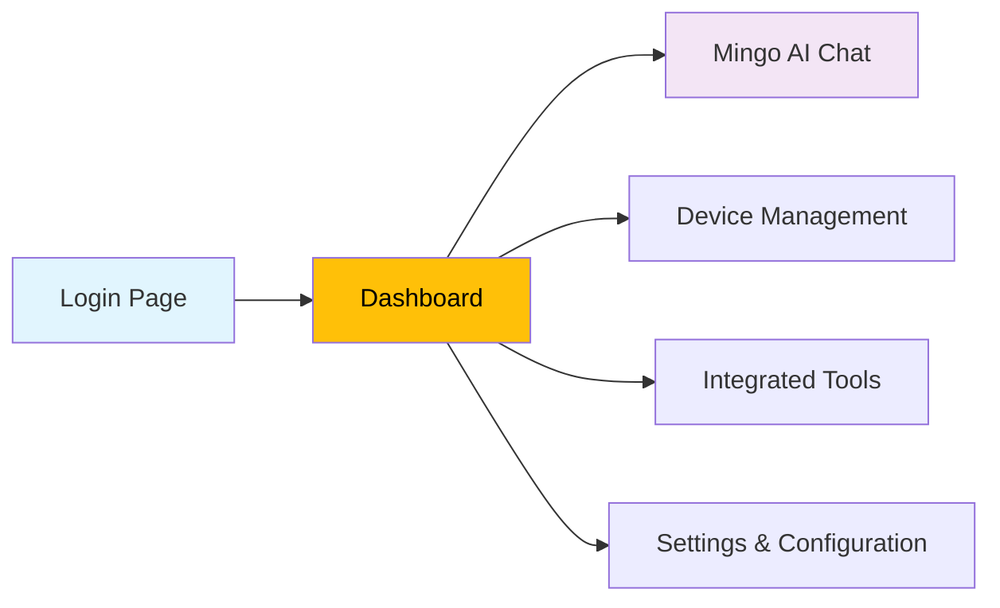

# Quick Start Guide

Get OpenFrame up and running in just 5 minutes! This guide will have you exploring the AI-powered MSP platform quickly.

[](https://www.youtube.com/watch?v=jEkFcS4AcQ4)

## TL;DR - 5-Minute Setup

```bash
# 1. Clone the repository
git clone https://github.com/flamingo-stack/openframe-oss-tenant.git
cd openframe-oss-tenant

# 2. Set up development configuration
./clients/openframe-client/scripts/setup_dev_init_config.sh

# 3. Start infrastructure services
docker-compose up -d mongodb kafka redis

# 4. Build and start backend services
mvn clean install
mvn spring-boot:run -pl openframe-services-gateway &
mvn spring-boot:run -pl openframe-services-api &

# 5. Start frontend
cd openframe/services/openframe-frontend
npm install && npm run dev

# 🎉 Access OpenFrame at https://localhost:3000
```

## Detailed Setup Steps

### Step 1: Clone and Navigate

```bash
# Clone the OpenFrame repository
git clone https://github.com/flamingo-stack/openframe-oss-tenant.git

# Enter the project directory
cd openframe-oss-tenant

# Verify you're in the right place
ls -la
# You should see: clients/, openframe/, pom.xml, etc.
```

### Step 2: Development Configuration

The setup script will fetch your registration secret and configure local TLS:

```bash
# Run the development setup script
./clients/openframe-client/scripts/setup_dev_init_config.sh
```

You'll be prompted for:
- **Access Token**: Your OpenFrame API token
- The script will automatically configure mkcert for local HTTPS

**Expected Output:**
```text
OpenFrame Development Setup - Initial Configuration
============================================================
Please enter your access token: [hidden input]
✓ Successfully fetched registration secret
✓ Configuration file created successfully
Location: ~/Library/Logs/OpenFrame/initial_config.json
```

### Step 3: Start Infrastructure Services

Using Docker Compose for quick infrastructure setup:

```bash
# Start MongoDB, Kafka, and Redis
docker-compose up -d mongodb kafka redis

# Verify services are running
docker-compose ps
```

**Expected Output:**
```text
NAME         SERVICE      STATUS        PORTS
mongodb      mongodb      Up            0.0.0.0:27017->27017/tcp
kafka        kafka        Up            0.0.0.0:9092->9092/tcp
redis        redis        Up            0.0.0.0:6379->6379/tcp
```

### Step 4: Build Backend Services

Build the entire platform with Maven:

```bash
# Clean and install all modules
mvn clean install -DskipTests

# This will build:
# - All shared libraries (openframe-oss-lib)
# - All microservices (openframe/services)
# - Client applications
```

### Step 5: Start Core Services

Start the essential services for development:

```bash
# Start Gateway Service (Entry Point)
mvn spring-boot:run -pl openframe/services/openframe-gateway &

# Start API Service (Main Business Logic)
mvn spring-boot:run -pl openframe/services/openframe-api &

# Start Authorization Server (OAuth2/OIDC)
mvn spring-boot:run -pl openframe/services/openframe-authorization-server &

# Check services are starting
jobs
```

**Service Startup Logs:**
```text
[INFO] Starting OpenFrame Gateway on port 8080...
[INFO] Starting OpenFrame API on port 8081...
[INFO] Starting OpenFrame Authorization Server on port 8082...
```

### Step 6: Start Frontend

Launch the Next.js frontend application:

```bash
# Navigate to frontend directory
cd openframe/services/openframe-frontend

# Install dependencies
npm install

# Start development server
npm run dev
```

**Expected Output:**
```text
   ▲ Next.js 14.0.0
   - Local:        http://localhost:3000
   - Network:      http://192.168.1.100:3000

 ✓ Ready in 2.3s
```

## Access OpenFrame

Open your browser and navigate to:

**🔗 https://localhost:3000**

You should see the OpenFrame login page. Use the credentials from your setup configuration.

### First Login Experience

1. **Login Page**: OAuth2-powered authentication
2. **Dashboard**: Overview of your MSP environment
3. **Mingo AI**: Chat with the AI assistant
4. **Device Management**: Monitor and manage endpoints
5. **Integrated Tools**: Access Fleet MDM, Tactical RMM, etc.



## Hello World Example

### Test the API

```bash
# Test Gateway health
curl -k https://localhost:8080/health

# Test API service
curl -k https://localhost:8081/api/health

# Expected response:
{"status":"UP","timestamp":"2024-01-15T10:30:00Z"}
```

### Test Mingo AI Chat

1. Navigate to the **Mingo** section in the UI
2. Type: "Hello Mingo, help me understand OpenFrame"
3. Experience AI-powered MSP assistance

### Create Your First Organization

1. Go to **Organizations** → **New Organization**
2. Fill in basic details:
   - **Name**: "Test MSP"
   - **Type**: "Managed Service Provider"
3. Click **Create**

## Expected Results

After completing the quick start, you should have:

### ✅ Running Services
- **Gateway**: https://localhost:8080 (Entry point)
- **API Service**: https://localhost:8081 (Business logic)
- **Auth Server**: https://localhost:8082 (OAuth2)
- **Frontend**: https://localhost:3000 (Main UI)

### ✅ Infrastructure
- **MongoDB**: localhost:27017 (Data persistence)
- **Kafka**: localhost:9092 (Event streaming)
- **Redis**: localhost:6379 (Caching)

### ✅ Functional Features
- Multi-tenant authentication
- Organization management
- Mingo AI assistant
- Device monitoring dashboard
- Settings and configuration

## Troubleshooting Quick Fixes

### Services Won't Start
```bash
# Check port conflicts
lsof -i :8080 :8081 :8082

# Kill conflicting processes
kill -9 <PID>

# Restart services
mvn spring-boot:run -pl openframe/services/openframe-gateway &
```

### Database Connection Issues
```bash
# Check MongoDB status
docker-compose logs mongodb

# Restart MongoDB
docker-compose restart mongodb
```

### Frontend Won't Load
```bash
# Check Node.js version
node --version  # Should be 18+

# Clear npm cache and reinstall
npm cache clean --force
rm -rf node_modules package-lock.json
npm install
```

### TLS Certificate Issues
```bash
# Reinstall mkcert root CA
mkcert -install

# Re-run setup script
./clients/openframe-client/scripts/setup_dev_init_config.sh
```

## Performance Optimization Tips

### Development Mode
```bash
# Set development environment variables
export NODE_ENV=development
export SPRING_PROFILES_ACTIVE=development
export OPENFRAME_LOG_LEVEL=debug

# Use faster build options
mvn spring-boot:run -Dspring-boot.run.jvmArguments="-Xmx2g"
```

### Resource Allocation
```bash
# Allocate more memory to Maven build
export MAVEN_OPTS="-Xmx4g -XX:MaxPermSize=512m"

# Increase Node.js memory limit
export NODE_OPTIONS="--max-old-space-size=4096"
```

## Next Steps

🎉 **Congratulations!** OpenFrame is now running locally. Here's what to explore next:

### Immediate Next Steps
1. **[First Steps Guide](first-steps.md)**: Learn the 5 essential things to do after installation
2. **Explore Mingo AI**: Chat with the AI assistant to understand capabilities
3. **Add Devices**: Connect your first endpoints for monitoring

### Development Path
- **Development Environment Setup**: For customization and contribution
- **Architecture Overview**: Understand the microservices design
- **API Documentation**: Explore GraphQL and REST endpoints

### Production Path
- **Deployment Guide**: Deploy to Kubernetes or cloud platforms
- **Security Hardening**: Production security configurations
- **Scaling Considerations**: Multi-node setup and performance tuning

## Need Help?

- **Issues?** Join our [OpenMSP Slack community](https://join.slack.com/t/openmsp/shared_invite/zt-36bl7mx0h-3~U2nFH6nqHqoTPXMaHEHA)
- **Questions?** Check out [First Steps Guide](first-steps.md)
- **Documentation**: Visit [openframe.ai](https://openframe.ai)

> **💡 Pro Tip**: The OpenFrame platform is designed for continuous development. Keep your services running and make changes to see live updates!

---

**Ready to dive deeper?** Continue with [First Steps Guide](first-steps.md) to explore OpenFrame's powerful features! 🚀