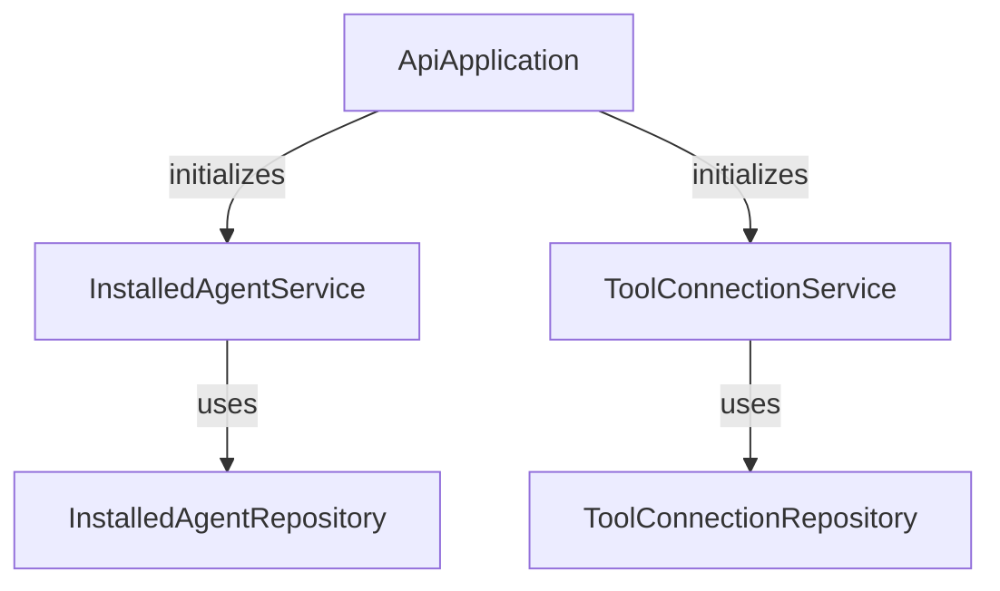

# API Services Documentation

## Overview
The API Services module is a core component of the OpenFrame platform, responsible for managing API interactions and providing essential services related to installed agents and tool connections. This module serves as the backbone for communication between various components of the system, enabling efficient data retrieval and management.

## Architecture Overview
The API Services module consists of several key components that interact with each other to provide a cohesive service layer. Below is a diagram illustrating the architecture of the API Services module:

### Core Components
1. **ApiApplication**: The entry point of the API Services module, responsible for bootstrapping the Spring application.
   - **File**: `openframe/services/openframe-api/src/main/java/com/openframe/api/ApiApplication.java`
   - **Functionality**: Initializes the application context and scans for components.

2. **InstalledAgentService**: Manages operations related to installed agents on machines.
   - **File**: `deps-openframe-oss-lib/openframe-api-lib/src/main/java/com/openframe/api/service/InstalledAgentService.java`
   - **Functionality**: Provides methods to retrieve installed agents for specific machines, all installed agents, and agents by type.
   - **Related Documentation**: See [InstalledAgentService Documentation](InstalledAgentService.md)

3. **ToolConnectionService**: Handles operations related to tool connections for machines.
   - **File**: `deps-openframe-oss-lib/openframe-api-lib/src/main/java/com/openframe/api/service/ToolConnectionService.java`
   - **Functionality**: Provides methods to retrieve tool connections for specific machines.
   - **Related Documentation**: See [ToolConnectionService Documentation](ToolConnectionService.md)

## High-Level Functionality
The API Services module provides the following high-level functionalities:
- **Installed Agent Management**: Retrieve and manage installed agents across multiple machines.
- **Tool Connection Management**: Manage connections to various tools used by the system.

For detailed information on each service, please refer to their respective documentation files.