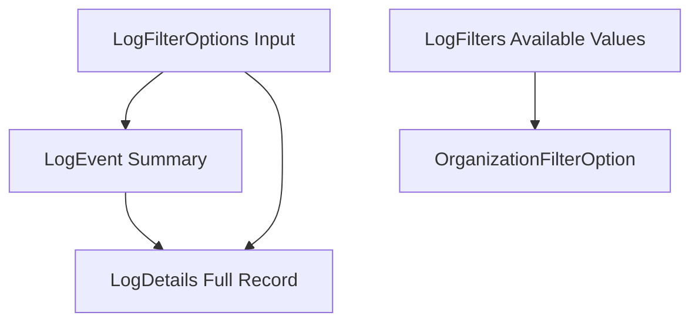
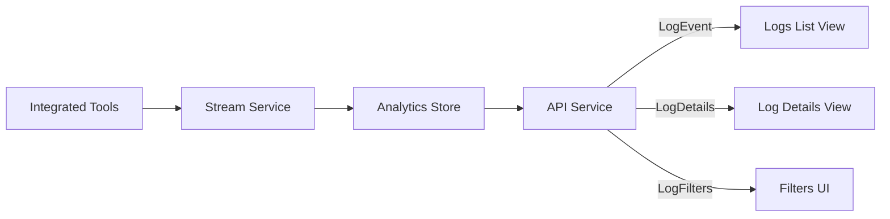

# Audit Models

## Overview
The **Audit Models** module defines the core Data Transfer Objects (DTOs) used to represent, filter, and summarize audit log data across the OpenFrame platform. These models sit at the boundary between the data layer, API services (REST and GraphQL), and external consumers, providing a consistent schema for audit events generated by integrated tools, devices, and user actions.

This module is part of the broader **API DTO and Filter Models** layer and is primarily consumed by:
- API service GraphQL data fetchers and REST controllers
- External API services exposing audit/log endpoints
- Frontend clients rendering logs, filters, and log details views

The Audit Models are intentionally simple, immutable-style DTOs (via Lombok) with no business logic, ensuring they can be safely reused across services.

---

## Core Components

### LogEvent

`LogEvent` represents a **lightweight summary view** of an audit log entry. It is typically used in list and table views where many log records are displayed.

**Key characteristics:**
- Optimized for high-volume log queries
- Excludes verbose message and detail fields
- Suitable for pagination and cursor-based results

**Fields:**
- `toolEventId`: Unique identifier from the source tool
- `eventType`: Normalized event type (for example, login, policy_change)
- `ingestDay`: Day-based partition key used by analytics stores
- `toolType`: Source tool generating the event
- `severity`: Severity level of the event
- `userId`: User associated with the event (if applicable)
- `deviceId`: Device associated with the event (if applicable)
- `hostname`: Hostname of the device
- `organizationId`: Organization identifier
- `organizationName`: Human-readable organization name
- `summary`: Short human-readable summary
- `timestamp`: Event timestamp

---

### LogDetails

`LogDetails` extends the information provided by `LogEvent` with **full message content and structured details**. It is used when a user drills down into a specific log entry.

**Key characteristics:**
- Full-fidelity representation of an audit log
- Used in log detail views and single-record queries
- Contains potentially large text fields

**Additional fields beyond LogEvent:**
- `message`: Full log message
- `details`: Structured or unstructured detail payload (often tool-specific)

---

### LogFilterOptions

`LogFilterOptions` defines the **input criteria** used to query audit logs. It is commonly mapped from GraphQL or REST filter inputs and passed into service and repository layers.

**Supported filters:**
- Date range (`startDate`, `endDate`)
- Event types
- Tool types
- Severity levels
- Organization IDs
- Device ID

These options allow flexible, multi-dimensional filtering while remaining transport-agnostic.

---

### LogFilters

`LogFilters` represents the **available filter values** returned to clients so they can build dynamic filter UIs (for example, dropdowns and multi-selects).

**Contents:**
- Supported tool types
- Supported event types
- Supported severities
- Available organizations

This model is typically populated by aggregating distinct values from the underlying log store.

---

### OrganizationFilterOption

`OrganizationFilterOption` is a small helper DTO used within `LogFilters` to represent organizations in a user-friendly way.

**Fields:**
- `id`: Organization identifier
- `name`: Organization display name

It is specifically designed for frontend filter components.

---

## Relationships Between Models

The following diagram illustrates how the audit models relate to each other:

---

## Data Flow in the System

Audit Models participate in the end-to-end audit log flow, from ingestion to presentation:

---

## Usage Context

### GraphQL Layer
- `LogEvent` is typically returned in paginated connections for log listings
- `LogDetails` is returned for single-log queries
- `LogFilterOptions` is derived from GraphQL filter inputs
- `LogFilters` is returned to bootstrap filter UIs

### External API Layer
External audit endpoints map internal audit models to response DTOs, preserving the same conceptual structure while adapting naming or pagination formats as needed.

### Frontend Clients
Frontend applications rely on:
- `LogEvent` for tables and timelines
- `LogDetails` for detail panels and modals
- `LogFilters` and `OrganizationFilterOption` to dynamically render filtering controls

---

## Design Principles

- **Separation of concerns**: Audit Models contain no business logic
- **Reusability**: Shared across REST, GraphQL, and external APIs
- **Performance-aware**: Clear distinction between summary and detailed views
- **UI-friendly**: Explicit filter option models for frontend consumption

---

## Related Modules

- Device Models: Used when filtering or correlating logs by device
- Event Models: Complement audit logs with higher-level event semantics
- Organization Models: Provide richer organization context beyond filter options
- Shared Models: Provide pagination and generic query wrappers

Refer to the respective module documentation for details on those models.
