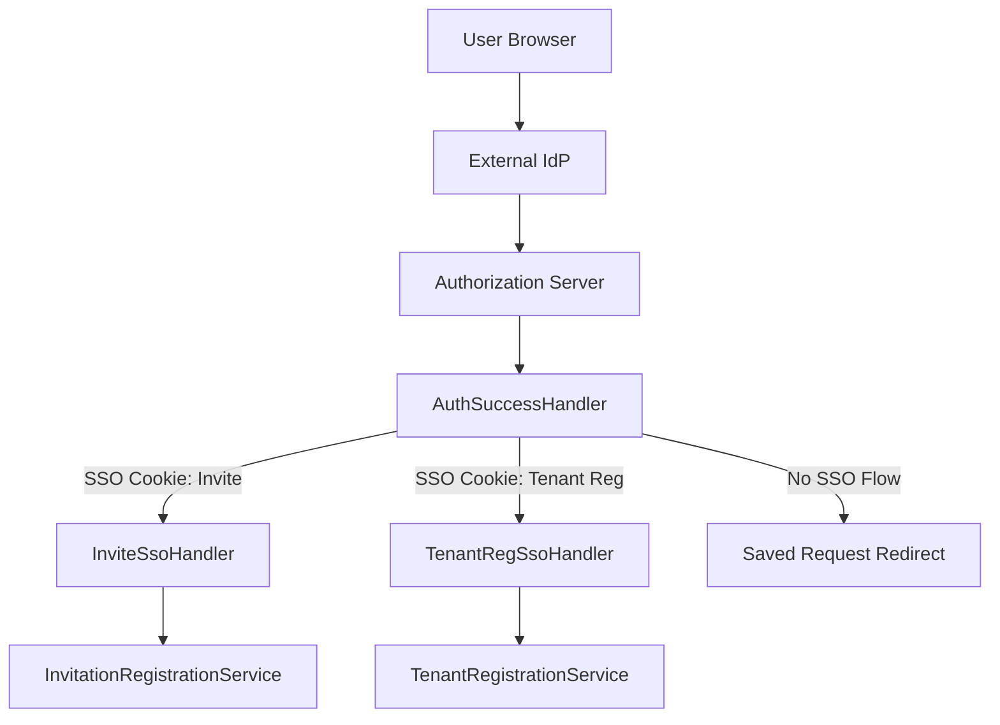
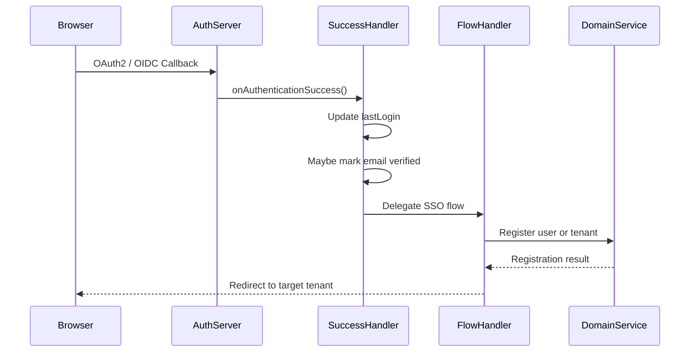
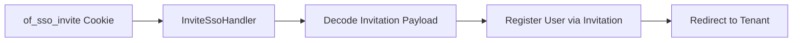
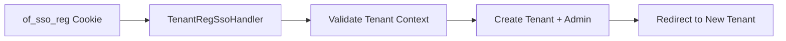

# Auth Flow Handlers

## Overview

The **Auth Flow Handlers** module is responsible for orchestrating post-authentication Single Sign-On (SSO) flows inside the OpenFrame Authorization Server. It bridges successful OAuth2/OIDC authentication with **tenant onboarding**, **invitation-based user registration**, and **user lifecycle updates** while preserving a seamless OAuth redirect experience.

This module lives under **authz_service_core_auth_flow_and_processors** and is invoked during Spring Security authentication success handling. It is intentionally isolated from REST and persistence layers, delegating business logic to domain services.

Key responsibilities:

- Handle authentication success events
- Route users into the correct SSO flow (tenant registration vs invitation acceptance)
- Update user metadata (last login, email verification)
- Manage short-lived SSO cookies that carry onboarding context

---

## Core Components

### AuthSuccessHandler

**Class:** `AuthSuccessHandler`

Acts as the global authentication success entry point for the authorization server.

**Responsibilities:**

- Update the user's `lastLogin` timestamp
- Opportunistically mark email addresses as verified for trusted IdPs
- Delegate to SSO flow handlers to continue onboarding or invitation flows

**Key Collaborators:**

- `TenantContext` – resolves active tenant
- `UserService` – user lifecycle updates
- `SsoTenantRegistrationSuccessHandler` – routes to SSO flows

**Key Behaviors:**

- Does **not block login** if user updates fail
- Supports both OIDC (`OidcUser`) and classic `UserDetails`
- Trusts Google and Microsoft as verified IdPs when claims allow

---

### InviteSsoHandler

**Class:** `InviteSsoHandler`

Handles **invitation-based SSO registration**. This flow is triggered when a user authenticates via SSO with an invitation cookie present.

**Responsibilities:**

- Decode and validate invitation SSO cookies
- Extract user identity from OIDC claims
- Register the user via invitation
- Redirect user to the target tenant

**Key Collaborators:**

- `SsoCookieCodec` – decode signed invitation cookies
- `InvitationRegistrationService` – invitation-based user creation

**Cookie Used:**

- `of_sso_invite`

---

### TenantRegSsoHandler

**Class:** `TenantRegSsoHandler`

Handles **new tenant onboarding via SSO**. This is used when a user creates a brand-new tenant using an external IdP.

**Responsibilities:**

- Decode tenant registration context from cookies
- Validate tenant name and domain
- Create tenant and initial admin user
- Redirect user into the newly created tenant

**Key Collaborators:**

- `SsoCookieCodec` – decode tenant registration cookies
- `TenantRegistrationService` – tenant provisioning

**Cookie Used:**

- `of_sso_reg`

---

### SsoRegistrationConstants

Defines shared constants for SSO flows.

```java
public static final String COOKIE_SSO_REG = "of_sso_reg";
public static final String COOKIE_SSO_INVITE = "of_sso_invite";
public static final String ONBOARDING_TENANT_ID = "sso-onboarding";
```

These constants ensure consistent cookie naming and onboarding tenant resolution across flows.

---

## High-Level Architecture



---

## Authentication Success Flow



---

## Invitation-Based SSO Flow



**Important Notes:**

- Passwords are auto-generated (UUID-based)
- Email presence is mandatory
- Session is preserved to allow OAuth continuation

---

## Tenant Registration SSO Flow



**Important Notes:**

- Tenant domain is normalized to lowercase
- Access code is required for tenant creation
- Flow fails fast on invalid context

---

## Security Considerations

- SSO cookies are short-lived and validated cryptographically
- Authentication success handlers **never trust client input directly**
- Email verification is only auto-applied for trusted IdPs
- Failure to update user metadata does not block authentication

---

## How This Module Fits Into the System

- Invoked by Spring Security after OAuth2 authentication
- Works in conjunction with:
  - Authorization Server configuration
  - OIDC client registration strategies
  - User and tenant domain services
- Does **not** perform persistence directly

This separation ensures that authentication flows remain composable, testable, and secure.

---

## Summary

The Auth Flow Handlers module is the **control plane for SSO onboarding** in OpenFrame. It ensures that:

- Authentication success is consistently handled
- SSO onboarding flows are deterministic and secure
- Business logic remains delegated to domain services

By isolating flow orchestration here, OpenFrame maintains clean boundaries between authentication, onboarding, and core domain logic.
