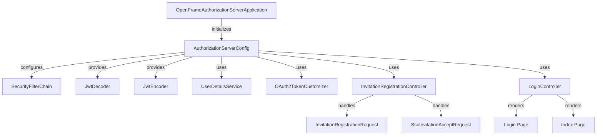

# Authorization Services Documentation

## Overview
The Authorization Services module is a critical component of the OpenFrame platform, responsible for managing user authentication and authorization. It provides a secure and flexible framework for handling user access across multiple tenants, ensuring that only authorized users can access specific resources.

## Architecture Overview
The Authorization Services module is built on top of Spring Boot and integrates with various components of the OpenFrame ecosystem. Below is a high-level architecture diagram illustrating the relationships between the core components:

## Core Components

### 1. InvitationRegistrationController
- **Purpose**: Manages invitation-based user registrations and SSO acceptance flows.
- **Key Functionality**: Handles incoming requests for accepting invitations and registering users.
- **Reference**: [InvitationRegistrationController.md](InvitationRegistrationController.md)

### 2. LoginController
- **Purpose**: Provides endpoints for user login and index page rendering.
- **Key Functionality**: Displays login errors and logout messages to users.
- **Reference**: [LoginController.md](LoginController.md)

### 1. OpenFrameAuthorizationServerApplication
- **Purpose**: The entry point for the Authorization Services module, responsible for bootstrapping the Spring application.
- **Key Functionality**: Initializes the application context and enables service discovery.
- **Reference**: [OpenFrameAuthorizationServerApplication.java](openframe/services/openframe-authorization-server/src/main/java/com/openframe/authz/OpenFrameAuthorizationServerApplication.java)

### 2. AuthorizationServerConfig
- **Purpose**: Configures the OAuth2 authorization server settings, including security filters and JWT handling.
- **Key Functionality**: Sets up security configurations, manages JWT encoding/decoding, and customizes token claims.
- **Reference**: [AuthorizationServerConfig.java](deps-openframe-oss-lib/openframe-authorization-service-core/src/main/java/com/openframe/authz/config/AuthorizationServerConfig.java)

### 3. InvitationRegistrationController
- **Purpose**: Manages invitation-based user registrations and SSO acceptance flows.
- **Key Functionality**: Handles incoming requests for accepting invitations and registering users.
- **Reference**: [InvitationRegistrationController.java](deps-openframe-oss-lib/openframe-authorization-service-core/src/main/java/com/openframe/authz/controller/InvitationRegistrationController.java)

### 4. LoginController
- **Purpose**: Provides endpoints for user login and index page rendering.
- **Key Functionality**: Displays login errors and logout messages to users.
- **Reference**: [LoginController.java](deps-openframe-oss-lib/openframe-authorization-service-core/src/main/java/com/openframe/authz/controller/LoginController.java)

## Integration with Other Modules
The Authorization Services module interacts closely with the following modules:
- **API Services**: Utilizes user services for authentication and authorization checks.
- **Client Services**: Integrates with client applications for user registration and login flows.
- **Data Models**: Leverages user and role data models for managing user identities and permissions.

## Conclusion
The Authorization Services module is essential for maintaining secure access control within the OpenFrame platform. By leveraging Spring Security and OAuth2 standards, it provides a robust framework for managing user authentication and authorization across multiple tenants.