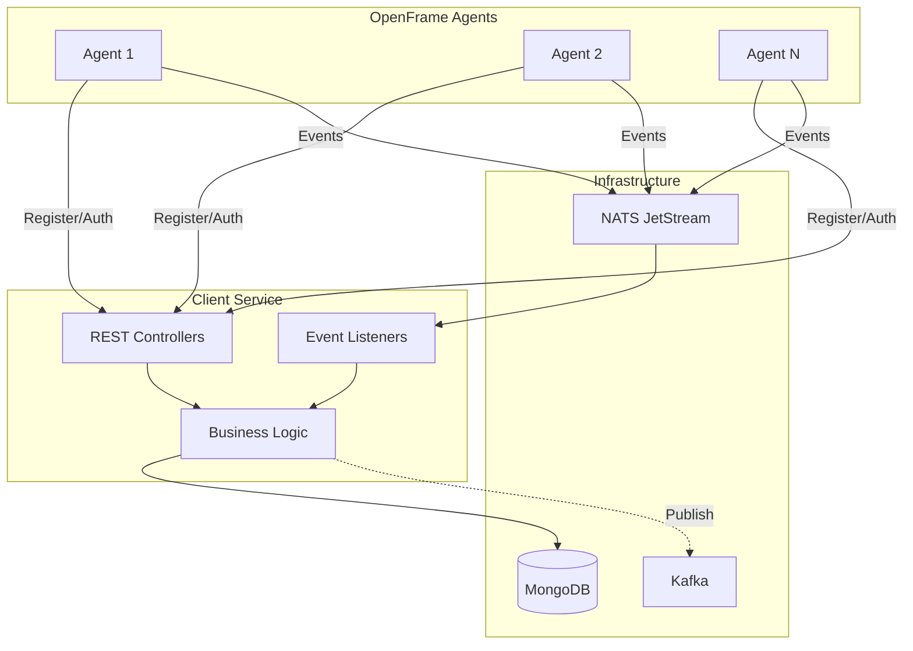

# OpenFrame Client Service

> **Agent Management & Real-time Device Monitoring for OpenFrame Platform**

[](https://www.flamingo.run/openframe)
[](https://flamingo.run)
[](https://join.slack.com/t/openmsp/shared_invite/zt-36bl7mx0h-3~U2nFH6nqHqoTPXMaHEHA)

---

## 🎯 Overview

The **Client Service** is the backbone of OpenFrame's agent management system, providing secure registration, authentication, and real-time monitoring for thousands of managed devices. It bridges the gap between OpenFrame agents running on client machines and the centralized OpenFrame platform.

### Key Features

✅ **Secure Agent Registration** - OAuth2-based onboarding with initial key validation  
✅ **Real-time Status Monitoring** - NATS-powered heartbeat and connection tracking  
✅ **Agent Inventory Management** - Track installed agents and versions across your fleet  
✅ **Horizontal Scalability** - Stateless design supports multiple instances  
✅ **Event-Driven Architecture** - Asynchronous processing with NATS JetStream  
✅ **Extensible Processing** - Plugin hooks for custom registration workflows  

---

## 📋 Table of Contents

- [Quick Start](#-quick-start)
- [Architecture](#-architecture)
- [Core Capabilities](#-core-capabilities)
- [API Reference](#-api-reference)
- [Event Streams](#-event-streams)
- [Configuration](#-configuration)
- [Deployment](#-deployment)
- [Monitoring](#-monitoring)
- [Documentation](#-documentation)
- [Community](#-community)

---

## 🚀 Quick Start

### Prerequisites

- Java 17+
- MongoDB 5.0+
- NATS Server 2.9+ with JetStream enabled
- Apache Kafka 3.0+ (optional, for event publishing)

### Running Locally

```bash
# Clone the repository
git clone https://github.com/openframe/openframe.git
cd openframe/services/openframe-client

# Set environment variables
export MONGODB_URI=mongodb://localhost:27017/openframe
export NATS_SERVERS=nats://localhost:4222
export JWT_SECRET=your-secret-key

# Run with Maven
./mvnw spring-boot:run

# Or with Gradle
./gradlew bootRun
```

### Docker Deployment

```bash
# Build the image
docker build -t openframe/client-service:latest .

# Run the container
docker run -d \
  -p 8080:8080 \
  -e MONGODB_URI=mongodb://mongo:27017/openframe \
  -e NATS_SERVERS=nats://nats:4222 \
  -e JWT_SECRET=your-secret-key \
  openframe/client-service:latest
```

### Kubernetes Deployment

```yaml
apiVersion: apps/v1
kind: Deployment
metadata:
  name: client-service
spec:
  replicas: 3
  selector:
    matchLabels:
      app: client-service
  template:
    metadata:
      labels:
        app: client-service
    spec:
      containers:
      - name: client-service
        image: openframe/client-service:latest
        ports:
        - containerPort: 8080
        env:
        - name: MONGODB_URI
          valueFrom:
            secretKeyRef:
              name: openframe-secrets
              key: mongodb-uri
        - name: NATS_SERVERS
          value: "nats://nats:4222"
        - name: JWT_SECRET
          valueFrom:
            secretKeyRef:
              name: openframe-secrets
              key: jwt-secret
```

---

## 🏗️ Architecture

### High-Level Overview



### Component Layers

| Layer | Components | Responsibility |
|-------|-----------|----------------|
| **Controllers** | `AgentController`, `AgentAuthController` | REST API endpoints for registration and authentication |
| **Listeners** | `ClientConnectionListener`, `MachineHeartbeatListener`, `InstalledAgentListener` | NATS event processing |
| **Services** | `AgentRegistrationService`, `AgentAuthService`, `MachineStatusService` | Business logic and orchestration |
| **Data** | MongoDB repositories | Persistence layer |
| **Messaging** | NATS, Kafka | Event streaming and publishing |

---

## 💡 Core Capabilities

### 1. Agent Registration

Secure onboarding of new agents with automatic credential generation:

```bash
curl -X POST http://localhost:8080/api/agents/register \
  -H "X-Initial-Key: your-initial-key" \
  -H "Content-Type: application/json" \
  -d '{
    "hostname": "workstation-001",
    "machineId": "uuid-123",
    "organizationId": "org-456",
    "platform": "linux",
    "architecture": "x86_64"
  }'
```

**Response:**
```json
{
  "machineId": "uuid-123",
  "clientId": "generated-client-id",
  "clientSecret": "generated-client-secret",
  "accessToken": "jwt-access-token",
  "refreshToken": "jwt-refresh-token",
  "expiresIn": 3600
}
```

### 2. OAuth2 Authentication

Token-based authentication for registered agents:

```bash
curl -X POST http://localhost:8080/oauth/token \
  -H "Content-Type: application/x-www-form-urlencoded" \
  -d "grant_type=client_credentials" \
  -d "client_id=your-client-id" \
  -d "client_secret=your-client-secret"
```

**Supported Grant Types:**
- `client_credentials` - Initial authentication
- `refresh_token` - Token renewal

### 3. Real-time Monitoring

Automatic processing of agent events:

- **Heartbeats**: Every 30 seconds (configurable)
- **Connection Events**: Connect/disconnect notifications
- **Agent Installations**: Track software deployments

### 4. Status Management

Intelligent machine status tracking:

- **Online**: Active heartbeat within threshold
- **Offline**: No heartbeat or explicit disconnect
- **Last Seen**: Timestamp of last activity

---

## 📡 API Reference

### Registration Endpoint

**POST** `/api/agents/register`

| Header | Type | Required | Description |
|--------|------|----------|-------------|
| `X-Initial-Key` | string | Yes | Initial registration key |
| `Content-Type` | string | Yes | `application/json` |

**Request Body:**
```json
{
  "hostname": "string",
  "machineId": "string",
  "organizationId": "string",
  "platform": "string",
  "architecture": "string",
  "osVersion": "string"
}
```

**Response:** `200 OK`
```json
{
  "machineId": "string",
  "clientId": "string",
  "clientSecret": "string",
  "accessToken": "string",
  "refreshToken": "string",
  "expiresIn": 3600
}
```

### Authentication Endpoint

**POST** `/oauth/token`

**Request Parameters** (form-urlencoded):
```text
grant_type=client_credentials
client_id=your-client-id
client_secret=your-client-secret
```

**Response:** `200 OK`
```json
{
  "access_token": "string",
  "refresh_token": "string",
  "token_type": "Bearer",
  "expires_in": 3600
}
```

---

## 📨 Event Streams

### NATS Subjects

| Subject Pattern | Type | Description |
|----------------|------|-------------|
| `machine.*.heartbeat` | Core/Fanout | Machine heartbeat signals |
| `machine.*.installed-agent` | JetStream | Agent installation notifications |
| Connection events | Spring Cloud Function | Connect/disconnect events |

### JetStream Configuration

**Stream**: `INSTALLED_AGENTS`
```yaml
subject: machine.*.installed-agent
consumer: installed-agent-processor-v1
delivery_group: installed-agent
ack_policy: explicit
max_deliver: 50
ack_wait: 30s
```

### Event Message Formats

**Heartbeat Event:**
```text
Subject: machine.abc-123.heartbeat
Payload: (empty - timestamp generated server-side)
```

**Connection Event:**
```json
{
  "client": {
    "name": "machine-id"
  },
  "timestamp": "2024-01-15T10:30:00Z"
}
```

**Installed Agent Event:**
```json
{
  "agentType": "fleet-mdm",
  "version": "1.2.3"
}
```

---

## ⚙️ Configuration

### Environment Variables

| Variable | Description | Default | Required |
|----------|-------------|---------|----------|
| `MONGODB_URI` | MongoDB connection string | `mongodb://localhost:27017/openframe` | Yes |
| `NATS_SERVERS` | NATS server URLs | `nats://localhost:4222` | Yes |
| `KAFKA_BOOTSTRAP_SERVERS` | Kafka broker addresses | `localhost:9092` | No |
| `JWT_SECRET` | JWT signing secret | - | Yes |
| `JWT_EXPIRATION` | Token expiration (ms) | `3600000` | No |

### Application Properties

```yaml
spring:
  application:
    name: openframe-client
  
  data:
    mongodb:
      uri: ${MONGODB_URI}
  
  cloud:
    stream:
      nats:
        binder:
          servers: ${NATS_SERVERS}
          jetstream:
            enabled: true

nats:
  server: ${NATS_SERVERS}
  connection-timeout: 5000
  max-reconnect: 10

security:
  jwt:
    secret: ${JWT_SECRET}
    expiration: ${JWT_EXPIRATION:3600000}
```

---

## 🚢 Deployment

### Scaling Considerations

**Horizontal Scaling:**
- ✅ Stateless design - scale to N instances
- ✅ NATS consumer groups - automatic load balancing
- ✅ MongoDB connection pooling - efficient resource usage

**Resource Requirements:**

| Environment | CPU | Memory | Disk |
|-------------|-----|--------|------|
| Development | 1 core | 512 MB | 1 GB |
| Production | 2 cores | 1 GB | 5 GB |
| High Load | 4 cores | 2 GB | 10 GB |

### High Availability

```yaml
# Kubernetes HPA example
apiVersion: autoscaling/v2
kind: HorizontalPodAutoscaler
metadata:
  name: client-service-hpa
spec:
  scaleTargetRef:
    apiVersion: apps/v1
    kind: Deployment
    name: client-service
  minReplicas: 3
  maxReplicas: 10
  metrics:
  - type: Resource
    resource:
      name: cpu
      target:
        type: Utilization
        averageUtilization: 70
```

### Health Checks

```yaml
# Kubernetes probes
livenessProbe:
  httpGet:
    path: /actuator/health
    port: 8080
  initialDelaySeconds: 30
  periodSeconds: 10

readinessProbe:
  httpGet:
    path: /actuator/health
    port: 8080
  initialDelaySeconds: 10
  periodSeconds: 5
```

---

## 📊 Monitoring

### Key Metrics

Monitor these metrics for optimal performance:

| Metric | Type | Alert Threshold |
|--------|------|-----------------|
| Registration Rate | Counter | > 100/min |
| Authentication Rate | Counter | > 500/min |
| Heartbeat Processing | Gauge | < 1000/sec |
| Event Processing Lag | Gauge | > 1000 messages |
| Error Rate | Counter | > 1% |
| MongoDB Connection Pool | Gauge | > 80% utilization |

### Prometheus Metrics

```yaml
# Exposed at /actuator/prometheus
management:
  endpoints:
    web:
      exposure:
        include: health,info,metrics,prometheus
  metrics:
    export:
      prometheus:
        enabled: true
```

### Logging

Structured JSON logging with correlation IDs:

```json
{
  "timestamp": "2024-01-15T10:30:00Z",
  "level": "INFO",
  "logger": "com.openframe.client.listener.MachineHeartbeatListener",
  "message": "Processing machine heartbeat",
  "machineId": "abc-123",
  "correlationId": "xyz-789"
}
```

---

## 📚 Documentation

### Comprehensive Guides

- **[Client Service Overview](./client_service.md)** - Complete architecture and design
- **[Registration & Authentication](./client_service_registration_auth.md)** - Detailed OAuth2 flows
- **[Event Listeners](./client_service_event_listeners.md)** - NATS event processing
- **[Data Layer](./data_layer_mongo.md)** - MongoDB schemas and repositories
- **[Gateway Service](./gateway_service.md)** - API gateway integration
- **[Authorization Service](./authorization_service.md)** - OAuth2 server

### Related Services

- [API Service](./api_service.md) - GraphQL and REST APIs
- [Stream Processing](./stream_processing.md) - Kafka event processing
- [Management Service](./management_service.md) - Tool integration

---

## 🤝 Community

### Get Involved

- **Slack Community**: [Join OpenMSP Slack](https://join.slack.com/t/openmsp/shared_invite/zt-36bl7mx0h-3~U2nFH6nqHqoTPXMaHEHA)
- **Documentation**: [OpenFrame Docs](https://www.flamingo.run/openframe)
- **Platform**: [Flamingo MSP](https://flamingo.run)

### Support Channels

- 💬 **Slack**: Real-time community support
- 📧 **Email**: support@flamingo.run
- 🐛 **Issues**: GitHub Issues (managed via Slack)

---

## 🎥 Video Resources

Learn more about OpenFrame and the Client Service:

[](https://www.youtube.com/watch?v=awc-yAnkhIo)

*OpenFrame Platform Overview - Architecture and Core Services*

---

## 📄 License

OpenFrame is part of the Flamingo MSP platform. See the main repository for license information.

---

## 🔄 Version History

| Version | Date | Changes |
|---------|------|---------|
| 1.0.0 | 2024 | Initial release with core functionality |

---

**Built with ❤️ by the OpenFrame Team**

*Empowering MSPs with AI-driven automation and open-source tools*
