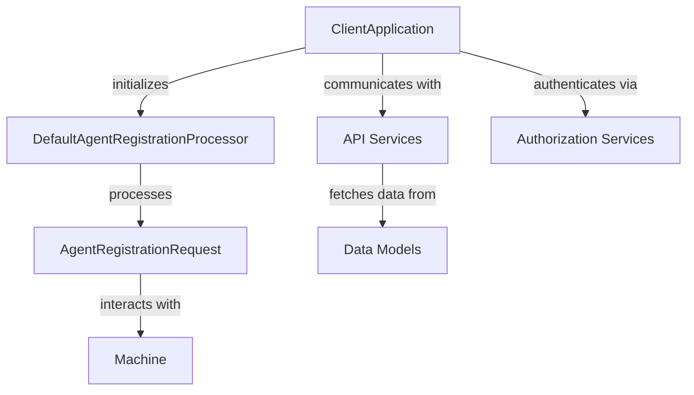

# Client Services Module Documentation

## Overview
The Client Services module is a core component of the Flamingo platform, responsible for managing client interactions and agent registrations. It serves as the interface between the client applications and the backend services, ensuring seamless communication and data flow.

## Architecture Overview
The Client Services module is built using Spring Boot and follows a microservices architecture. It interacts with various other modules, including API Services, Authorization Services, and Data Models, to provide a comprehensive client management solution.

## Core Components

### ClientApplication
- **Location**: `openframe.services.openframe-client.src.main.java.com.openframe.client.ClientApplication`
- **Purpose**: The entry point of the Client Services module, responsible for bootstrapping the Spring application.
- **Key Functionality**: Initializes the application context and scans for components in specified packages.

### DefaultAgentRegistrationProcessor
- **Location**: `deps-openframe-oss-lib.openframe-client-core.src.main.java.com.openframe.client.service.agentregistration.processor.DefaultAgentRegistrationProcessor`
- **Purpose**: Implements the `AgentRegistrationProcessor` interface with default behavior for agent registration.
- **Key Functionality**: Provides a no-op implementation for post-processing agent registrations, which can be overridden by custom processors.

### ClientApplication
- **Location**: `openframe.services.openframe-client.src.main.java.com.openframe.client.ClientApplication`
- **Purpose**: The entry point of the Client Services module, responsible for bootstrapping the Spring application.
- **Key Functionality**: Initializes the application context and scans for components in specified packages.

### DefaultAgentRegistrationProcessor
- **Location**: `deps-openframe-oss-lib.openframe-client-core.src.main.java.com.openframe.client.service.agentregistration.processor.DefaultAgentRegistrationProcessor`
- **Purpose**: Implements the `AgentRegistrationProcessor` interface with default behavior for agent registration.
- **Key Functionality**: Provides a no-op implementation for post-processing agent registrations, which can be overridden by custom processors.

## Interactions with Other Modules
The Client Services module interacts with the following modules:
- **API Services**: Handles requests and responses between the client and server.
- **Authorization Services**: Manages user authentication and authorization processes.
- **Data Models**: Provides access to the underlying data structures for devices, users, and organizations.

For more details on these modules, refer to their respective documentation:
- [API Services](API Services.md)
- [Authorization Services](Authorization Services.md)
- [Data Models](Data Models.md)

The Client Services module interacts with the following modules:
- **API Services**: Handles requests and responses between the client and server.
- **Authorization Services**: Manages user authentication and authorization processes.
- **Data Models**: Provides access to the underlying data structures for devices, users, and organizations.

For more details on these modules, refer to their respective documentation:
- [API Services](API Services.md)
- [Authorization Services](Authorization Services.md)
- [Data Models](Data Models.md)

## Conclusion
The Client Services module plays a crucial role in the Flamingo platform by facilitating client interactions and managing agent registrations. Its design allows for extensibility and integration with other services, ensuring a robust client management experience.