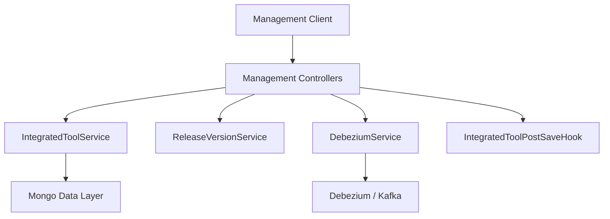
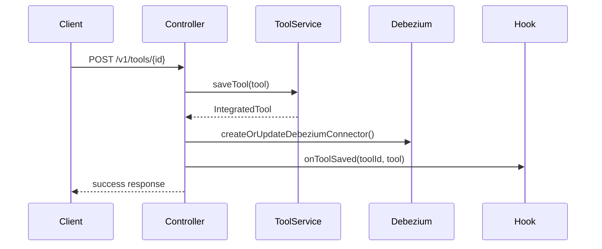
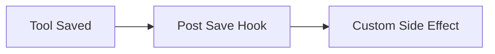
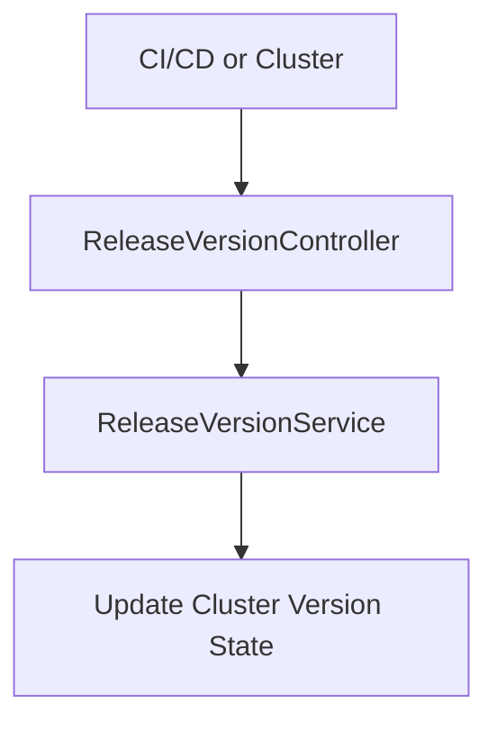

# Management Service – Controllers Module

## Overview
The **Controllers module** in the Management Service exposes REST endpoints responsible for **cluster-level management operations**. These controllers act as the boundary between external management requests (from operators, automation, or CI/CD systems) and the internal management services that orchestrate tools, releases, and data pipeline side-effects.

This module is intentionally thin:
- Controllers **do not implement business logic**
- They validate and route requests to dedicated services
- They trigger **side-effects** such as Debezium connector updates and post-save hooks

The module currently contains two primary controllers:
- **IntegratedToolController** – manages integrated tool configurations
- **ReleaseVersionController** – processes cluster release version updates

---

## Module Responsibilities

- Expose versioned REST APIs under `/v1/*`
- Coordinate tool lifecycle persistence
- Trigger infrastructure side-effects (Debezium, hooks)
- Act as an integration surface for management automation

---

## Architecture Context

The Controllers module sits within the **Management Service Core**, interacting with:
- Data-layer services for persistence
- Stream infrastructure via Debezium
- Extension hooks for tool-specific side effects



---

## IntegratedToolController

**Package:** `com.openframe.management.controller`

**Base Path:** `/v1/tools`

### Purpose
Manages the lifecycle of **Integrated Tools**, which represent external systems connected to the OpenFrame platform (RMMs, ticketing systems, monitoring tools, etc.).

This controller:
- Lists configured tools
- Retrieves a single tool by ID
- Saves or updates tool configuration
- Triggers downstream side-effects after persistence

### Dependencies

- `IntegratedToolService` – persistence and retrieval
- `DebeziumService` – CDC connector orchestration
- `IntegratedToolPostSaveHook` – extension hooks for post-save logic

### Endpoints

#### `GET /v1/tools`
Returns all integrated tools.

**Response Structure:**
```json
{
  "status": "success",
  "tools": [ ... ]
}
```

---

#### `GET /v1/tools/{id}`
Returns a single integrated tool by ID.

**Success Response:**
```json
{
  "status": "success",
  "tool": { ... }
}
```

**Error Response:**
```json
{
  "status": "error",
  "message": "Tool not found"
}
```

---

#### `POST /v1/tools/{id}`
Creates or updates an integrated tool configuration.

**Request Body:**
```json
{
  "tool": { ... }
}
```

### Processing Flow



### Key Behaviors

- Tool ID is enforced from the URL path
- Tools are automatically enabled on save
- Debezium connectors are created or updated **synchronously**
- Hook failures are logged but **do not fail** the request

---

## IntegratedToolPostSaveHook

**Package:** `com.openframe.management.hook`

### Purpose
Defines a lightweight extension point executed **after** an integrated tool is saved.

This avoids:
- Heavy Spring event infrastructure
- Tight coupling between controller and downstream services

### Interface
```java
void onToolSaved(String toolId, IntegratedTool tool);
```

### Usage Pattern



Typical use cases include:
- Initializing tool-specific agents
- Syncing metadata
- Triggering background jobs

---

## ReleaseVersionController

**Package:** `com.openframe.management.controller`

**Base Path:** `/v1/cluster-registrations`

### Purpose
Processes **cluster release version updates**, typically originating from deployment pipelines or cluster registration flows.

This controller acts as a thin ingestion layer for release metadata.

### Endpoint

#### `POST /v1/cluster-registrations`

**Request Body:**
```json
{
  "imageTagVersion": "string"
}
```

### Processing Flow



### Characteristics

- No response body
- Fire-and-forget semantics
- Delegates all logic to `ReleaseVersionService`

---

## Design Principles

- **Thin Controllers** – no domain logic
- **Explicit Side Effects** – Debezium and hooks are visible and ordered
- **Failure Isolation** – hook failures do not impact persistence
- **Versioned APIs** – all routes are under `/v1`

---

## How This Module Fits in the System

The Controllers module bridges:
- External management automation
- Internal management services
- Data and streaming infrastructure

It plays a critical role during:
- Tool onboarding
- Infrastructure integration
- Platform upgrades and releases

For deeper behavior, refer to the **Management Service Core** documentation covering services, schedulers, and initializers.
