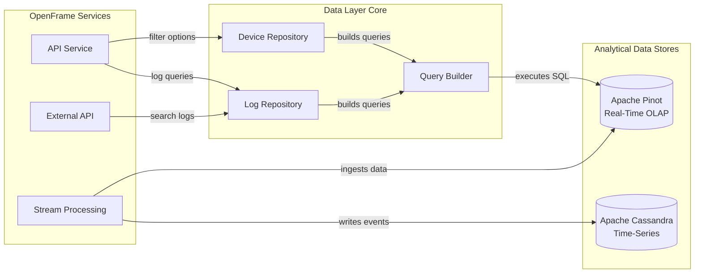
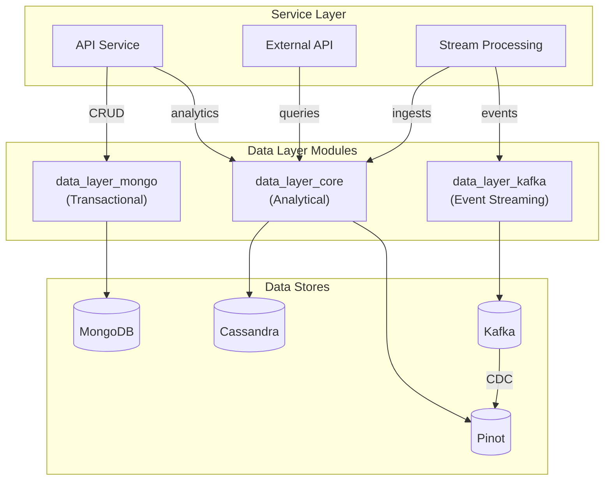
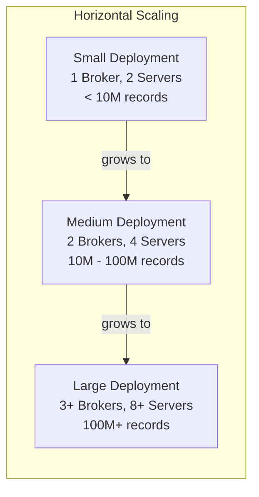

# Data Layer Core - README

## 📊 Overview

The **Data Layer Core** module is OpenFrame's high-performance analytical data access layer, providing real-time analytics and time-series data storage capabilities through **Apache Pinot** and **Apache Cassandra**. This module complements the transactional [data_layer_mongo](./data_layer_mongo.md) by offering specialized repositories optimized for OLAP queries, aggregations, and large-scale data analysis.

**Part of**: [OpenFrame](https://www.flamingo.run/openframe) - AI-driven unified MSP platform  
**Repository**: OpenFrame OSS Library  
**Module Type**: Data Access Layer (Analytical)

---

## 🎯 Key Features

### Real-Time Analytics with Apache Pinot
- ⚡ **Sub-Second Queries**: OLAP queries on millions of records in milliseconds
- 📊 **Dynamic Aggregations**: Real-time filter options with counts for UI components
- 🔍 **Full-Text Search**: Text matching with relevance scoring across log data
- 📄 **Cursor Pagination**: Efficient pagination without offset/limit overhead
- 🎯 **Multi-Dimensional Filtering**: Complex filters across devices, logs, and events

### Time-Series Storage with Apache Cassandra
- 📈 **High Write Throughput**: Optimized for time-series data ingestion
- 🔄 **Tunable Consistency**: Balance between consistency and availability
- 🗂️ **Automatic Partitioning**: Time-based partitioning for efficient queries
- 🌍 **Multi-Datacenter Replication**: Geographic distribution for resilience

### Developer Experience
- 🛡️ **Type-Safe Query Building**: Fluent API with compile-time safety
- 🔒 **SQL Injection Prevention**: Automatic parameter escaping and validation
- ⚙️ **Conditional Configuration**: Enable/disable data stores via properties
- 📝 **Rich Data Models**: Projection classes for optimized data transfer

---

## 📁 Module Structure

```text
data_layer_core/
├── Configuration Layer
│   ├── DataConfiguration          # Conditional repository enablement
│   ├── CassandraConfig            # Cassandra session and driver config
│   └── PinotConfig                # Pinot broker and controller connections
│
├── Repository Layer
│   ├── PinotClientDeviceRepository  # Device analytics and filtering
│   └── PinotClientLogRepository     # Log search and aggregations
│
├── Query Builders
│   └── PinotQueryBuilder          # Fluent SQL query construction
│
└── Data Models
    ├── LogProjection              # Log query results
    └── OrganizationOption         # Organization filter options
```

---

## 🏗️ Architecture

### Data Flow



### Integration with Data Layer Ecosystem



---

## 🚀 Quick Start

### 1. Add Dependency

**Maven**:
```xml
<dependency>
    <groupId>com.openframe</groupId>
    <artifactId>openframe-data</artifactId>
    <version>${openframe.version}</version>
</dependency>
```

**Gradle**:
```gradle
implementation 'com.openframe:openframe-data:${openframeVersion}'
```

### 2. Configure Data Stores

**application.yml**:
```yaml
# Pinot Configuration (Required)
pinot:
  broker:
    url: localhost:8099
  controller:
    url: localhost:9000
  tables:
    devices:
      name: devices
    logs:
      name: logs

# Cassandra Configuration (Optional)
spring:
  data:
    cassandra:
      enabled: true  # Set to false to disable
      keyspace-name: openframe_timeseries
      contact-points: localhost
      port: 9042
      local-datacenter: datacenter1
```

### 3. Use Repositories

**Device Filter Options**:
```java
@Service
public class DeviceService {
    
    @Autowired
    private PinotClientDeviceRepository deviceRepository;
    
    public Map<String, Integer> getStatusOptions() {
        return deviceRepository.getStatusFilterOptions(
            null,  // statuses
            null,  // deviceTypes
            null,  // osTypes
            null,  // organizationIds
            null   // tagNames
        );
    }
}
```

**Log Search**:
```java
@Service
public class LogService {
    
    @Autowired
    private PinotClientLogRepository logRepository;
    
    public List<LogProjection> searchLogs(String searchTerm) {
        return logRepository.searchLogs(
            LocalDate.now().minusDays(7),  // startDate
            LocalDate.now(),                // endDate
            null,                           // toolTypes
            null,                           // eventTypes
            null,                           // severities
            null,                           // organizationIds
            null,                           // deviceId
            searchTerm,                     // searchTerm
            null,                           // cursor
            100                             // limit
        );
    }
}
```

---

## 📚 Documentation

### Core Documentation
- **[Data Layer Core](./data_layer_core.md)** - Main module documentation with architecture and usage

### Sub-Module Documentation
- **[Configuration Layer](./data_layer_core_configuration.md)** - Cassandra and Pinot configuration
- **[Pinot Repositories](./data_layer_core_pinot_repositories.md)** - Device and log repositories
- **[Query Builders](./data_layer_core_query_builders.md)** - SQL query construction

### Related Modules
- **[Data Layer MongoDB](./data_layer_mongo.md)** - Transactional data storage
- **[Data Layer Kafka](./data_layer_kafka.md)** - Event streaming and CDC
- **[Stream Processing](./stream_processing.md)** - Data ingestion pipeline
- **[API Service](./api_service.md)** - REST and GraphQL consumers

---

## 🔧 Configuration Reference

### Pinot Configuration

| Property | Description | Default | Required |
|----------|-------------|---------|----------|
| `pinot.broker.url` | Pinot broker connection URL | - | ✅ Yes |
| `pinot.controller.url` | Pinot controller connection URL | - | ✅ Yes |
| `pinot.tables.devices.name` | Devices table name | `devices` | ❌ No |
| `pinot.tables.logs.name` | Logs table name | `logs` | ❌ No |

### Cassandra Configuration

| Property | Description | Default | Required |
|----------|-------------|---------|----------|
| `spring.data.cassandra.enabled` | Enable Cassandra repositories | `false` | ❌ No |
| `spring.data.cassandra.keyspace-name` | Cassandra keyspace | - | ⚠️ If enabled |
| `spring.data.cassandra.contact-points` | Cassandra contact points | `localhost` | ⚠️ If enabled |
| `spring.data.cassandra.port` | Cassandra port | `9042` | ❌ No |
| `spring.data.cassandra.local-datacenter` | Local datacenter name | - | ⚠️ If enabled |

---

## 💡 Usage Examples

### Dynamic Device Filtering

```java
@RestController
@RequestMapping("/api/devices")
public class DeviceController {
    
    @Autowired
    private PinotClientDeviceRepository deviceRepository;
    
    @GetMapping("/filter-options")
    public DeviceFilterOptions getFilterOptions(
            @RequestParam(required = false) List<String> statuses,
            @RequestParam(required = false) List<String> deviceTypes,
            @RequestParam(required = false) List<String> osTypes) {
        
        return DeviceFilterOptions.builder()
            .statusOptions(deviceRepository.getStatusFilterOptions(
                statuses, deviceTypes, osTypes, null, null))
            .deviceTypeOptions(deviceRepository.getDeviceTypeFilterOptions(
                statuses, deviceTypes, osTypes, null, null))
            .osTypeOptions(deviceRepository.getOsTypeFilterOptions(
                statuses, deviceTypes, osTypes, null, null))
            .totalCount(deviceRepository.getFilteredDeviceCount(
                statuses, deviceTypes, osTypes, null, null))
            .build();
    }
}
```

### Log Search with Pagination

```java
@RestController
@RequestMapping("/api/logs")
public class LogController {
    
    @Autowired
    private PinotClientLogRepository logRepository;
    
    @GetMapping("/search")
    public LogSearchResponse searchLogs(
            @RequestParam String searchTerm,
            @RequestParam(required = false) String cursor,
            @RequestParam(defaultValue = "100") int limit) {
        
        List<LogProjection> logs = logRepository.searchLogs(
            LocalDate.now().minusDays(30),
            LocalDate.now(),
            null, null, null, null, null,
            searchTerm,
            cursor,
            limit
        );
        
        // Generate next cursor
        String nextCursor = null;
        if (!logs.isEmpty() && logs.size() == limit) {
            LogProjection lastLog = logs.get(logs.size() - 1);
            nextCursor = lastLog.eventTimestamp.toEpochMilli() + 
                        "_" + lastLog.toolEventId;
        }
        
        return LogSearchResponse.builder()
            .logs(logs)
            .nextCursor(nextCursor)
            .hasMore(nextCursor != null)
            .build();
    }
}
```

### Custom Query Building

```java
@Service
public class CustomAnalyticsService {
    
    @Autowired
    @Qualifier("pinotBrokerConnection")
    private Connection pinotConnection;
    
    public List<Map<String, Object>> getCustomMetrics() {
        String query = new PinotQueryBuilder("devices")
            .select("organizationId", "COUNT(*) as deviceCount")
            .whereNotEquals("status", "DELETED")
            .whereDateRange("lastSeenAt", 
                LocalDate.now().minusDays(30), 
                LocalDate.now())
            .groupBy("organizationId")
            .orderByCountDesc()
            .limit(10)
            .build();
        
        ResultSetGroup results = pinotConnection.execute(query);
        // Process results...
        return processResults(results);
    }
}
```

---

## 🎯 Use Cases

### 1. Device Management Dashboard
- **Filter Options**: Dynamic dropdowns with device counts
- **Status Aggregations**: Real-time device status distribution
- **Organization Filtering**: Multi-tenant device isolation
- **Tag-Based Search**: Device categorization and filtering

### 2. Log Analysis and Search
- **Full-Text Search**: Search across log summaries and user IDs
- **Time-Range Queries**: Filter logs by date ranges
- **Severity Filtering**: Filter by log severity levels
- **Event Type Discovery**: Dynamic event type options

### 3. Real-Time Monitoring
- **Device Health Metrics**: Real-time device status aggregations
- **Log Volume Analysis**: Log ingestion rates and patterns
- **Organization Analytics**: Per-tenant usage statistics
- **Trend Analysis**: Time-series data visualization

### 4. Compliance and Auditing
- **Audit Log Search**: Search historical audit logs
- **User Activity Tracking**: Track user actions across devices
- **Event Correlation**: Correlate events across multiple devices
- **Retention Queries**: Query historical data for compliance

---

## ⚡ Performance Characteristics

### Query Performance

| Operation | Dataset Size | Latency | Notes |
|-----------|-------------|---------|-------|
| Device filter options | 1M devices | < 100ms | With indexes |
| Log search (no filters) | 10M logs | < 200ms | Date range required |
| Log search (with filters) | 10M logs | < 150ms | Partition pruning |
| Full-text search | 10M logs | < 300ms | Inverted index |
| Aggregations | 1M devices | < 100ms | Columnar storage |

### Scaling Characteristics



**Scaling Recommendations**:
- **Small**: Single broker, 2-3 servers (< 10M records)
- **Medium**: 2 brokers, 4-6 servers (10M - 100M records)
- **Large**: 3+ brokers, 8+ servers (100M+ records)
- **Add servers** to increase query throughput
- **Add brokers** to handle more concurrent queries

---

## 🔒 Security Considerations

### SQL Injection Prevention

The `PinotQueryBuilder` automatically escapes all user input:

```java
// Safe - automatically escaped
String query = new PinotQueryBuilder("logs")
    .whereEquals("userId", userInput)  // Escaped
    .whereLike("summary", searchTerm)  // Escaped
    .build();

// Unsafe - direct SQL construction (DON'T DO THIS)
String unsafeQuery = "SELECT * FROM logs WHERE userId = '" + userInput + "'";
```

### Multi-Tenant Isolation

Always filter by organization ID for tenant isolation:

```java
// Correct - tenant-aware query
List<LogProjection> logs = logRepository.findLogs(
    startDate, endDate,
    null, null, null,
    List.of(currentUser.getOrganizationId()),  // ✅ Filter by org
    null, null, 100
);

// Incorrect - cross-tenant data leak
List<LogProjection> logs = logRepository.findLogs(
    startDate, endDate,
    null, null, null,
    null,  // ❌ No org filter - security risk!
    null, null, 100
);
```

---

## 🧪 Testing

### Unit Testing

```java
@ExtendWith(MockitoExtension.class)
class PinotClientLogRepositoryTest {
    
    @Mock
    private Connection pinotConnection;
    
    @InjectMocks
    private PinotClientLogRepository repository;
    
    @Test
    void testSearchLogs() {
        // Mock Pinot response
        ResultSetGroup resultSetGroup = mock(ResultSetGroup.class);
        ResultSet resultSet = mock(ResultSet.class);
        
        when(pinotConnection.execute(anyString())).thenReturn(resultSetGroup);
        when(resultSetGroup.getResultSet(0)).thenReturn(resultSet);
        when(resultSet.getRowCount()).thenReturn(0);
        
        // Execute
        List<LogProjection> logs = repository.searchLogs(
            LocalDate.now().minusDays(7),
            LocalDate.now(),
            null, null, null, null, null, "test", null, 10
        );
        
        assertNotNull(logs);
        assertTrue(logs.isEmpty());
    }
}
```

### Integration Testing

```java
@SpringBootTest
@Testcontainers
class PinotIntegrationTest {
    
    @Container
    static PinotContainer pinot = new PinotContainer("apachepinot/pinot:latest");
    
    @DynamicPropertySource
    static void configurePinot(DynamicPropertyRegistry registry) {
        registry.add("pinot.broker.url", pinot::getBrokerUrl);
    }
    
    @Autowired
    private PinotClientLogRepository logRepository;
    
    @Test
    void testRealPinotQuery() {
        List<LogProjection> logs = logRepository.findLogs(
            LocalDate.now().minusDays(1),
            LocalDate.now(),
            null, null, null, null, null, null, 10
        );
        
        assertNotNull(logs);
    }
}
```

---

## 🐛 Troubleshooting

### Common Issues

#### 1. Connection Refused to Pinot Broker

**Symptoms**: `Connection refused` or `Unable to connect to Pinot broker`

**Solutions**:
```bash
# Verify Pinot is running
curl http://localhost:8099/health

# Check broker URL in configuration
pinot.broker.url=localhost:8099  # Correct format

# Verify network connectivity
telnet localhost 8099
```

#### 2. Empty Query Results

**Symptoms**: Queries return empty results despite data in Pinot

**Solutions**:
```java
// Check date range (timezone issues)
LocalDate startDate = LocalDate.now().minusDays(7);  // User timezone
LocalDate endDate = LocalDate.now();

// Verify table name
pinot.tables.logs.name=logs  // Must match Pinot table

// Query Pinot directly to confirm data
curl -X POST http://localhost:8099/query/sql \
  -d '{"sql":"SELECT COUNT(*) FROM logs"}'
```

#### 3. Query Timeout

**Symptoms**: Queries timeout on large datasets

**Solutions**:
```java
// Add date range filters for partition pruning
.whereDateRange("eventTimestamp", startDate, endDate)

// Reduce result set size
.limit(100)  // Instead of .limit(10000)

// Add indexes in Pinot schema
"invertedIndexColumns": ["eventType", "severity", "organizationId"]
```

#### 4. Cassandra Connection Failures

**Symptoms**: `NoHostAvailableException` or authentication errors

**Solutions**:
```yaml
# Verify datacenter name
spring.data.cassandra.local-datacenter: datacenter1

# Check keyspace exists
cqlsh -e "DESCRIBE KEYSPACE openframe_timeseries;"

# Enable schema creation
# CassandraConfig.getSchemaAction() returns CREATE_IF_NOT_EXISTS
```

---

## 📊 Monitoring and Observability

### Health Checks

```java
@Component
public class PinotHealthIndicator implements HealthIndicator {
    
    @Autowired
    @Qualifier("pinotBrokerConnection")
    private Connection pinotConnection;
    
    @Override
    public Health health() {
        try {
            ResultSetGroup result = pinotConnection.execute(
                "SELECT 1 FROM devices LIMIT 1"
            );
            return Health.up()
                .withDetail("broker", "connected")
                .build();
        } catch (Exception e) {
            return Health.down()
                .withDetail("error", e.getMessage())
                .build();
        }
    }
}
```

### Metrics

Key metrics to monitor:
- **Query Latency**: P50, P95, P99 query response times
- **Query Throughput**: Queries per second
- **Error Rate**: Failed queries / total queries
- **Connection Pool**: Active connections to Pinot broker
- **Result Set Size**: Average rows returned per query

---

## 🤝 Contributing

This module is part of the OpenFrame open-source project. Contributions are welcome!

### Development Setup

```bash
# Clone repository
git clone https://github.com/openframe/openframe-oss-lib.git

# Navigate to data layer core
cd openframe-oss-lib/openframe-data

# Build module
mvn clean install

# Run tests
mvn test
```

### Contribution Guidelines

1. Follow existing code style and patterns
2. Add unit tests for new functionality
3. Update documentation for API changes
4. Test with real Pinot instance before submitting PR
5. Ensure SQL injection prevention in query builders

---

## 📖 Additional Resources

### Apache Pinot
- **Documentation**: https://docs.pinot.apache.org/
- **Query Language**: https://docs.pinot.apache.org/users/user-guide-query/querying-pinot
- **Performance Tuning**: https://docs.pinot.apache.org/operators/operating-pinot/tuning

### Apache Cassandra
- **Documentation**: https://cassandra.apache.org/doc/latest/
- **Data Modeling**: https://cassandra.apache.org/doc/latest/cassandra/data_modeling/
- **Spring Data Cassandra**: https://spring.io/projects/spring-data-cassandra

### OpenFrame Platform
- **OpenFrame Website**: https://www.flamingo.run/openframe
- **Flamingo Platform**: https://flamingo.run
- **OpenMSP Community**: https://www.openmsp.ai/
- **Slack Community**: https://join.slack.com/t/openmsp/shared_invite/zt-36bl7mx0h-3~U2nFH6nqHqoTPXMaHEHA

---

## 📄 License

This module is part of the OpenFrame OSS Library and is licensed under the Apache License 2.0.

---

## 💬 Support

**Need Help?**
- 💬 Join our [OpenMSP Slack Community](https://join.slack.com/t/openmsp/shared_invite/zt-36bl7mx0h-3~U2nFH6nqHqoTPXMaHEHA)
- 📧 Email: support@flamingo.run
- 🌐 Website: https://www.flamingo.run/openframe

**Found a Bug?**
- Report issues on our Slack community (we don't use GitHub Issues)
- Provide Pinot query logs and error messages
- Include configuration and environment details

---

**Built with ❤️ by the OpenFrame Team**
