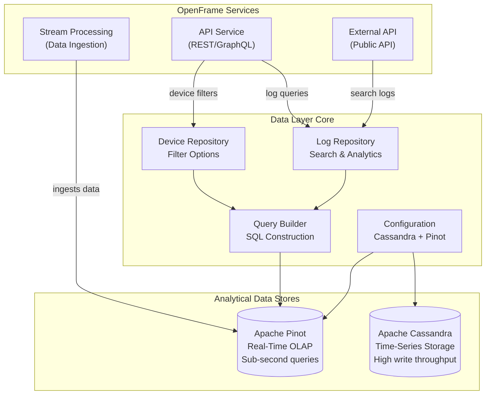
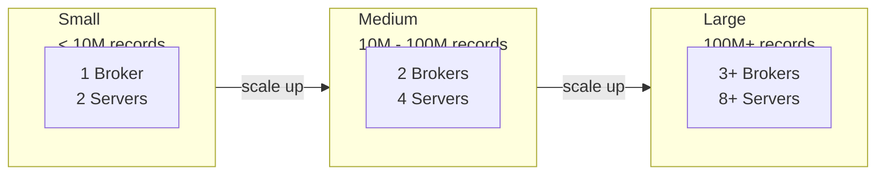
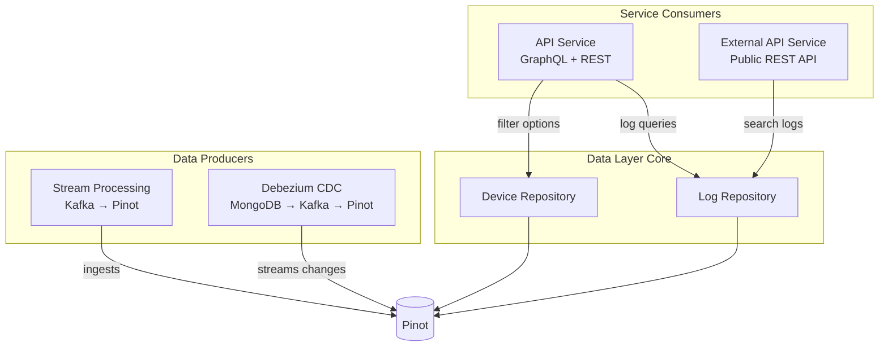

# Data Layer Core - Executive Summary

## 🎯 Module Purpose

The **Data Layer Core** module provides high-performance analytical data access for the OpenFrame platform through **Apache Pinot** (real-time OLAP) and **Apache Cassandra** (time-series storage). This module enables sub-second analytics queries on millions of device and log records, supporting dynamic filtering, aggregations, and full-text search capabilities.

**Key Value Proposition**: Separates analytical workloads from transactional operations, enabling real-time dashboards and reporting without impacting operational database performance.

---

## 📊 Architecture at a Glance



---

## 🔑 Core Components

### 1. Configuration Layer
**Purpose**: Auto-configure analytical data stores with Spring Boot

| Component | Responsibility | Key Features |
|-----------|---------------|--------------|
| `DataConfiguration` | Conditional repository enablement | `@ConditionalOnProperty` for Cassandra |
| `CassandraConfig` | Cassandra session factory | Multi-datacenter support, schema management |
| `PinotConfig` | Pinot connection beans | Broker (queries) + Controller (admin) |

**Configuration Example**:
```yaml
pinot:
  broker.url: localhost:8099
  controller.url: localhost:9000
  tables:
    devices.name: devices
    logs.name: logs

spring.data.cassandra:
  enabled: true  # Optional - disable if not needed
  keyspace-name: openframe_timeseries
  local-datacenter: datacenter1
```

---

### 2. Pinot Repositories
**Purpose**: High-performance analytical queries on device and log data

| Repository | Primary Use Cases | Key Methods |
|------------|-------------------|-------------|
| `PinotClientDeviceRepository` | Device filtering and aggregations | `getStatusFilterOptions()`, `getDeviceTypeFilterOptions()`, `getFilteredDeviceCount()` |
| `PinotClientLogRepository` | Log search and analytics | `searchLogs()`, `findLogs()`, `getEventTypeOptions()`, `getOrganizationOptions()` |

**Key Capabilities**:
- ✅ **Dynamic Filter Options**: Real-time aggregations for UI dropdowns with counts
- ✅ **Multi-Dimensional Filtering**: Filter by status, type, OS, organization, tags
- ✅ **Full-Text Search**: Text matching across log summaries and user IDs
- ✅ **Cursor Pagination**: Efficient pagination for large result sets
- ✅ **Tenant Isolation**: Organization-aware queries for multi-tenancy

**Example Usage**:
```java
// Get device filter options with counts
Map<String, Integer> statusOptions = deviceRepository.getStatusFilterOptions(
    null, null, null, List.of("org-123"), null
);
// Returns: {"ONLINE": 1250, "OFFLINE": 340, "MAINTENANCE": 45}

// Search logs with full-text search
List<LogProjection> logs = logRepository.searchLogs(
    LocalDate.now().minusDays(7), LocalDate.now(),
    null, null, null, List.of("org-123"), null,
    "error authentication",  // Search term
    null, 100
);
```

---

### 3. Query Builder
**Purpose**: Type-safe SQL query construction with security and validation

| Feature | Description | Benefit |
|---------|-------------|---------|
| **Fluent API** | Method chaining for query building | Readable, maintainable code |
| **SQL Injection Prevention** | Automatic parameter escaping | Security by default |
| **Date Range Queries** | Timezone-aware date filtering | Partition pruning optimization |
| **Full-Text Search** | `TEXT_MATCH` function support | Relevance-based search |
| **Cursor Pagination** | Timestamp + ID based cursors | Efficient large result sets |

**Example Usage**:
```java
String query = new PinotQueryBuilder("logs")
    .select("toolEventId", "eventType", "severity", "summary", "eventTimestamp")
    .whereDateRange("eventTimestamp", startDate, endDate)
    .whereIn("organizationId", List.of("org-123"))
    .whereRelevanceLogSearch("error authentication")
    .orderByTimestampDesc()
    .limit(100)
    .build();
// Generates safe, parameterized SQL with automatic escaping
```

---

## 🚀 Performance Characteristics

### Query Performance Benchmarks

| Operation | Dataset Size | Latency | Optimization |
|-----------|-------------|---------|--------------|
| Device filter options | 1M devices | < 100ms | Columnar storage + indexes |
| Log search (filtered) | 10M logs | < 150ms | Partition pruning by date |
| Full-text search | 10M logs | < 300ms | Inverted indexes |
| Aggregations | 1M devices | < 100ms | Pinot's OLAP engine |
| Cursor pagination | Any size | < 50ms | No offset overhead |

### Scaling Model



**Horizontal Scaling**:
- Add **Pinot servers** to increase query throughput
- Add **Pinot brokers** to handle more concurrent queries
- Add **Cassandra nodes** for higher write throughput
- Partition tables by time for efficient pruning

---

## 🔗 Integration Points

### Service Dependencies



### Related Modules

| Module | Relationship | Integration Point |
|--------|--------------|-------------------|
| **[data_layer_mongo](./data_layer_mongo.md)** | Transactional data source | CDC events → Pinot ingestion |
| **[data_layer_kafka](./data_layer_kafka.md)** | Event streaming | Kafka topics → Pinot real-time tables |
| **[stream_processing](./stream_processing.md)** | Data ingestion | Enriches and ingests to Pinot |
| **[api_service](./api_service.md)** | Primary consumer | GraphQL DataFetchers use repositories |
| **[external_api](./external_api.md)** | Public API consumer | REST controllers use log repository |

---

## 💡 Key Use Cases

### 1. Device Management Dashboard
**Scenario**: Display device inventory with dynamic filters

```java
// Get filter options with counts for UI dropdowns
DeviceFilterOptions options = DeviceFilterOptions.builder()
    .statusOptions(deviceRepo.getStatusFilterOptions(...))      // {"ONLINE": 1250, ...}
    .deviceTypeOptions(deviceRepo.getDeviceTypeFilterOptions(...)) // {"WORKSTATION": 890, ...}
    .osTypeOptions(deviceRepo.getOsTypeFilterOptions(...))      // {"WINDOWS": 1100, ...}
    .totalCount(deviceRepo.getFilteredDeviceCount(...))         // 1635
    .build();
```

**Benefits**:
- Real-time counts for each filter option
- Multi-dimensional filtering (status + type + OS + org + tags)
- Sub-100ms response time on millions of devices

---

### 2. Log Search and Analysis
**Scenario**: Search logs with full-text search and filters

```java
// Search logs with relevance scoring
List<LogProjection> logs = logRepo.searchLogs(
    LocalDate.now().minusDays(30),  // Last 30 days
    LocalDate.now(),
    List.of("FLEET_MDM", "TACTICAL_RMM"),  // Tool types
    List.of("ERROR", "WARNING"),            // Event types
    List.of("HIGH", "CRITICAL"),            // Severities
    List.of("org-123"),                     // Organization
    null,                                   // Device ID
    "authentication failed",                // Search term
    null,                                   // Cursor
    100                                     // Limit
);
```

**Benefits**:
- Full-text search across log summaries and user IDs
- Multi-dimensional filtering for precise results
- Cursor-based pagination for large result sets
- Sub-200ms response time on 10M+ logs

---

### 3. Real-Time Analytics Dashboard
**Scenario**: Display real-time metrics and trends

```java
// Get organization-specific metrics
List<OrganizationOption> orgs = logRepo.getOrganizationOptions(
    startDate, endDate, null, null, null
);

// Get event type distribution
List<String> eventTypes = logRepo.getEventTypeOptions(
    startDate, endDate, null, null, null, null
);

// Get severity distribution
List<String> severities = logRepo.getSeverityOptions(
    startDate, endDate, null, null, null, null
);
```

**Benefits**:
- Real-time aggregations without pre-computation
- Dynamic filter discovery based on actual data
- Organization-aware analytics for multi-tenancy

---

## 🔒 Security Features

### SQL Injection Prevention

```java
// ✅ SAFE - Automatic escaping by PinotQueryBuilder
String query = new PinotQueryBuilder("logs")
    .whereEquals("userId", userInput)  // Automatically escaped
    .whereLike("summary", searchTerm)  // Automatically escaped
    .build();

// ❌ UNSAFE - Direct SQL construction (DON'T DO THIS)
String unsafeQuery = "SELECT * FROM logs WHERE userId = '" + userInput + "'";
```

### Multi-Tenant Isolation

```java
// ✅ CORRECT - Always filter by organization
List<LogProjection> logs = logRepo.findLogs(
    startDate, endDate, null, null, null,
    List.of(currentUser.getOrganizationId()),  // Tenant isolation
    null, null, 100
);

// ❌ INCORRECT - Cross-tenant data leak
List<LogProjection> logs = logRepo.findLogs(
    startDate, endDate, null, null, null,
    null,  // No org filter - SECURITY RISK!
    null, null, 100
);
```

---

## 📈 Operational Considerations

### Monitoring Metrics

| Metric | Target | Alert Threshold | Action |
|--------|--------|-----------------|--------|
| Query Latency (P95) | < 200ms | > 500ms | Add Pinot servers |
| Query Error Rate | < 0.1% | > 1% | Check Pinot broker health |
| Connection Pool Usage | < 80% | > 90% | Increase pool size |
| Result Set Size | < 1000 rows | > 5000 rows | Review query limits |

### Health Checks

```java
// Pinot broker health check
@Component
public class PinotHealthIndicator implements HealthIndicator {
    @Override
    public Health health() {
        try {
            pinotConnection.execute("SELECT 1 FROM devices LIMIT 1");
            return Health.up().build();
        } catch (Exception e) {
            return Health.down().withDetail("error", e.getMessage()).build();
        }
    }
}
```

---

## 🐛 Common Issues and Solutions

### Issue 1: Empty Query Results

**Symptoms**: Queries return no results despite data in Pinot

**Root Causes**:
- Date range timezone mismatch
- Incorrect table name configuration
- Data not yet ingested to Pinot

**Solutions**:
```bash
# Verify data exists in Pinot
curl -X POST http://localhost:8099/query/sql \
  -d '{"sql":"SELECT COUNT(*) FROM logs"}'

# Check table configuration
pinot.tables.logs.name=logs  # Must match Pinot table name

# Verify date range
LocalDate.now()  # Uses system timezone - ensure consistency
```

---

### Issue 2: Query Timeout

**Symptoms**: Queries timeout on large datasets

**Root Causes**:
- Missing date range filters (no partition pruning)
- Large result sets without limits
- Missing indexes on filter columns

**Solutions**:
```java
// ✅ Add date range for partition pruning
.whereDateRange("eventTimestamp", startDate, endDate)

// ✅ Limit result set size
.limit(100)  // Instead of .limit(10000)

// ✅ Add indexes in Pinot schema
"invertedIndexColumns": ["eventType", "severity", "organizationId"]
```

---

### Issue 3: Connection Refused

**Symptoms**: `Connection refused` to Pinot broker

**Root Causes**:
- Pinot broker not running
- Incorrect broker URL
- Network/firewall issues

**Solutions**:
```bash
# Verify Pinot is running
curl http://localhost:8099/health

# Check configuration
pinot.broker.url=localhost:8099  # Correct format (no http://)

# Test connectivity
telnet localhost 8099
```

---

## 📚 Documentation Index

### Main Documentation
- **[Data Layer Core](./data_layer_core.md)** - Complete module documentation

### Sub-Module Documentation
- **[Configuration Layer](./data_layer_core_configuration.md)** - Cassandra and Pinot setup
- **[Pinot Repositories](./data_layer_core_pinot_repositories.md)** - Repository implementations
- **[Query Builders](./data_layer_core_query_builders.md)** - SQL query construction

### Quick References
- **[README](./DATA_LAYER_CORE_README.md)** - Quick start and examples
- **[Summary](./DATA_LAYER_CORE_SUMMARY.md)** - This document

---

## 🎓 Learning Path

### For New Developers

1. **Start Here**: [DATA_LAYER_CORE_README.md](./DATA_LAYER_CORE_README.md)
   - Quick start guide
   - Configuration examples
   - Basic usage patterns

2. **Deep Dive**: [data_layer_core.md](./data_layer_core.md)
   - Architecture overview
   - Integration patterns
   - Performance considerations

3. **Specific Topics**:
   - [Configuration](./data_layer_core_configuration.md) - Setup and configuration
   - [Repositories](./data_layer_core_pinot_repositories.md) - Query patterns
   - [Query Builders](./data_layer_core_query_builders.md) - Advanced queries

### For Architects

1. Review architecture diagrams in [data_layer_core.md](./data_layer_core.md)
2. Understand scaling strategies and performance characteristics
3. Review integration points with other modules
4. Study security considerations and multi-tenancy patterns

---

## 🔗 External Resources

### Apache Pinot
- **Official Docs**: https://docs.pinot.apache.org/
- **Query Language**: https://docs.pinot.apache.org/users/user-guide-query/querying-pinot
- **Performance Tuning**: https://docs.pinot.apache.org/operators/operating-pinot/tuning

### Apache Cassandra
- **Official Docs**: https://cassandra.apache.org/doc/latest/
- **Data Modeling**: https://cassandra.apache.org/doc/latest/cassandra/data_modeling/
- **Spring Data**: https://spring.io/projects/spring-data-cassandra

### OpenFrame Platform
- **OpenFrame**: https://www.flamingo.run/openframe
- **Flamingo**: https://flamingo.run
- **Community**: https://www.openmsp.ai/
- **Slack**: https://join.slack.com/t/openmsp/shared_invite/zt-36bl7mx0h-3~U2nFH6nqHqoTPXMaHEHA

---

## 📞 Support

**Need Help?**
- 💬 **Slack Community**: https://join.slack.com/t/openmsp/shared_invite/zt-36bl7mx0h-3~U2nFH6nqHqoTPXMaHEHA
- 📧 **Email**: support@flamingo.run
- 🌐 **Website**: https://www.flamingo.run/openframe

**Note**: We manage all discussions on our OpenMSP Slack community - we don't use GitHub Issues or GitHub Discussions.

---

**Last Updated**: 2024  
**Module Version**: Part of OpenFrame OSS Library  
**Maintained By**: OpenFrame Team
