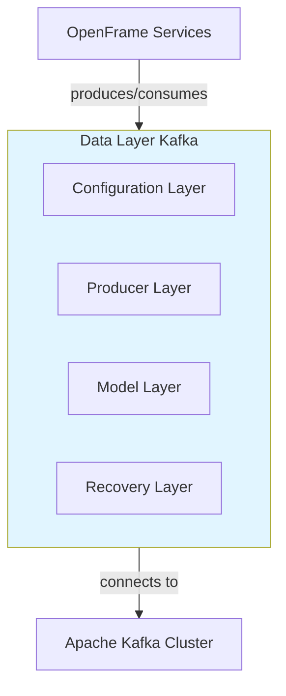

# Data Layer - Kafka Module

## Quick Reference

The **data_layer_kafka** module provides Kafka integration for OpenFrame's event-driven architecture, enabling reliable messaging and CDC (Change Data Capture) support.

---

## 📚 Documentation

**Main Documentation**: [data_layer_kafka.md](data_layer_kafka.md)

---

## 🎯 Key Features

- ✅ **Auto-configured Kafka Beans** - Producer, Consumer, Admin, and Listener factories
- ✅ **Debezium CDC Support** - Type-safe Change Data Capture event processing
- ✅ **Retry & Recovery** - Built-in error handling and recovery mechanisms
- ✅ **Topic Management** - Automatic topic creation and configuration
- ✅ **Async & Sync Producers** - Support for both fire-and-forget and blocking sends
- ✅ **JSON Serialization** - Native JSON support for message payloads

---

## 🏗️ Architecture



---

## 🔧 Core Components

| Component | Purpose | Documentation |
|-----------|---------|---------------|
| **OssKafkaConfig** | Disables default Kafka auto-configuration | [Configuration Components](data_layer_kafka.md#1-configuration-components) |
| **OssTenantKafkaAutoConfiguration** | Auto-configures all Kafka beans | [Configuration Components](data_layer_kafka.md#1-configuration-components) |
| **MessageProducer** | High-level message production interface | [Producer Components](data_layer_kafka.md#2-producer-components) |
| **OssTenantKafkaProducer** | OSS tenant Kafka producer implementation | [Producer Components](data_layer_kafka.md#2-producer-components) |
| **GenericKafkaProducer** | Base producer with error handling | [Producer Components](data_layer_kafka.md#2-producer-components) |
| **DebeziumMessage** | Type-safe CDC event model | [Model Components](data_layer_kafka.md#3-model-components) |
| **KafkaRecoveryHandler** | Failed message recovery handler | [Recovery Components](data_layer_kafka.md#4-recovery-components) |

---

## 🚀 Quick Start

### 1. Configuration

```yaml
spring:
  oss-tenant:
    kafka:
      enabled: true
      bootstrap-servers: localhost:9092
      
      producer:
        acks: all
        retries: 3
        
      consumer:
        group-id: openframe-consumer-group
        auto-offset-reset: earliest
        
      listener:
        ack-mode: RECORD
        concurrency: 3

openframe:
  oss-tenant:
    kafka:
      topics:
        auto-create: true
        inbound:
          device-events:
            name: device-events
            partitions: 3
            replication-factor: 2
```

### 2. Producing Messages

**Async (Fire-and-Forget)**:
```java
@Autowired
@Qualifier("ossTenantKafkaProducer")
private MessageProducer kafkaProducer;

public void publishEvent(DeviceEvent event) {
    kafkaProducer.sendAsyncMessage(
        "device-events",
        event,
        event.getDeviceId()
    );
}
```

**Sync (Blocking with Retry)**:
```java
@Retryable(value = TransientKafkaSendException.class, maxAttempts = 3)
public void publishCriticalEvent(CriticalEvent event) {
    kafkaProducer.sendAndAwaitMessage(
        "critical-events",
        event,
        event.getEventId()
    );
}
```

### 3. Consuming Messages

**Basic Listener**:
```java
@KafkaListener(
    topics = "device-events",
    groupId = "device-processor-group",
    containerFactory = "ossTenantKafkaListenerContainerFactory"
)
public void handleDeviceEvent(@Payload DeviceEvent event) {
    // Process event
}
```

**CDC Listener**:
```java
@KafkaListener(
    topics = "dbserver1.openframe.devices",
    groupId = "device-cdc-processor",
    containerFactory = "ossTenantKafkaListenerContainerFactory"
)
public void handleDeviceCdc(@Payload DebeziumMessage<Device> message) {
    Payload<Device> payload = message.getPayload();
    
    switch (payload.getOperation()) {
        case "c" -> handleCreate(payload.getAfter());
        case "u" -> handleUpdate(payload.getBefore(), payload.getAfter());
        case "d" -> handleDelete(payload.getBefore());
    }
}
```

---

## 🔗 Integration Points

### Stream Processing Service
- **Primary Consumer**: Processes Kafka events and CDC messages
- **Components**: JsonKafkaListener, DebeziumMessageHandler
- **Documentation**: [Stream Processing Module](stream_processing.md)

### Management Service
- **CDC Management**: Configures and monitors Debezium connectors
- **Components**: DebeziumService, DebeziumHealthCheckScheduler
- **Documentation**: [Management Service CDC Management](management_service_cdc_management.md)

### Client Service
- **Event Producer**: Publishes client connection and heartbeat events
- **Components**: ClientConnectionListener, MachineHeartbeatListener
- **Documentation**: [Client Service Event Listeners](client_service_event_listeners.md)

### Data Layer MongoDB
- **CDC Source**: MongoDB changes captured by Debezium
- **Topics**: Device, Machine, Organization, User collections
- **Documentation**: [Data Layer MongoDB](data_layer_mongo.md)

---

## 📖 Documentation Sections

| Section | Description | Link |
|---------|-------------|------|
| **Overview** | Module purpose and key features | [Overview](data_layer_kafka.md#overview) |
| **Architecture** | System architecture and component relationships | [Architecture](data_layer_kafka.md#architecture-overview) |
| **Core Components** | Detailed component documentation | [Core Components](data_layer_kafka.md#core-components) |
| **Configuration** | Configuration properties and examples | [Configuration](data_layer_kafka.md#configuration-properties) |
| **Producer Guide** | Message production patterns | [Producer Usage](data_layer_kafka.md#producer-usage-guide) |
| **Consumer Guide** | Message consumption patterns | [Consumer Usage](data_layer_kafka.md#consumer-usage-guide) |
| **Monitoring** | Logging, metrics, and health checks | [Monitoring](data_layer_kafka.md#monitoring-and-observability) |
| **Best Practices** | Recommended patterns and anti-patterns | [Best Practices](data_layer_kafka.md#best-practices) |
| **Troubleshooting** | Common issues and solutions | [Troubleshooting](data_layer_kafka.md#troubleshooting) |
| **Testing** | Unit and integration testing | [Testing](data_layer_kafka.md#testing) |
| **Migration** | Migration from default Spring Kafka | [Migration Guide](data_layer_kafka.md#migration-guide) |

---

## 🎓 Common Use Cases

### 1. Publishing Device Events
```java
DeviceEvent event = DeviceEvent.builder()
    .deviceId("device-123")
    .eventType("CONNECTED")
    .tenantId("tenant-456")
    .timestamp(Instant.now())
    .build();

kafkaProducer.sendAsyncMessage("device-events", event, event.getDeviceId());
```

### 2. Processing CDC Events
```java
@KafkaListener(topics = "dbserver1.openframe.devices")
public void handleDeviceCdc(DebeziumMessage<Device> message) {
    if ("u".equals(message.getPayload().getOperation())) {
        Device before = message.getPayload().getBefore();
        Device after = message.getPayload().getAfter();
        
        // Detect changes
        if (!before.getStatus().equals(after.getStatus())) {
            notifyStatusChange(after);
        }
    }
}
```

### 3. Handling Failed Messages
```java
@Service
public class CustomRecoveryHandler implements KafkaRecoveryHandler {
    
    @Override
    public void enqueue(Throwable ex, String topic, String key, Object payload) {
        // Save to dead letter queue
        deadLetterRepository.save(
            DeadLetter.builder()
                .topic(topic)
                .key(key)
                .payload(payload)
                .error(ex.getMessage())
                .timestamp(Instant.now())
                .build()
        );
    }
}
```

---

## 🔍 Key Concepts

### Message Keys
- **Purpose**: Determines partition assignment and ordering
- **Best Practice**: Use entity IDs (deviceId, tenantId, userId)
- **Impact**: All messages with same key go to same partition

### ACK Modes
- **RECORD**: Commit after each record (safest, slowest)
- **BATCH**: Commit after batch (balanced)
- **MANUAL**: Application controls commits (most flexible)

### Error Classification
- **Fatal Errors**: Non-retryable (RecordTooLargeException, AuthorizationException)
- **Transient Errors**: Retryable (TimeoutException, NetworkException)

### CDC Operations
- **c**: Create (INSERT)
- **u**: Update (UPDATE)
- **d**: Delete (DELETE)
- **r**: Read (initial snapshot)

---

## 📊 Monitoring

### Producer Metrics
- `kafka.producer.record-send-total`: Total records sent
- `kafka.producer.record-error-total`: Total send errors
- `kafka.producer.request-latency-avg`: Average request latency

### Consumer Metrics
- `kafka.consumer.records-consumed-total`: Total records consumed
- `kafka.consumer.fetch-latency-avg`: Average fetch latency
- `kafka.consumer.commit-latency-avg`: Average commit latency

### Health Check
```bash
curl http://localhost:8080/actuator/health/kafka
```

---

## 🛠️ Troubleshooting Quick Reference

| Issue | Symptom | Solution |
|-------|---------|----------|
| **Topic Not Found** | `UnknownTopicOrPartitionException` | Enable auto-creation in config |
| **Serialization Error** | `SerializationException` | Implement `KafkaMessage` interface |
| **Consumer Lag** | Slow processing | Increase concurrency |
| **Connection Timeout** | `TimeoutException` | Check broker connectivity |

See [Troubleshooting Guide](data_layer_kafka.md#troubleshooting) for detailed solutions.

---

## 📚 Additional Resources

### Apache Kafka
- [Kafka Documentation](https://kafka.apache.org/documentation/)
- [Producer Configs](https://kafka.apache.org/documentation/#producerconfigs)
- [Consumer Configs](https://kafka.apache.org/documentation/#consumerconfigs)

### Spring Kafka
- [Spring for Apache Kafka](https://spring.io/projects/spring-kafka)
- [Spring Kafka Reference](https://docs.spring.io/spring-kafka/reference/html/)

### Debezium
- [Debezium Documentation](https://debezium.io/documentation/)
- [MongoDB Connector](https://debezium.io/documentation/reference/stable/connectors/mongodb.html)

---

## 💬 Support

- **Slack Community**: [OpenMSP Slack](https://join.slack.com/t/openmsp/shared_invite/zt-36bl7mx0h-3~U2nFH6nqHqoTPXMaHEHA)
- **Documentation**: [OpenFrame Documentation](https://www.flamingo.run/openframe)
- **Platform**: [Flamingo Platform](https://flamingo.run)

---

**Last Updated**: 2024  
**Module Version**: 1.0  
**Maintainer**: OpenFrame Team
