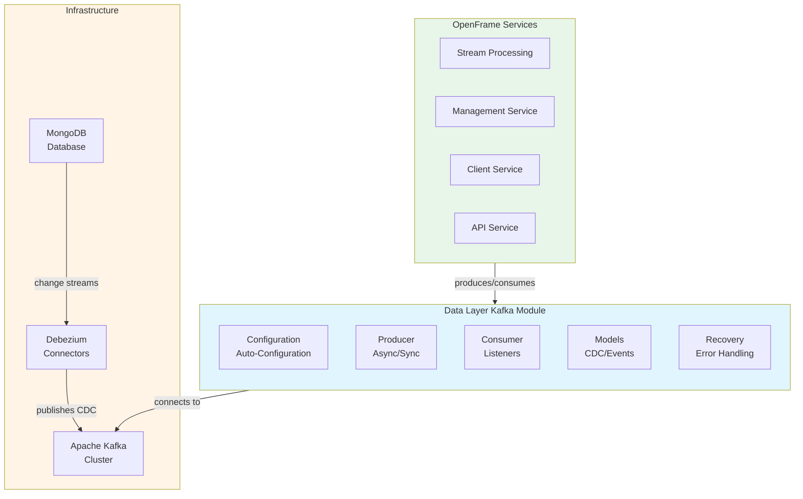
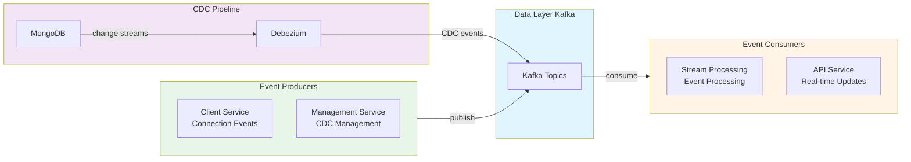

# Data Layer - Kafka Module Summary

## Executive Overview

The **data_layer_kafka** module is OpenFrame's foundational Kafka integration layer, providing production-ready event-driven communication infrastructure across all microservices. It abstracts Apache Kafka complexity with Spring Boot auto-configuration, offering reliable message producers, consumers, and comprehensive CDC (Change Data Capture) support through Debezium integration.

---

## Module Purpose

### Primary Responsibilities

1. **Event-Driven Communication**: Enable asynchronous, decoupled communication between OpenFrame services
2. **CDC Integration**: Process database change events from MongoDB via Debezium connectors
3. **Reliable Messaging**: Provide fault-tolerant message production with automatic retry and recovery
4. **Multi-Tenant Support**: Support OSS (Open Source Software) tenant-specific Kafka clusters
5. **Auto-Configuration**: Simplify Kafka setup with Spring Boot conventions and sensible defaults

### Business Value

- **Scalability**: Enables horizontal scaling through asynchronous event processing
- **Resilience**: Decouples services, preventing cascading failures
- **Real-Time Processing**: Supports real-time data pipelines and event streaming
- **Audit Trail**: CDC provides complete change history for compliance and debugging
- **Performance**: Reduces latency through non-blocking message production

---

## Architecture at a Glance



---

## Core Components Overview

### 1. Configuration Layer

**Purpose**: Auto-configures Kafka infrastructure with Spring Boot conventions

**Key Components**:
- `OssKafkaConfig`: Disables default Kafka auto-configuration
- `OssTenantKafkaAutoConfiguration`: Creates all Kafka beans (Producer, Consumer, Admin)
- `KafkaTopicProperties`: Manages topic configuration and auto-creation
- `OssTenantKafkaProperties`: Binds configuration from `spring.oss-tenant.kafka.*`

**Beans Created**:
- ProducerFactory, ConsumerFactory
- KafkaTemplate, KafkaListenerContainerFactory
- KafkaAdmin, MessageProducer

---

### 2. Producer Layer

**Purpose**: Provides high-level abstractions for message production

**Key Components**:
- `MessageProducer`: Interface defining async/sync message production
- `OssTenantKafkaProducer`: OSS tenant implementation
- `GenericKafkaProducer`: Base class with error handling and logging

**Features**:
- **Async Production**: Non-blocking with `CompletableFuture`
- **Sync Production**: Blocking with retry support
- **Error Classification**: Distinguishes fatal vs. transient errors
- **Comprehensive Logging**: Success/failure tracking with payload truncation

---

### 3. Model Layer

**Purpose**: Defines type-safe data structures for Kafka messages

**Key Components**:
- `DebeziumMessage<T>`: Generic CDC event model
- `KafkaMessage`: Marker interface for custom message types

**CDC Structure**:
```text
DebeziumMessage<T>
├── payload
│   ├── before: T (state before change)
│   ├── after: T (state after change)
│   ├── source: Source (metadata)
│   ├── operation: String (c/u/d/r)
│   └── timestamp: Long
```

**Supported Operations**:
- `c`: Create (INSERT)
- `u`: Update (UPDATE)
- `d`: Delete (DELETE)
- `r`: Read (initial snapshot)

---

### 4. Recovery Layer

**Purpose**: Handles unrecoverable message failures

**Key Components**:
- `KafkaRecoveryHandler`: Interface for recovery operations
- `KafkaRecoveryHandlerImpl`: Default implementation with structured logging

**Features**:
- Structured error logging with full context
- Designed for DLQ (Dead Letter Queue) integration
- Supports manual intervention and alerting

---

## Integration Architecture

### Service Integration Map



### Key Integration Points

| Service | Role | Topics | Documentation |
|---------|------|--------|---------------|
| **Stream Processing** | Primary Consumer | All event topics, CDC topics | [Stream Processing](stream_processing.md) |
| **Management Service** | CDC Manager | Debezium connector topics | [Management CDC](management_service_cdc_management.md) |
| **Client Service** | Event Producer | device-events, machine-heartbeats | [Client Listeners](client_service_event_listeners.md) |
| **Data Layer MongoDB** | CDC Source | dbserver1.openframe.* | [MongoDB Layer](data_layer_mongo.md) |

---

## Key Features & Capabilities

### 1. Auto-Configuration

✅ **Zero-Code Setup**: Spring Boot auto-configuration creates all necessary beans  
✅ **Property-Driven**: Configure via `application.yml` without custom code  
✅ **Conditional Activation**: Enable/disable with `spring.oss-tenant.kafka.enabled`  
✅ **Topic Auto-Creation**: Automatically creates configured topics on startup

### 2. Reliable Message Production

✅ **Async Production**: Fire-and-forget with `CompletableFuture` for high throughput  
✅ **Sync Production**: Blocking with retry support for critical messages  
✅ **Error Classification**: Automatic distinction between fatal and transient errors  
✅ **Spring Retry Integration**: Works seamlessly with `@Retryable` annotations

### 3. CDC Support

✅ **Type-Safe Models**: Generic `DebeziumMessage<T>` for any entity type  
✅ **Operation Detection**: Easy handling of create/update/delete operations  
✅ **Metadata Access**: Full source information (database, collection, timestamp)  
✅ **Snapshot Support**: Handles initial data snapshots

### 4. Monitoring & Observability

✅ **Comprehensive Logging**: Structured logs for all operations  
✅ **Metrics Integration**: Spring Boot Actuator metrics for producers/consumers  
✅ **Health Checks**: Kafka connectivity health endpoint  
✅ **Payload Truncation**: Prevents log overflow with large messages

### 5. Error Handling

✅ **Automatic Retry**: Transient errors automatically retried  
✅ **Recovery Handler**: Pluggable recovery for unrecoverable failures  
✅ **Detailed Logging**: Full context for debugging failures  
✅ **DLQ Ready**: Designed for Dead Letter Queue integration

---

## Configuration Overview

### Minimal Configuration

```yaml
spring:
  oss-tenant:
    kafka:
      enabled: true
      bootstrap-servers: localhost:9092
```

### Production Configuration

```yaml
spring:
  oss-tenant:
    kafka:
      enabled: true
      bootstrap-servers: kafka-1:9092,kafka-2:9092,kafka-3:9092
      
      producer:
        acks: all  # Wait for all replicas
        retries: 5
        batch-size: 16384
        linger-ms: 10
        
      consumer:
        group-id: openframe-consumer-group
        auto-offset-reset: earliest
        enable-auto-commit: false
        max-poll-records: 500
        
      listener:
        ack-mode: RECORD  # Commit after each record
        concurrency: 5  # 5 consumer threads
        poll-timeout: 3s
        
      admin:
        enabled: true

openframe:
  oss-tenant:
    kafka:
      topics:
        auto-create: true
        inbound:
          device-events:
            name: device-events
            partitions: 5
            replication-factor: 3
```

---

## Usage Patterns

### Producer Pattern: Async (High Throughput)

```java
@Service
public class DeviceEventService {
    
    @Autowired
    @Qualifier("ossTenantKafkaProducer")
    private MessageProducer kafkaProducer;
    
    public void publishDeviceEvent(DeviceEvent event) {
        kafkaProducer.sendAsyncMessage(
            "device-events",
            event,
            event.getDeviceId()  // Partition key
        );
    }
}
```

### Producer Pattern: Sync (Critical Messages)

```java
@Service
public class CriticalEventService {
    
    @Autowired
    @Qualifier("ossTenantKafkaProducer")
    private MessageProducer kafkaProducer;
    
    @Retryable(
        value = TransientKafkaSendException.class,
        maxAttempts = 3,
        backoff = @Backoff(delay = 1000, multiplier = 2)
    )
    public void publishCriticalEvent(CriticalEvent event) {
        kafkaProducer.sendAndAwaitMessage(
            "critical-events",
            event,
            event.getEventId()
        );
    }
}
```

### Consumer Pattern: Basic Listener

```java
@Service
public class DeviceEventListener {
    
    @KafkaListener(
        topics = "device-events",
        groupId = "device-processor-group",
        containerFactory = "ossTenantKafkaListenerContainerFactory"
    )
    public void handleDeviceEvent(@Payload DeviceEvent event) {
        // Process event
        log.info("Processing device event: {}", event.getDeviceId());
    }
}
```

### Consumer Pattern: CDC Listener

```java
@Service
public class DeviceCdcListener {
    
    @KafkaListener(
        topics = "dbserver1.openframe.devices",
        groupId = "device-cdc-processor",
        containerFactory = "ossTenantKafkaListenerContainerFactory"
    )
    public void handleDeviceCdc(@Payload DebeziumMessage<Device> message) {
        Payload<Device> payload = message.getPayload();
        
        switch (payload.getOperation()) {
            case "c" -> handleDeviceCreated(payload.getAfter());
            case "u" -> handleDeviceUpdated(payload.getBefore(), payload.getAfter());
            case "d" -> handleDeviceDeleted(payload.getBefore());
        }
    }
}
```

---

## Best Practices

### ✅ DO

1. **Use Async for High Throughput**: Fire-and-forget for non-critical events
2. **Use Sync for Critical Messages**: Blocking with retry for important operations
3. **Choose Meaningful Keys**: Use entity IDs (deviceId, tenantId) for partitioning
4. **Implement KafkaMessage**: Type safety for custom message types
5. **Monitor Consumer Lag**: Track processing delays
6. **Configure ACK Modes**: Balance safety vs. performance
7. **Use Descriptive Group IDs**: `device-processor-group` not `group1`

### ❌ DON'T

1. **Don't Send Large Payloads**: Keep messages < 1MB
2. **Don't Use Random Keys**: Defeats partition affinity
3. **Don't Ignore Errors**: Always handle exceptions
4. **Don't Share Consumer Groups**: One group per logical application
5. **Don't Over-Partition**: More partitions ≠ better performance
6. **Don't Skip Testing**: Use `@EmbeddedKafka` for integration tests

---

## Performance Characteristics

### Producer Performance

| Configuration | Throughput | Latency | Reliability |
|---------------|------------|---------|-------------|
| **Async, acks=1** | Very High | Very Low | Medium |
| **Async, acks=all** | High | Low | High |
| **Sync, acks=all** | Medium | Medium | Very High |

### Consumer Performance

| Configuration | Throughput | Latency | Reliability |
|---------------|------------|---------|-------------|
| **ACK=RECORD, concurrency=1** | Low | Low | Very High |
| **ACK=BATCH, concurrency=3** | Medium | Medium | High |
| **ACK=MANUAL, concurrency=5** | High | Medium | High |

### Recommended Settings

**High Throughput (Non-Critical)**:
```yaml
producer:
  acks: 1
  batch-size: 32768
  linger-ms: 50
```

**High Reliability (Critical)**:
```yaml
producer:
  acks: all
  retries: 10
  enable-idempotence: true
```

---

## Monitoring & Metrics

### Key Metrics to Monitor

**Producer Metrics**:
- `kafka.producer.record-send-total`: Total records sent
- `kafka.producer.record-error-total`: Total send errors
- `kafka.producer.request-latency-avg`: Average request latency
- `kafka.producer.record-retry-total`: Total retries

**Consumer Metrics**:
- `kafka.consumer.records-consumed-total`: Total records consumed
- `kafka.consumer.records-lag-max`: Maximum consumer lag
- `kafka.consumer.fetch-latency-avg`: Average fetch latency
- `kafka.consumer.commit-latency-avg`: Average commit latency

### Health Check

```bash
# Check Kafka connectivity
curl http://localhost:8080/actuator/health/kafka

# Response
{
  "status": "UP",
  "details": {
    "clusterId": "kafka-cluster-1",
    "nodes": 3
  }
}
```

---

## Common Issues & Solutions

| Issue | Symptom | Solution |
|-------|---------|----------|
| **Topic Not Found** | `UnknownTopicOrPartitionException` | Enable auto-creation or create manually |
| **Serialization Error** | `SerializationException` | Implement `KafkaMessage` interface |
| **Consumer Lag** | Slow processing | Increase concurrency or optimize processing |
| **Connection Timeout** | `TimeoutException` | Check broker connectivity and network |
| **Record Too Large** | `RecordTooLargeException` | Reduce payload size or increase broker limit |

See [Troubleshooting Guide](data_layer_kafka.md#troubleshooting) for detailed solutions.

---

## Testing Strategy

### Unit Testing

```java
@SpringBootTest
@EmbeddedKafka(topics = {"test-topic"})
class KafkaProducerTest {
    
    @Autowired
    @Qualifier("ossTenantKafkaProducer")
    private MessageProducer kafkaProducer;
    
    @Test
    void testAsyncMessageProduction() throws Exception {
        DeviceEvent event = DeviceEvent.builder()
            .deviceId("device-123")
            .build();
        
        CompletableFuture<SendResult<String, Object>> future = 
            kafkaProducer.sendAsyncMessage("test-topic", event, "device-123");
        
        SendResult<String, Object> result = future.get(5, TimeUnit.SECONDS);
        assertThat(result.getRecordMetadata().topic()).isEqualTo("test-topic");
    }
}
```

### Integration Testing

```java
@SpringBootTest
@EmbeddedKafka(topics = {"device-events"})
class DeviceEventIntegrationTest {
    
    @Autowired
    private KafkaTemplate<String, Object> kafkaTemplate;
    
    @Autowired
    private DeviceEventListener listener;
    
    @Test
    void testEndToEndEventProcessing() throws Exception {
        DeviceEvent event = DeviceEvent.builder()
            .deviceId("device-123")
            .eventType("CONNECTED")
            .build();
        
        kafkaTemplate.send("device-events", "device-123", event);
        
        await().atMost(5, TimeUnit.SECONDS)
            .until(() -> listener.getProcessedEvents().size() == 1);
    }
}
```

---

## Documentation Index

| Document | Description | Link |
|----------|-------------|------|
| **Main Documentation** | Comprehensive module documentation | [data_layer_kafka.md](data_layer_kafka.md) |
| **Quick Reference** | Quick start and common patterns | [DATA_LAYER_KAFKA_README.md](DATA_LAYER_KAFKA_README.md) |
| **Summary** | Executive overview (this document) | [DATA_LAYER_KAFKA_SUMMARY.md](DATA_LAYER_KAFKA_SUMMARY.md) |

### Related Module Documentation

- [Stream Processing Module](stream_processing.md) - Primary Kafka consumer
- [Stream Processing Listeners](stream_processing_listeners.md) - Listener implementations
- [Management Service CDC](management_service_cdc_management.md) - Debezium management
- [Client Service Listeners](client_service_event_listeners.md) - Event producers
- [Data Layer MongoDB](data_layer_mongo.md) - CDC source database

---

## Technology Stack

| Technology | Version | Purpose |
|------------|---------|---------|
| **Apache Kafka** | 3.x | Message broker |
| **Spring Kafka** | 3.x | Spring integration |
| **Spring Boot** | 3.x | Auto-configuration |
| **Debezium** | 2.x | CDC connector |
| **Jackson** | 2.x | JSON serialization |

---

## Future Enhancements

### Planned Features

1. **Dead Letter Queue**: Automatic DLQ for failed messages
2. **Schema Registry**: Avro schema support
3. **Transactional Messaging**: Exactly-once semantics
4. **Multi-Cluster Support**: Support for multiple Kafka clusters
5. **Enhanced Monitoring**: Custom metrics and dashboards
6. **Automatic Retry Scheduling**: Scheduled retry for failed messages

---

## Support & Resources

### Documentation
- **Main Docs**: [data_layer_kafka.md](data_layer_kafka.md)
- **OpenFrame Docs**: [https://www.flamingo.run/openframe](https://www.flamingo.run/openframe)
- **Flamingo Platform**: [https://flamingo.run](https://flamingo.run)

### Community
- **Slack**: [OpenMSP Slack Community](https://join.slack.com/t/openmsp/shared_invite/zt-36bl7mx0h-3~U2nFH6nqHqoTPXMaHEHA)

### External Resources
- **Apache Kafka**: [https://kafka.apache.org/documentation/](https://kafka.apache.org/documentation/)
- **Spring Kafka**: [https://spring.io/projects/spring-kafka](https://spring.io/projects/spring-kafka)
- **Debezium**: [https://debezium.io/documentation/](https://debezium.io/documentation/)

---

**Last Updated**: 2024  
**Module Version**: 1.0  
**Maintainer**: OpenFrame Team
