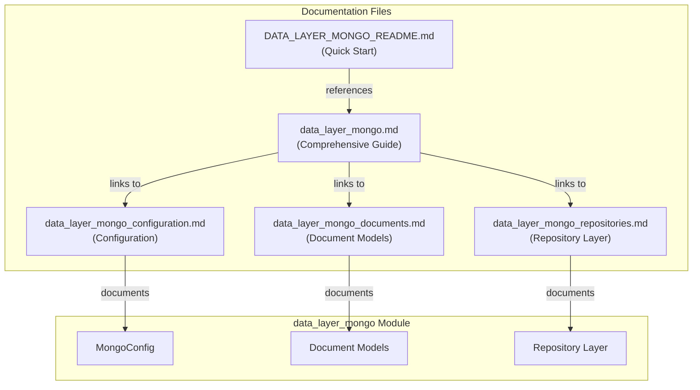

# Data Layer MongoDB - Documentation Summary

## 📚 Documentation Overview

This document provides a quick reference to all documentation files for the **data_layer_mongo** module, the foundational MongoDB persistence layer for the OpenFrame platform.

## 🗂️ Documentation Structure

### Main Documentation Files

| Document | Description | Audience |
|----------|-------------|----------|
| **[DATA_LAYER_MONGO_README.md](./DATA_LAYER_MONGO_README.md)** | Quick start guide with examples and best practices | Developers (Getting Started) |
| **[data_layer_mongo.md](./data_layer_mongo.md)** | Comprehensive technical documentation | Developers & Architects |

### Sub-Module Documentation

| Document | Focus Area | Key Topics |
|----------|------------|------------|
| **[data_layer_mongo_configuration.md](./data_layer_mongo_configuration.md)** | MongoDB Configuration | MongoConfig, Blocking/Reactive modes, Auditing, Custom converters |
| **[data_layer_mongo_documents.md](./data_layer_mongo_documents.md)** | Document Models | User, Organization, Machine, Device, IntegratedTool, CoreEvent |
| **[data_layer_mongo_repositories.md](./data_layer_mongo_repositories.md)** | Repository Layer | BaseUserRepository, BaseTenantRepository, Blocking/Reactive patterns |

## 🎯 Quick Navigation

### For New Developers

**Start here**: [DATA_LAYER_MONGO_README.md](./DATA_LAYER_MONGO_README.md)

This README provides:
- Quick start guide
- Basic usage examples
- Configuration setup
- Common patterns

### For System Architects

**Start here**: [data_layer_mongo.md](./data_layer_mongo.md)

This comprehensive guide covers:
- Architecture overview
- Module structure
- Integration patterns
- Performance considerations
- Security best practices

### For Specific Topics

#### Configuration & Setup
→ [data_layer_mongo_configuration.md](./data_layer_mongo_configuration.md)
- MongoConfig class details
- Blocking vs Reactive configuration
- Custom converters
- Auditing setup

#### Data Models
→ [data_layer_mongo_documents.md](./data_layer_mongo_documents.md)
- User document schema
- Organization multi-tenancy
- Machine and Device models
- IntegratedTool configuration
- CoreEvent structure

#### Data Access Patterns
→ [data_layer_mongo_repositories.md](./data_layer_mongo_repositories.md)
- Base repository interfaces
- Blocking repository implementations
- Reactive repository implementations
- Custom query methods

## 📊 Module Overview

### Core Components



### Document Types Covered

| Document Type | Collection | Documentation Section |
|---------------|------------|----------------------|
| **User** | `users` | [Document Models](./data_layer_mongo_documents.md#user-document) |
| **Organization** | `organizations` | [Document Models](./data_layer_mongo_documents.md#organization-document) |
| **Machine** | `machines` | [Document Models](./data_layer_mongo_documents.md#machine-document) |
| **Device** | `devices` | [Document Models](./data_layer_mongo_documents.md#device-document) |
| **IntegratedTool** | `integrated_tools` | [Document Models](./data_layer_mongo_documents.md#integratedtool-document) |
| **CoreEvent** | `events` | [Document Models](./data_layer_mongo_documents.md#coreevent-document) |

## 🔍 Key Concepts

### 1. Dual Programming Model

The module supports both **blocking** and **reactive** programming:

- **Blocking (Servlet)**: Traditional Spring Data MongoDB
  - Return types: `Optional<T>`, `List<T>`, `boolean`
  - Used by: API Service, Authorization Service, Management Service

- **Reactive (WebFlux)**: Non-blocking reactive streams
  - Return types: `Mono<T>`, `Flux<T>`, `Mono<Boolean>`
  - Used by: Gateway Service

**Documentation**: [Configuration](./data_layer_mongo_configuration.md#configuration-modes)

### 2. Multi-Tenancy

Organization-scoped data isolation through:
- `organizationId` field indexing
- Tenant-specific repository methods
- Default organization support

**Documentation**: [Main Guide](./data_layer_mongo.md#multi-tenancy-support)

### 3. Auditing

Automatic timestamp management:
- `@CreatedDate`: Set on entity creation
- `@LastModifiedDate`: Updated on modification

**Documentation**: [Configuration](./data_layer_mongo_configuration.md#auditing-configuration)

### 4. Soft Delete

Recoverable deletion pattern:
- `deleted` boolean flag
- `deletedAt` timestamp
- Query filtering for non-deleted entities

**Documentation**: [Document Models](./data_layer_mongo_documents.md#soft-delete-pattern)

## 🔗 Integration Points

### Services Using This Module

| Service | Documentation | Usage |
|---------|---------------|-------|
| **API Service** | [api_service.md](./api_service.md) | REST + GraphQL data access |
| **Authorization Service** | [authorization_service.md](./authorization_service.md) | User authentication, tenant management |
| **Management Service** | [management_service.md](./management_service.md) | Tool configuration, CDC management |
| **Client Service** | [client_service.md](./client_service.md) | Device registration, heartbeat tracking |
| **External API** | External API docs | Public API data access |

### Related Data Layers

| Module | Documentation | Purpose |
|--------|---------------|---------|
| **data_layer_kafka** | [data_layer_kafka.md](./data_layer_kafka.md) | Event streaming, CDC events |
| **data_layer_core** | [data_layer_core.md](./data_layer_core.md) | Cassandra + Pinot analytics |

## 📖 Documentation Features

### Diagrams

All documentation includes Mermaid diagrams for:
- Architecture visualization
- Data flow diagrams
- Component relationships
- Integration patterns

### Code Examples

Each document provides:
- Configuration examples
- Usage patterns
- Best practices
- Common pitfalls

### Cross-References

Documents are interconnected with:
- Internal links between sections
- References to related modules
- Service integration examples

## 🚀 Getting Started Paths

### Path 1: Quick Implementation (30 minutes)

1. Read [Quick Start](./DATA_LAYER_MONGO_README.md#quick-start)
2. Configure MongoDB connection
3. Review [Usage Examples](./DATA_LAYER_MONGO_README.md#usage-examples)
4. Implement basic CRUD operations

### Path 2: Deep Understanding (2-3 hours)

1. Read [Architecture Overview](./data_layer_mongo.md#architecture-overview)
2. Study [Document Models](./data_layer_mongo_documents.md)
3. Understand [Repository Patterns](./data_layer_mongo_repositories.md)
4. Review [Configuration Details](./data_layer_mongo_configuration.md)
5. Explore [Integration Patterns](./data_layer_mongo.md#integration-with-other-modules)

### Path 3: Production Deployment (4-6 hours)

1. Complete Path 2
2. Review [Performance Considerations](./data_layer_mongo.md#performance-considerations)
3. Study [Security Best Practices](./data_layer_mongo.md#security-considerations)
4. Implement [Monitoring](./data_layer_mongo.md#monitoring-and-observability)
5. Plan [Migration Strategy](./data_layer_mongo.md#migration-and-evolution)

## 🎓 Learning Resources

### Internal Documentation

- **Architecture**: [data_layer_mongo.md](./data_layer_mongo.md#architecture-overview)
- **Configuration**: [data_layer_mongo_configuration.md](./data_layer_mongo_configuration.md)
- **Data Models**: [data_layer_mongo_documents.md](./data_layer_mongo_documents.md)
- **Repositories**: [data_layer_mongo_repositories.md](./data_layer_mongo_repositories.md)

### External Resources

- [Spring Data MongoDB Documentation](https://docs.spring.io/spring-data/mongodb/docs/current/reference/html/)
- [MongoDB Best Practices](https://www.mongodb.com/docs/manual/administration/production-notes/)
- [Reactive Programming Guide](https://projectreactor.io/docs/core/release/reference/)

### Community

- **Slack**: [OpenMSP Community](https://join.slack.com/t/openmsp/shared_invite/zt-36bl7mx0h-3~U2nFH6nqHqoTPXMaHEHA)
- **Website**: [https://openframe.ai](https://openframe.ai)
- **Flamingo**: [https://flamingo.run](https://flamingo.run)

## 📝 Documentation Maintenance

### Last Updated
- **Date**: 2024
- **Version**: 1.0

### Change Log

| Date | Changes | Documents Updated |
|------|---------|-------------------|
| 2024 | Initial documentation | All documents |

### Contributing

To update this documentation:
1. Join the [OpenMSP Slack community](https://join.slack.com/t/openmsp/shared_invite/zt-36bl7mx0h-3~U2nFH6nqHqoTPXMaHEHA)
2. Discuss proposed changes
3. Submit updates following the documentation guidelines

## 🔖 Quick Reference

### Configuration Properties

```yaml
spring:
  data:
    mongodb:
      enabled: true
      uri: mongodb://localhost:27017/openframe
      database: openframe
```

### Common Imports

```java
// Document models
import com.openframe.data.document.user.User;
import com.openframe.data.document.organization.Organization;
import com.openframe.data.document.device.Machine;

// Repositories
import com.openframe.data.repository.user.UserRepository;
import com.openframe.data.repository.organization.OrganizationRepository;
import com.openframe.data.repository.device.MachineRepository;

// Configuration
import com.openframe.data.config.MongoConfig;
```

### Key Annotations

```java
@Document(collection = "collection_name")  // Mark as MongoDB document
@Id                                        // Primary key
@Indexed                                   // Create index
@CreatedDate                               // Auto-set creation timestamp
@LastModifiedDate                          // Auto-update modification timestamp
```

## 📞 Support

### Documentation Issues

If you find issues with the documentation:
1. Check the [Troubleshooting](./data_layer_mongo.md#troubleshooting) section
2. Search existing discussions on Slack
3. Ask in the [OpenMSP Slack community](https://join.slack.com/t/openmsp/shared_invite/zt-36bl7mx0h-3~U2nFH6nqHqoTPXMaHEHA)

### Technical Support

For technical issues:
1. Review [Common Issues](./DATA_LAYER_MONGO_README.md#troubleshooting)
2. Check service-specific documentation
3. Reach out on Slack for community support

---

**Happy Coding! 🚀**

Built with ❤️ by the Flamingo team | [OpenFrame](https://openframe.ai) | [Flamingo](https://flamingo.run)
