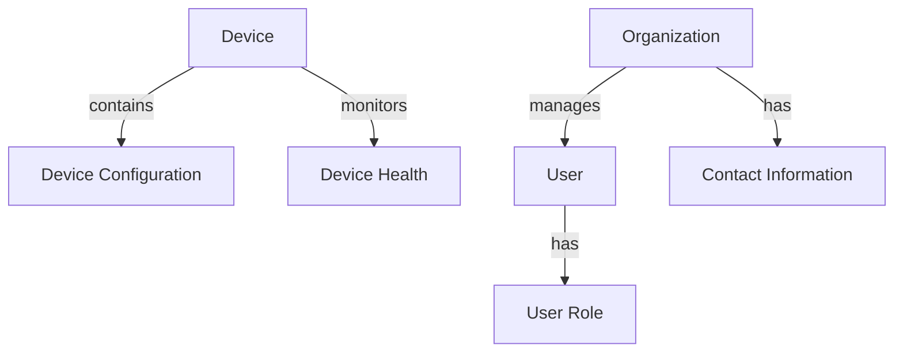

# Data Models Module Documentation

## Overview
The Data Models module is responsible for defining the core data structures used throughout the OpenFrame platform. It includes the definitions for devices, organizations, and users, which are essential for managing the application's data layer.

## Architecture Overview
The Data Models module consists of three primary components:

1. **Device**: Represents a physical or virtual device within the system.
2. **Organization**: Represents a company or entity, containing business-related information.
3. **User**: Represents an individual user within the system, including their roles and status.

### Component Interaction Diagram

## Core Components

### 1. Device
The `Device` class represents a device in the system. It includes properties such as:
- `id`: Unique identifier for the device.
- `machineId`: Link to the Machine entity.
- `serialNumber`: Serial number of the device.
- `model`: Model of the device.
- `osVersion`: Operating system version.
- `status`: Current status of the device (ACTIVE, OFFLINE, MAINTENANCE).
- `type`: Type of device (DESKTOP, LAPTOP, SERVER, etc.).
- `lastCheckin`: Timestamp of the last check-in.
- `configuration`: Configuration details of the device.
- `health`: Health status of the device.

**Reference**: [Device.java](deps-openframe-oss-lib/openframe-data-mongo/src/main/java/com/openframe/data/document/device/Device.java)

### 2. Organization
The `Organization` class represents an organization in the system. Key properties include:
- `id`: Unique identifier for the organization.
- `name`: Name of the organization.
- `organizationId`: Unique organization identifier (immutable).
- `isDefault`: Indicates if this is the default organization for the tenant.
- `category`: Business category or industry.
- `numberOfEmployees`: Total number of employees.
- `websiteUrl`: Organization's website URL.
- `notes`: Additional information about the organization.
- `contactInformation`: Contact details for the organization.
- `monthlyRevenue`: Monthly revenue in the organization's currency.
- `contractStartDate` and `contractEndDate`: Dates for the organization's contract.

**Reference**: [Organization.java](deps-openframe-oss-lib/openframe-data-mongo/src/main/java/com/openframe/data/document/organization/Organization.java)

### 3. User
The `User` class represents a user in the system. Important properties include:
- `id`: Unique identifier for the user.
- `email`: User's email address.
- `firstName`: User's first name.
- `lastName`: User's last name.
- `roles`: List of roles assigned to the user.
- `emailVerified`: Indicates if the user's email is verified.
- `status`: Current status of the user (ACTIVE, INACTIVE, etc.).

**Reference**: [User.java](deps-openframe-oss-lib/openframe-data-mongo/src/main/java/com/openframe/data/document/user/User.java)

## Conclusion

For detailed information on each core component, refer to the respective documentation files:
- [Device Documentation](Device.md)
- [Organization Documentation](Organization.md)
- [User Documentation](User.md)
The Data Models module is a critical part of the OpenFrame architecture, providing the necessary data structures to support various functionalities across the platform. For further details on related modules, refer to the [API Services](API%20Services.md), [Authorization Services](Authorization%20Services.md), and [Client Services](Client%20Services.md) documentation.