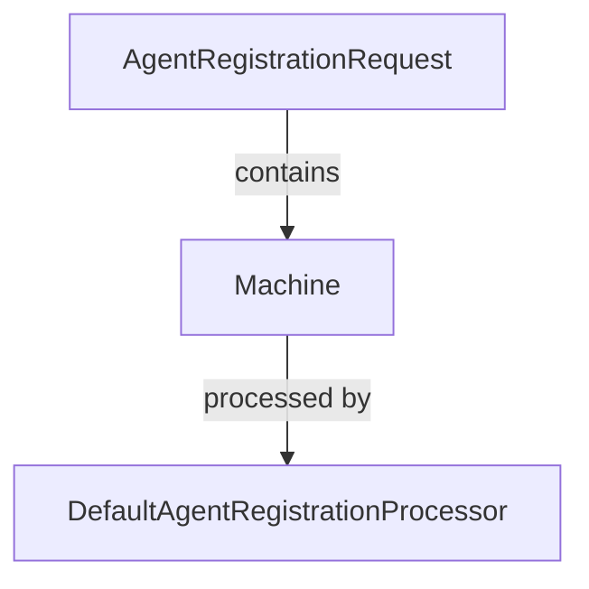

# DefaultAgentRegistrationProcessor Documentation

## Overview
The `DefaultAgentRegistrationProcessor` is a core component of the Flamingo platform, specifically designed to handle the post-processing of agent registrations. It implements the `AgentRegistrationProcessor` interface, providing a default behavior for agent registration processes.

## Purpose
The primary purpose of the `DefaultAgentRegistrationProcessor` is to serve as a fallback implementation for agent registration. It allows for the registration of agents without requiring additional processing logic, making it suitable for basic use cases where no special handling is needed.

## Core Functionality
The `DefaultAgentRegistrationProcessor` contains the following key functionality:
- **Post-Processing of Agent Registrations**: The `postProcessAgentRegistration` method is invoked after an agent registration request is received. This method currently provides a no-operation (no-op) implementation, which can be overridden by custom implementations if needed.

### Method Details
#### `postProcessAgentRegistration(Machine machine, AgentRegistrationRequest request)`
- **Parameters**:
  - `Machine machine`: Represents the machine associated with the agent registration.
  - `AgentRegistrationRequest request`: Contains the details of the agent registration request.
- **Functionality**: Logs the machine ID and hostname of the agent being registered. This method can be extended to include additional processing logic as required by specific use cases.

## Architecture
The `DefaultAgentRegistrationProcessor` is part of the Client Services module and interacts with the following components:
- **Machine**: Represents the machine that is being registered.
- **AgentRegistrationRequest**: Encapsulates the details of the registration request.

## Integration with Other Modules
The `DefaultAgentRegistrationProcessor` is designed to work seamlessly within the Flamingo ecosystem. It can be integrated with other services such as the `InstalledAgentService` and `ToolConnectionService` to enhance the agent registration process.

- **InstalledAgentService**: Manages the lifecycle of installed agents and can utilize the `DefaultAgentRegistrationProcessor` for processing registrations.
- **ToolConnectionService**: Facilitates connections to various tools and may require agent registration as part of its setup process.

## Conclusion
The `DefaultAgentRegistrationProcessor` provides a foundational implementation for agent registration within the Flamingo platform. Its no-op behavior allows for flexibility and customization, enabling developers to extend its functionality as needed for their specific use cases.