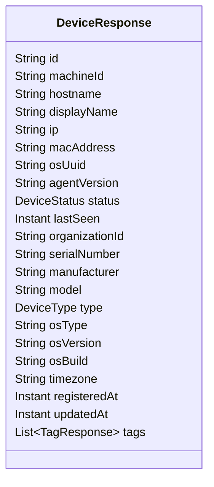
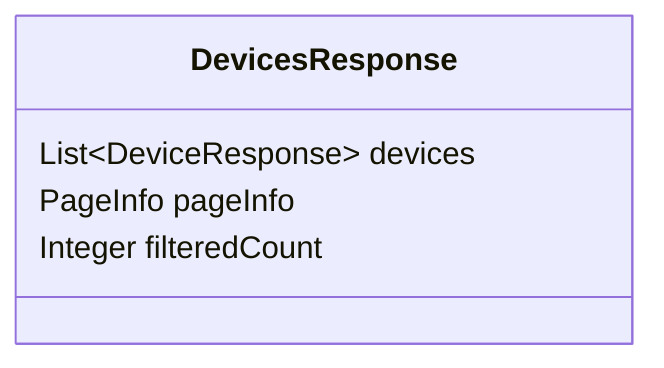
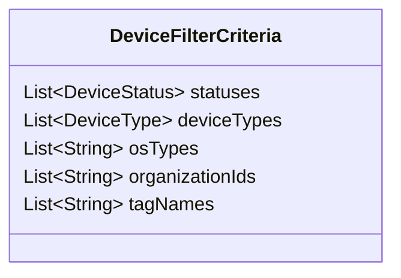
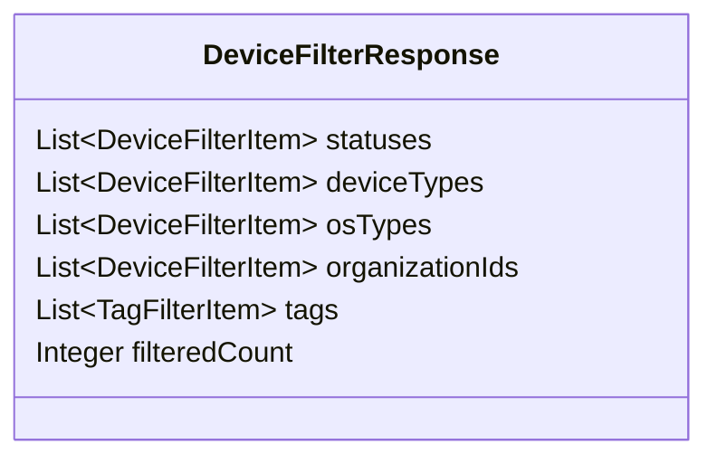
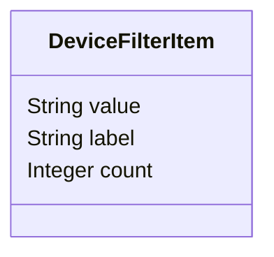
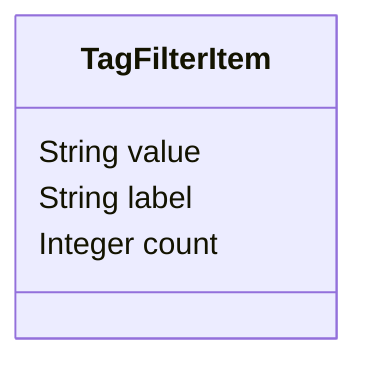
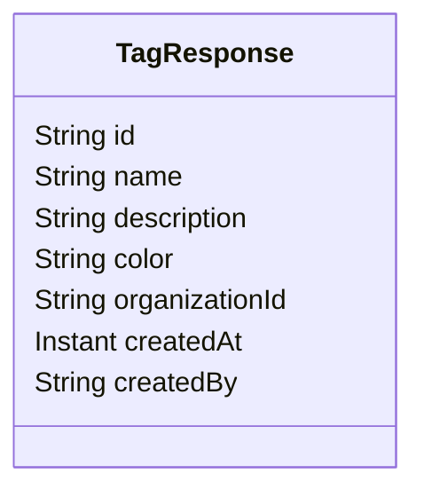
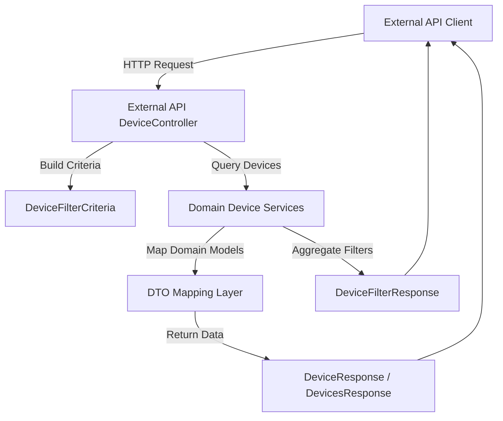

# Device DTOs Module

## Overview

The **Device DTOs module** defines the REST-facing Data Transfer Objects (DTOs) used by the **External API Service** to represent devices, device lists, tags, and filtering metadata. These DTOs provide a stable contract between the backend services and external consumers (partners, integrations, and UI clients), abstracting internal persistence models and domain logic.

This module lives under:

````text
com.openframe.external.dto.device
````

and is primarily consumed by the **External API DeviceController** and related REST endpoints.

---

## Responsibilities

The Device DTOs module is responsible for:

- Representing **device data** returned by the external REST API
- Defining **filter criteria** accepted by device listing endpoints
- Providing **filter aggregation responses** (counts per status, type, tag, etc.)
- Encapsulating **pagination-aware device collections**
- Exposing **tag metadata** associated with devices

The module deliberately contains **no business logic**. All classes are simple data carriers annotated for:

- OpenAPI / Swagger documentation
- Lombok-generated boilerplate (getters, setters, builders)

---

## Key DTOs

### 1. DeviceResponse

`DeviceResponse` represents a single managed device as exposed through the External API.

**Purpose:**
- Used when fetching individual devices
- Embedded inside paginated device listings

**Key characteristics:**
- Identifiers (device ID, machine ID)
- Hardware and OS metadata
- Status and lifecycle timestamps
- Organization ownership
- Associated tags



---

### 2. DevicesResponse

`DevicesResponse` wraps a paginated collection of devices.

**Purpose:**
- Returned by list endpoints (for example: `GET /devices`)
- Provides pagination and total counts alongside device data

**Fields:**
- `devices`: List of `DeviceResponse`
- `pageInfo`: Pagination metadata (cursor, page size, etc.)
- `filteredCount`: Total number of devices matching the applied filters



---

### 3. DeviceFilterCriteria

`DeviceFilterCriteria` defines the **input filters** accepted by device listing endpoints.

**Purpose:**
- Allows API consumers to constrain device queries
- Supports multi-dimensional filtering

**Supported filters:**
- Device status
- Device type
- Operating system type
- Organization ownership
- Associated tag names



---

### 4. DeviceFilterResponse

`DeviceFilterResponse` provides **aggregated filter options** with counts.

**Purpose:**
- Used to build filter sidebars and dashboards in client applications
- Enables UI clients to show available filter values and result counts

**Example use case:**
- Show how many devices are online vs offline
- Display tag usage distribution



---

### 5. DeviceFilterItem

`DeviceFilterItem` represents a single filter option with a count.

**Purpose:**
- Generic structure reused across multiple filter dimensions

**Typical usage:**
- Status: Online (42)
- OS Type: Linux (120)



---

### 6. TagFilterItem

`TagFilterItem` is a specialization for tag-based filters.

**Purpose:**
- Represents tag names and their usage counts across devices



---

### 7. TagResponse

`TagResponse` represents full tag metadata associated with a device.

**Purpose:**
- Returned inline with `DeviceResponse`
- Used for displaying tag details in UI clients



---

## Data Flow and Usage

The following diagram illustrates how Device DTOs are used in a typical request flow.



---

## Relationship to Other Modules

- **External API Controllers**
  - Consume and return these DTOs directly

- **Domain Services and Repositories**
  - Operate on internal domain and persistence models
  - Are mapped into Device DTOs before leaving the service boundary

- **Frontend and Integration Clients**
  - Depend on these DTOs as a stable API contract
  - Use filter responses to dynamically construct UI controls

This separation ensures that changes in internal data models do **not** leak into public APIs.

---

## Design Principles

- **API Stability:** DTOs provide a clear contract for external consumers
- **Read-Only Semantics:** DTOs are immutable from the API consumer perspective
- **No Business Logic:** All processing happens in service and processor layers
- **Consistency:** Shared patterns for filters, pagination, and counts

---

## Summary

The Device DTOs module is a foundational part of the External API surface. It defines:

- How devices are represented externally
- How clients filter and page through device data
- How aggregated metadata is exposed for rich client experiences

By keeping these DTOs simple, well-documented, and decoupled from internal models, the platform ensures long-term API stability and ease of integration.
