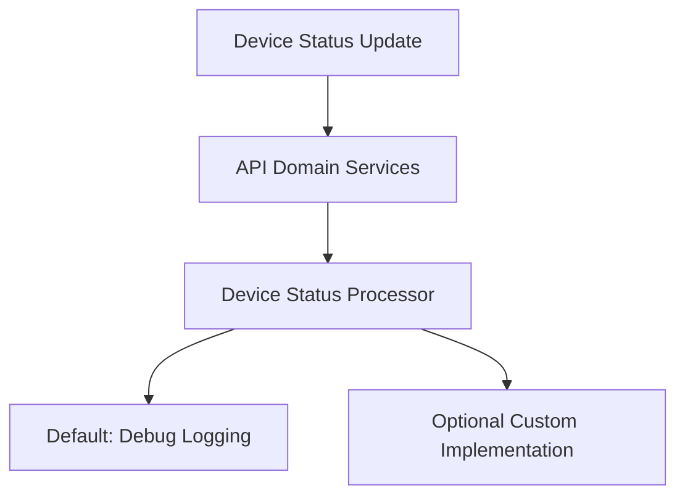
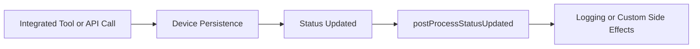

# Device Status Processor

## Overview

The **Device Status Processor** module is part of the API core domain services layer. Its responsibility is to react to **device (machine) status changes** after they have been persisted or resolved by upstream services. This module provides a **post-processing hook** that allows the platform to extend device lifecycle behavior without tightly coupling that logic to persistence, controllers, or data fetchers.

The current implementation, `DefaultDeviceStatusProcessor`, is intentionally lightweight and acts as a **safe default**. It ensures that device status updates are observable (via logging) while allowing downstream deployments or extensions to override the behavior when more advanced processing is required.

---

## Responsibilities

The Device Status Processor is designed around the following responsibilities:

- Act as a **post-update hook** for device status changes
- Provide a **stable extension point** for custom implementations
- Decouple status-driven side effects from core device persistence logic
- Maintain compatibility across API, stream, and management services

Typical use cases for custom implementations include:

- Triggering notifications when devices go offline or online
- Emitting domain events to Kafka or other messaging systems
- Updating derived state or caches
- Integrating with external monitoring or ticketing systems

---

## Core Component

### `DefaultDeviceStatusProcessor`

**Package**: `com.openframe.api.service.processor`

This class is the default implementation of the `DeviceStatusProcessor` interface.

Key characteristics:

- Registered as a Spring component
- Only active when no other `DeviceStatusProcessor` bean is defined
- Performs non-intrusive logging of status changes

```java
@Override
public void postProcessStatusUpdated(Machine machine) {
    log.debug("Device status updated: {}, new status: {}", machine.getMachineId(), machine.getStatus());
}
```

The processor receives a `Machine` domain object and is invoked **after** its status has been updated.

---

## Spring Boot Conditional Behavior

The processor is annotated with `@ConditionalOnMissingBean`, which makes it a **fallback implementation**.

```java
@ConditionalOnMissingBean(
    value = DeviceStatusProcessor.class,
    ignored = DefaultDeviceStatusProcessor.class
)
```

### What this means:

- If **no custom `DeviceStatusProcessor`** is provided, this implementation is used
- If a custom processor is registered, this bean is **not loaded**
- Enables safe customization without modifying core API code

This pattern is widely used across OpenFrame to support tenant- or deployment-specific behavior.

---

## Dependencies

### Direct Dependencies

- **Machine domain model**
  - `com.openframe.data.document.device.Machine`
- **Spring Framework**
  - Component lifecycle and conditional bean registration
- **SLF4J**
  - Debug-level logging

### Conceptual Dependencies

Although not directly referenced in code, this processor is typically invoked as part of workflows involving:

- Device persistence and updates (MongoDB layer)
- API service domain logic
- Stream-driven updates from integrated tools (FleetDM, Tactical RMM, etc.)

---

## Position in the Overall Architecture

The Device Status Processor sits **inside the API service domain layer**, downstream from controllers and data fetchers, and upstream from optional side-effect systems.



---

## Data Flow

The typical data flow involving the Device Status Processor is as follows:



---

## Extension and Customization

To customize device status handling:

1. Create a new class implementing `DeviceStatusProcessor`
2. Register it as a Spring bean
3. Ensure it is discoverable by component scanning

The default implementation will automatically be disabled.

### Design Guidelines for Custom Processors

- Keep processing **idempotent** where possible
- Avoid long-running or blocking operations
- Delegate heavy work to async processors or message queues
- Treat the processor as a **reaction hook**, not a source of truth

---

## Operational Considerations

- The default processor logs at **DEBUG** level only
- No external calls or database writes are performed
- Safe to enable in all environments, including production

For observability or automation use cases, a custom processor should be introduced.

---

## Summary

The Device Status Processor provides a clean and extensible mechanism for reacting to device status changes within the OpenFrame API service.

- ✅ Safe default behavior
- ✅ Clear extension point
- ✅ Decoupled from controllers and persistence
- ✅ Aligned with Spring Boot best practices

This makes it a foundational building block for advanced device lifecycle automation across the platform.
