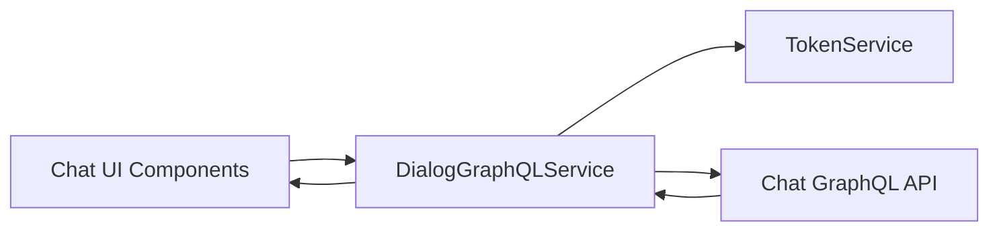
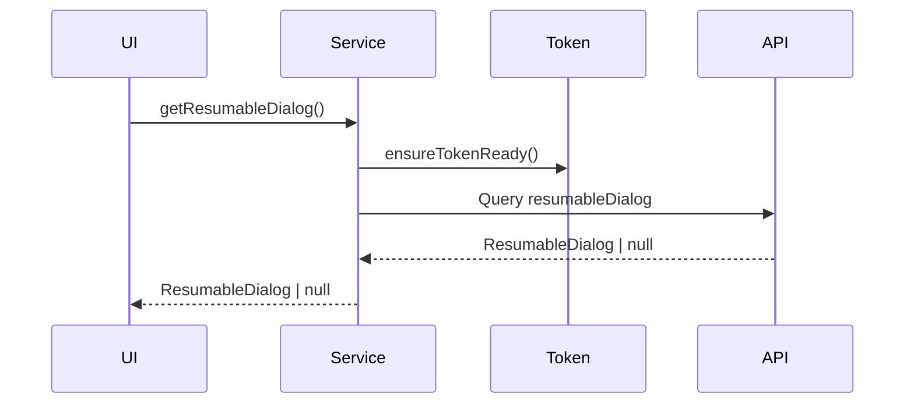
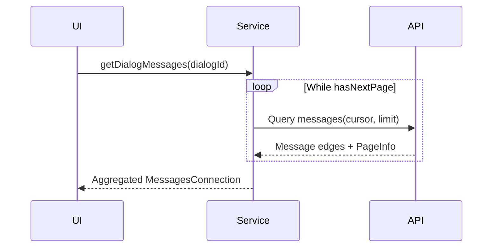

# DialogGraphQLService

## Overview

`DialogGraphQLService` is a frontend client-side service responsible for interacting with the **Chat GraphQL API** to retrieve dialog state and message history for the OpenFrame chat experience. It is part of the **chat_client_app_services** module and is used by the OpenFrame Chat client to:

- Resume an existing dialog session for a user
- Fetch historical chat messages with cursor-based pagination
- Transparently handle authentication headers via `TokenService`

This service acts as a thin, typed abstraction over `graphql-request`, ensuring consistent authentication, pagination handling, and message typing aligned with shared frontend chat models.

---

## Responsibilities

- Initialize and manage a `GraphQLClient` bound to the current tenant API endpoint
- Inject bearer tokens from `TokenService` into every request
- Execute GraphQL queries for dialogs and messages
- Aggregate paginated message results into a single logical response
- Provide typed interfaces for dialogs, messages, and pagination metadata

---

## Position in the System

`DialogGraphQLService` sits at the **frontend service layer**, bridging UI state management (stores and hooks) with backend GraphQL chat APIs.

---

## Key Dependencies

### Internal Dependencies

- **TokenService**  
  Used to:
  - Resolve the current API base URL
  - Retrieve and refresh the access token
  - Ensure the token is ready before requests are made

### External Dependencies

- **graphql-request**  
  Provides the `GraphQLClient`, query execution, and typing utilities.

- **@flamingo-stack/openframe-frontend-core**  
  Supplies shared chat and message type definitions to keep UI, services, and processors aligned.

---

## Data Models

### ResumableDialog

Represents a dialog that can be resumed by the client.

- `id`: Unique dialog identifier
- `title`: Human-readable dialog title
- `status`: Current dialog state
- `createdAt`: Creation timestamp
- `statusUpdatedAt`: Last status change timestamp
- `resolvedAt`: Resolution timestamp, if resolved
- `aiResolutionSuggestedAt`: When AI suggested a resolution
- `rating`: Optional rating metadata

### Message and Pagination Types

- **Message**: Extends historical message data with dialog-specific metadata
- **MessageEdge**: Cursor-based edge wrapper
- **MessagesConnection**: Collection of edges plus pagination info
- **PageInfo**: Cursor and navigation metadata

These structures mirror common GraphQL connection patterns used across the platform.

---

## GraphQL Operations

### Get Resumable Dialog

Retrieves the current resumable dialog for the authenticated user.

### Get Dialog Messages

Fetches all messages for a dialog, transparently traversing cursor-based pagination until all pages are retrieved.

---

## Pagination Strategy

The service intentionally **abstracts pagination from callers**:

- Callers may provide an initial cursor, but are not required to manage paging
- Internally, the service:
  - Requests messages in batches (`limit`, default 5)
  - Accumulates all edges
  - Continues fetching until `hasNextPage` is false

This simplifies UI logic at the cost of potentially larger payloads, which is acceptable for chat history use cases.

---

## Error Handling

- All public methods catch and log errors
- On failure:
  - `null` is returned instead of throwing
  - This allows UI layers to gracefully degrade or show empty states

Error handling is intentionally conservative to avoid breaking the chat experience due to transient network or auth issues.

---

## Lifecycle Management

### Client Initialization

- The GraphQL client is lazily initialized on first request
- The endpoint is derived from the current tenant API base URL
- Authorization headers are refreshed whenever a token is available

### Disposal

The `dispose()` method:

- Clears the cached `GraphQLClient`
- Resets the stored endpoint

This is useful when:
- Switching tenants
- Logging out
- Resetting application state

---

## Related Modules (Conceptual)

- Chat UI stores and hooks consume this service to populate dialog and message state
- Backend Chat GraphQL API resolves dialogs and messages
- Token management and authentication are delegated to shared frontend auth services

Refer to platform-level documentation for details on the Chat GraphQL schema and authentication flows.

---

## Summary

`DialogGraphQLService` provides a focused, reliable abstraction for chat-related GraphQL access in the OpenFrame frontend. By centralizing authentication, pagination, and typing concerns, it enables chat UI components to remain declarative, simple, and resilient while integrating seamlessly with the broader OpenFrame platform.