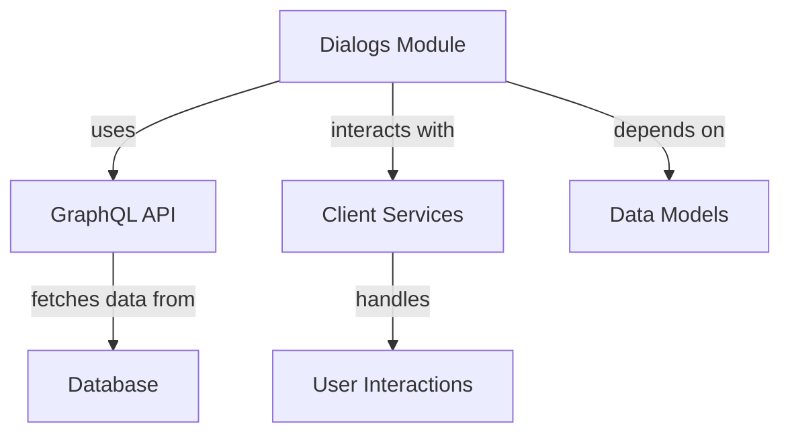

# Dialogs Module Documentation

## Overview
The Dialogs module is a core component of the Flamingo platform, responsible for managing and responding to dialog interactions within the system. It provides a structured way to handle dialog data, including the status, ownership, and resolution of dialogs.

## Core Functionality
The Dialogs module primarily deals with the following functionalities:
- **Dialog Management**: Handles the creation, updating, and retrieval of dialog data.
- **GraphQL Integration**: Utilizes GraphQL for efficient data querying and manipulation.
- **Response Handling**: Manages responses related to dialogs, including ratings and status updates.

## Core Components
The main component of the Dialogs module is the `DialogsResponse` interface, which defines the structure of the data returned from GraphQL queries related to dialogs.

### DialogsResponse Interface
The `DialogsResponse` interface is defined as follows:
```typescript
export interface DialogsResponse {
  data: {
    dialogs: DialogConnection
  }
}
```

### DialogConnection Interface
The `DialogConnection` interface represents a connection to a list of dialogs, including pagination information:
```typescript
export interface DialogConnection {
  edges: DialogEdge[]
  pageInfo: {
    hasNextPage: boolean
    hasPreviousPage: boolean
    startCursor?: string
    endCursor?: string
  }
}
```

### DialogNode Interface
Each dialog is represented by the `DialogNode` interface, which includes details such as the dialog's ID, title, status, and timestamps:
```typescript
export interface DialogNode {
  id: string
  title: string
  status: string
  owner?: {
    machineId?: string
    machine?: {
      id: string
      machineId: string
      hostname: string
      organizationId: string
    }
  }
  createdAt: string
  statusUpdatedAt?: string
  resolvedAt?: string
  aiResolutionSuggestedAt?: string
  rating?: {
    id: string
    dialogId: string
    createdAt: string
  }
}
```

### DialogEdge Interface
The `DialogEdge` interface is used to represent an edge in the dialog connection:
```typescript
export interface DialogEdge {
  cursor: string
  node: DialogNode
}
```

## Architecture
The Dialogs module interacts with various other components within the Flamingo ecosystem. Below is a diagram illustrating the architecture and relationships:


## Dependencies
The Dialogs module relies on several other modules for its functionality:
- **Client Services**: For handling user interactions and requests related to dialogs.
- **Data Models**: For defining the structure of dialog data stored in the database.
- **GraphQL API**: For querying and mutating dialog data efficiently.

## Conclusion
The Dialogs module is a vital part of the Flamingo platform, enabling effective dialog management and interaction. Its integration with GraphQL and other services ensures a seamless experience for users and developers alike.

For more information on related modules, refer to the following documentation:
- [API Services](API_Services.md)
- [Authorization Services](Authorization_Services.md)
- [Client Services](Client_Services.md)
- [Data Models](Data_Models.md)
