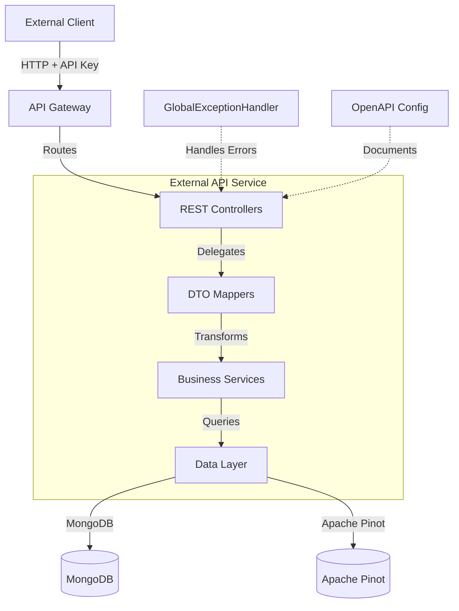

# External API Service Documentation

## 📚 Documentation Index

This directory contains comprehensive documentation for the **OpenFrame External API Service** - a RESTful API gateway that provides programmatic access to OpenFrame platform functionality for external integrations and third-party applications.

---

## 🗂️ Documentation Structure

### Main Documentation
- **[external_api.md](./external_api.md)** - Complete service overview, architecture, and integration guide

### Sub-Module Documentation
1. **[external_api_rest_controllers.md](./external_api_rest_controllers.md)** - REST endpoint implementations
2. **[external_api_dto_mappers.md](./external_api_dto_mappers.md)** - Data transformation layer
3. **[external_api_configuration.md](./external_api_configuration.md)** - OpenAPI and Spring Boot configuration
4. **[external_api_exception_handling.md](./external_api_exception_handling.md)** - Centralized error handling

---

## 🚀 Quick Start

### Prerequisites
- Java 17+
- MongoDB 5.0+
- Apache Kafka 3.0+
- Apache Pinot 0.12+

### Running the Service

```bash
# Using Docker
docker run -d \
  --name openframe-external-api \
  -p 8080:8080 \
  -e MONGODB_URI=mongodb://mongo:27017 \
  -e KAFKA_BOOTSTRAP_SERVERS=kafka:9092 \
  -e PINOT_BROKER_URL=http://pinot-broker:8099 \
  openframe/external-api:latest
```

### API Documentation
Once running, access the interactive API documentation at:
- **Swagger UI:** `http://localhost:8080/external-api/swagger-ui.html`
- **OpenAPI Spec:** `http://localhost:8080/external-api/v3/api-docs`

---

## 🔑 Authentication

All API endpoints require authentication using an API key:

```bash
curl -H "X-API-Key: ak_your_key_id.sk_your_secret_key" \
  http://localhost:8080/external-api/api/v1/devices
```

---

## 📊 API Endpoints Overview

### Device Management
- `GET /api/v1/devices` - List devices with filtering
- `GET /api/v1/devices/{machineId}` - Get device details
- `PATCH /api/v1/devices/{machineId}` - Update device status
- `GET /api/v1/devices/filters` - Get filter options

### Event Management
- `GET /api/v1/events` - List events
- `GET /api/v1/events/{id}` - Get event details
- `POST /api/v1/events` - Create event
- `PUT /api/v1/events/{id}` - Update event
- `GET /api/v1/events/filters` - Get filter options

### Log Management
- `GET /api/v1/logs` - List logs with filtering
- `GET /api/v1/logs/details` - Get log details
- `GET /api/v1/logs/filters` - Get filter options

### Organization Management
- `GET /api/v1/organizations` - List organizations
- `GET /api/v1/organizations/{id}` - Get organization by ID
- `POST /api/v1/organizations` - Create organization
- `PUT /api/v1/organizations/{id}` - Update organization
- `DELETE /api/v1/organizations/{id}` - Delete organization

### Tool Management
- `GET /api/v1/tools` - List integrated tools
- `GET /api/v1/tools/filters` - Get filter options

---

## 🏗️ Architecture Overview



---

## 📖 Key Features

- 🔐 **API Key Authentication** - Secure access using API key credentials
- 📊 **Comprehensive Resource Access** - Full CRUD operations on devices, events, logs, organizations, and tools
- 🔍 **Advanced Filtering & Search** - Powerful query capabilities with cursor-based pagination
- 📈 **Rate Limiting** - Built-in rate limiting to protect service availability
- 📝 **OpenAPI Documentation** - Interactive Swagger UI for API exploration
- 🎯 **RESTful Design** - Standard HTTP methods and status codes
- 🔄 **Cursor-based Pagination** - Efficient pagination for large datasets

---

## 🔗 Related Services

The External API Service integrates with:
- **[API Service](./api_service.md)** - Core business logic services
- **[Data Layer (MongoDB)](./data_layer_mongo.md)** - MongoDB data models
- **[Data Layer (Core)](./data_layer_core.md)** - Apache Pinot repositories
- **[Security Core](./security_core.md)** - Authentication and JWT handling
- **[Gateway Service](./gateway_service.md)** - API Gateway routing

---

## 📝 Usage Examples

### List Devices with Filtering

```bash
curl -X GET "http://localhost:8080/external-api/api/v1/devices?statuses=ONLINE&limit=20" \
  -H "X-API-Key: ak_your_key_id.sk_your_secret_key"
```

### Create an Event

```bash
curl -X POST "http://localhost:8080/external-api/api/v1/events" \
  -H "X-API-Key: ak_your_key_id.sk_your_secret_key" \
  -H "Content-Type: application/json" \
  -d '{
    "type": "DEVICE_REGISTERED",
    "payload": {
      "deviceId": "device-123",
      "timestamp": "2024-01-15T10:30:00Z"
    },
    "userId": "user-789"
  }'
```

### Query Logs

```bash
curl -X GET "http://localhost:8080/external-api/api/v1/logs?startDate=2024-01-01&severities=ERROR&limit=50" \
  -H "X-API-Key: ak_your_key_id.sk_your_secret_key"
```

---

## 🛠️ Development

### Building from Source

```bash
# Clone the repository
git clone https://github.com/openframe/openframe.git
cd openframe/services/openframe-external-api

# Build with Maven
mvn clean package

# Run the service
java -jar target/openframe-external-api.jar
```

### Running Tests

```bash
# Run all tests
mvn test

# Run integration tests
mvn verify
```

---

## 📊 Monitoring

### Health Check
```bash
curl http://localhost:8080/external-api/actuator/health
```

### Metrics
```bash
curl http://localhost:8080/external-api/actuator/metrics
```

---

## 🐛 Troubleshooting

### Common Issues

**Issue: 401 Unauthorized**
- Verify API key format: `ak_keyId.sk_secretKey`
- Check API key is valid and not expired
- Ensure `X-API-Key` header is included

**Issue: 429 Too Many Requests**
- Rate limit exceeded
- Check rate limit headers in response
- Implement exponential backoff

**Issue: 503 Service Unavailable**
- Check MongoDB connection
- Verify Apache Pinot is running
- Check service logs for errors

---

## 💬 Support

For questions or issues:

- 💬 **Slack Community:** [OpenMSP Slack](https://join.slack.com/t/openmsp/shared_invite/zt-36bl7mx0h-3~U2nFH6nqHqoTPXMaHEHA)
- 📧 **Email:** support@openframe.ai
- 📖 **Documentation:** https://docs.openframe.ai

---

## 📄 License

This project is licensed under the MIT License - see the LICENSE file for details.

---

**Last Updated:** 2024-01-15  
**Version:** 1.0.0  
**Maintainer:** OpenFrame Team
