# OpenFrame Frontend - Architecture Diagrams

## 📐 Visual Architecture Reference

This document provides comprehensive visual diagrams for the OpenFrame Frontend architecture, data flows, and system interactions.

---

## 🏗️ System Architecture

### Complete System Overview

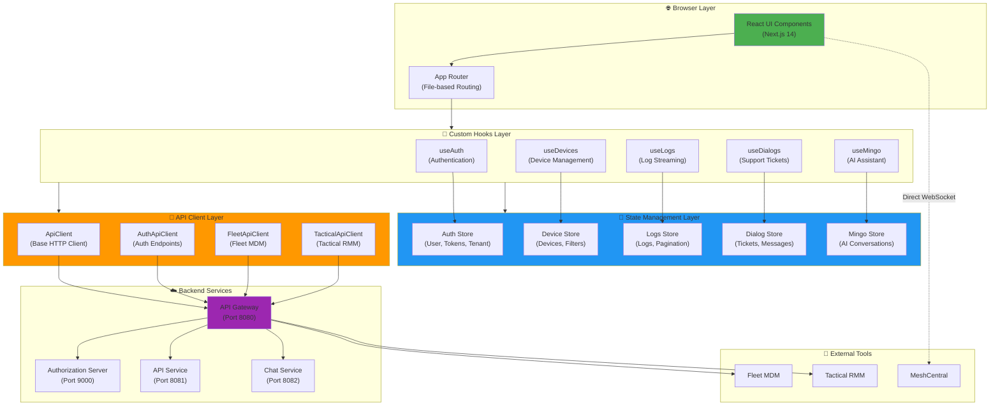

---

## 🔐 Authentication Architecture

### Multi-Tenant Authentication Flow

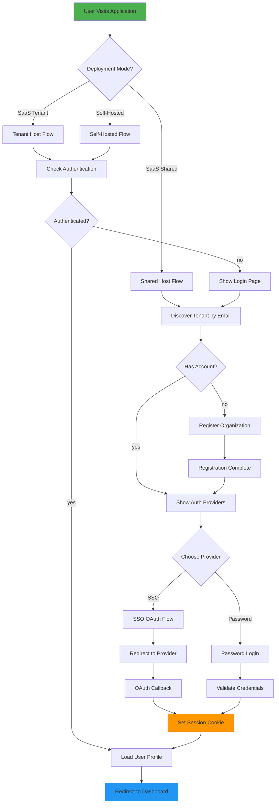

### Token Refresh Mechanism

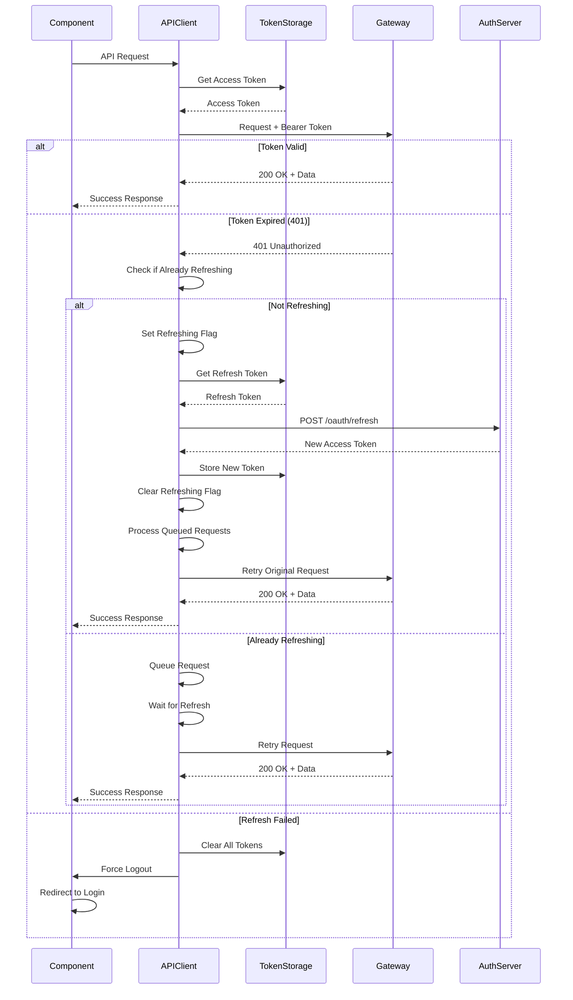

---

## 📊 Data Flow Architecture

### Device Data Aggregation

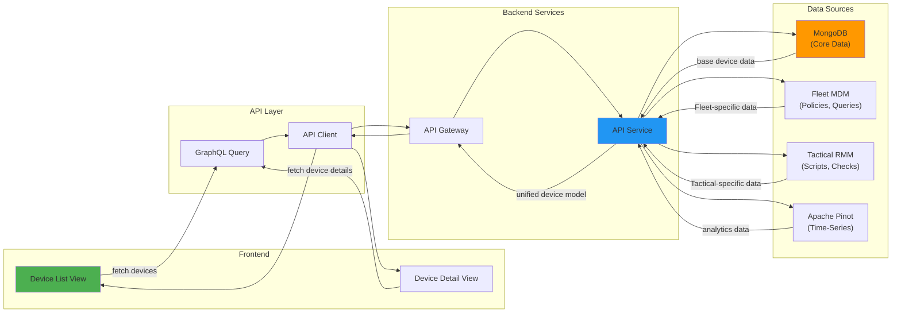

### Log Streaming Flow

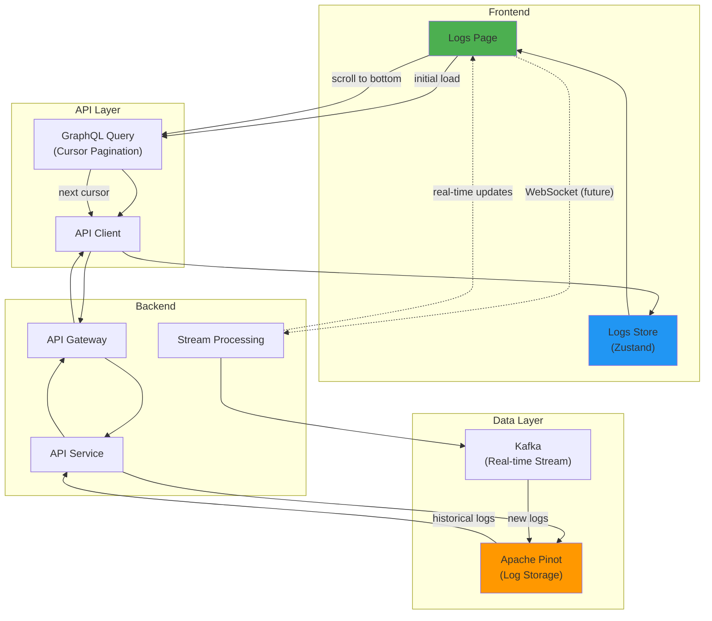

### Support Ticket Real-Time Flow

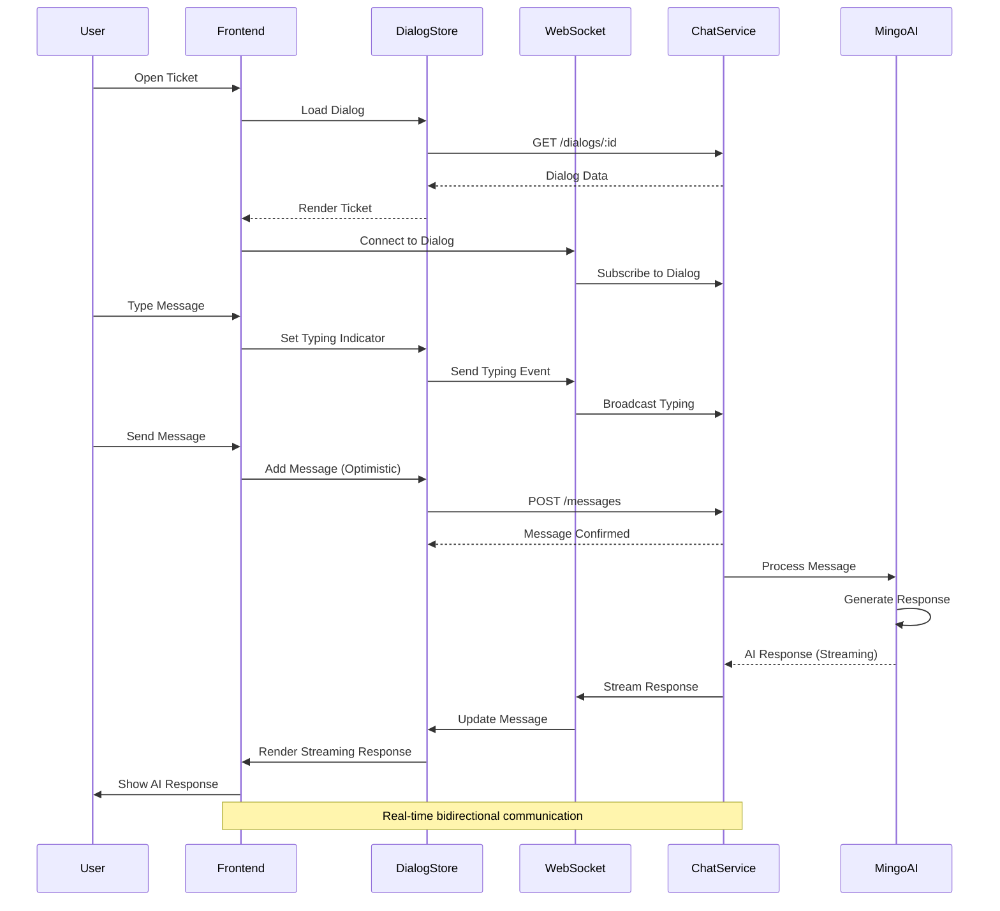

---

## 🔄 State Management Architecture

### Zustand Store Organization

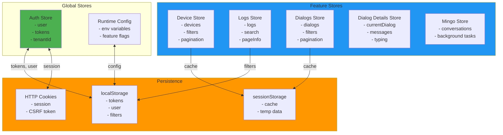

### Component-Store-API Pattern

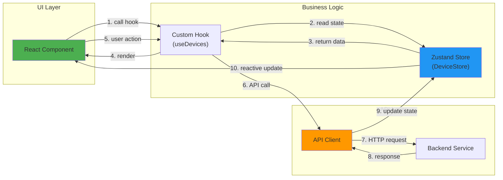

---

## 🌐 Deployment Architecture

### SaaS Shared Mode

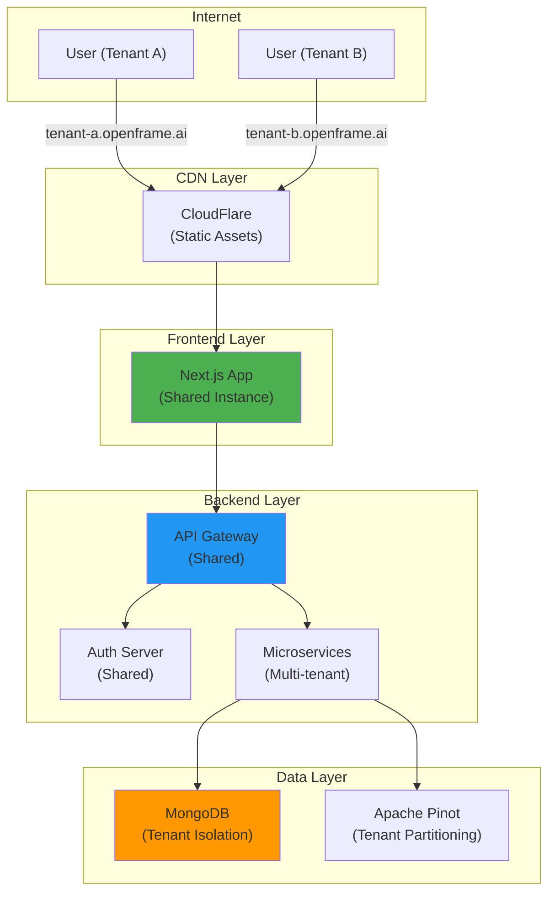

### Self-Hosted Mode

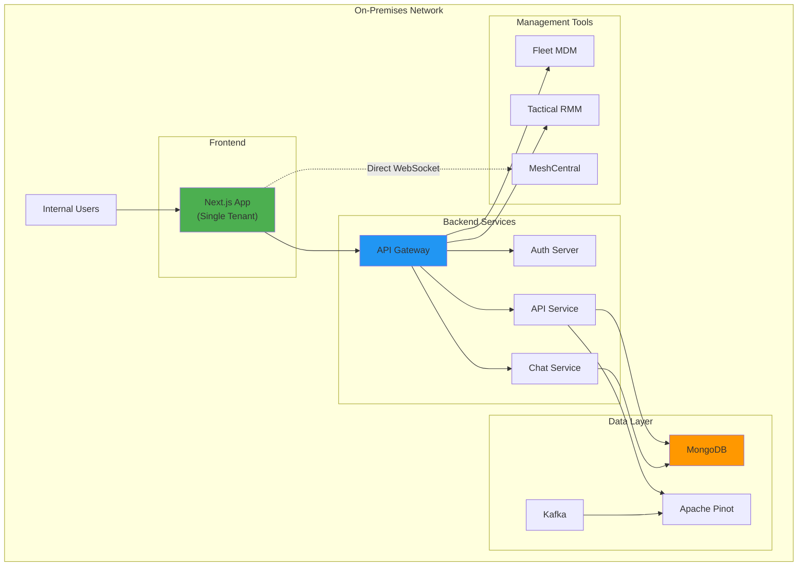

---

## 🔌 Integration Architecture

### External Tool Integration

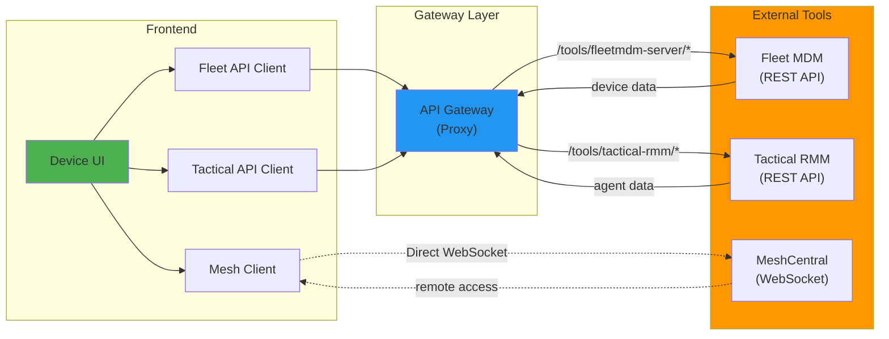

### WebSocket Communication

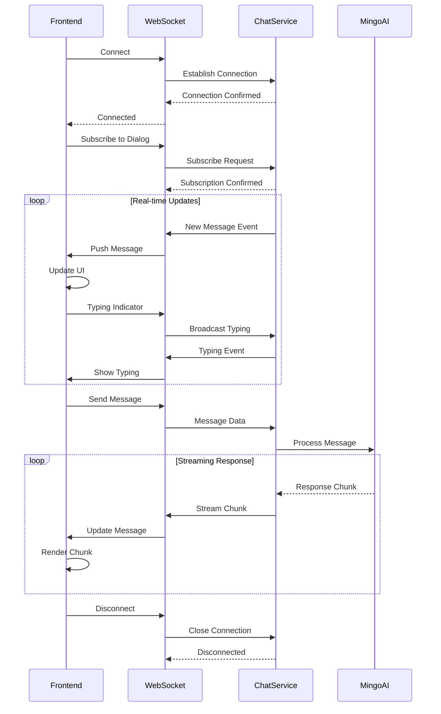

---

## 🔒 Security Architecture

### Authentication Security Layers

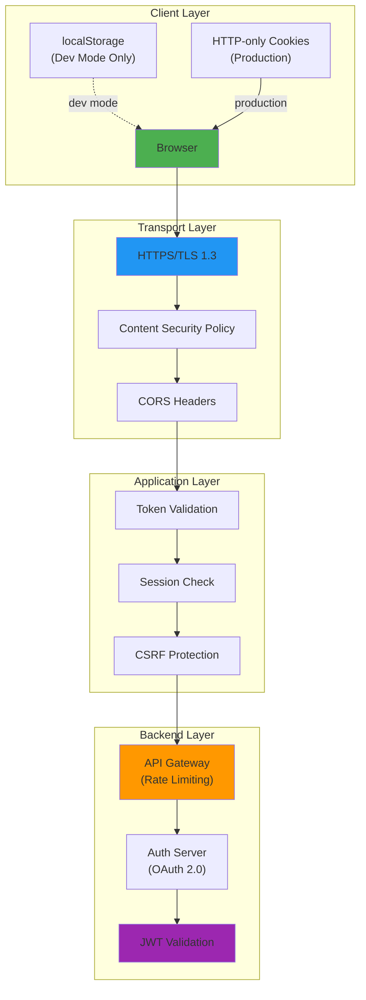

---

## 📈 Performance Architecture

### Optimization Layers

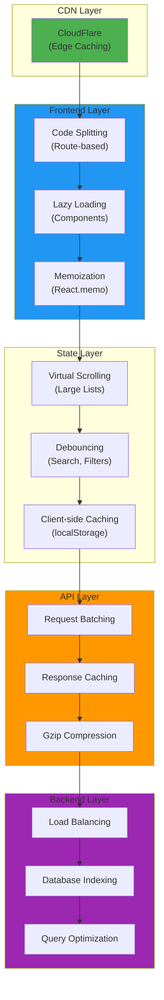

---

## 🎯 Component Hierarchy

### Main Application Structure

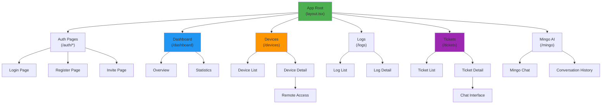

---

## 📚 Related Documentation

- **[Main Documentation](./frontend_main.md)** - Complete architecture overview
- **[Getting Started](./FRONTEND_MAIN_README.md)** - Setup and installation
- **[Executive Summary](./FRONTEND_MAIN_SUMMARY.md)** - High-level overview
- **[Documentation Index](./FRONTEND_DOCUMENTATION_INDEX.md)** - Complete documentation map

---

**Last Updated**: 2024  
**Version**: 1.0  
**Maintained by**: Flamingo Team
